# 人才简历智能筛选与管理系统

> 基于 LangChain + LangGraph + FastAPI 的企业级智能简历筛选平台，集成大语言模型实现简历智能解析、多条件筛选和 RAG 智能问答。

## 项目背景

在企业招聘过程中，HR 每天需要处理大量简历，传统人工筛选方式存在以下痛点：

| 痛点 | 描述 |
|------|------|
| 效率低下 | 人工阅读一份简历平均需要 3-5 分钟 |
| 标准不一 | 不同 HR 筛选标准存在主观差异 |
| 信息遗漏 | 容易遗漏关键信息或优秀候选人 |
| 难以追溯 | 筛选结果缺乏数据支撑和可追溯性 |
| 查询困难 | 海量简历难以快速检索和统计分析 |

本系统利用大语言模型（LLM）技术，实现简历的**智能解析**、**自动筛选**和**智能问答**，大幅提升招聘效率。

## 核心优势

### 1. 智能化程度高

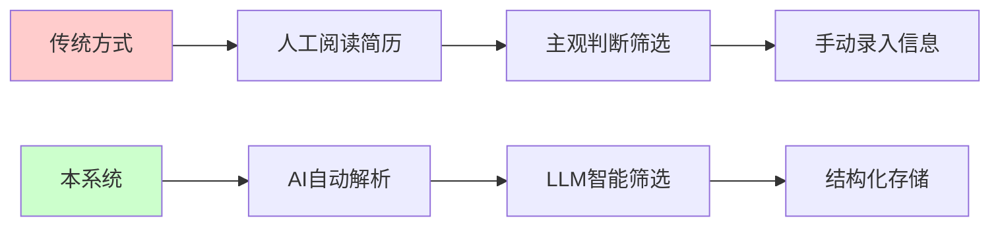

- **智能解析**：自动提取姓名、学历、技能、工作经历等 20+ 字段
- **智能筛选**：基于 LLM 的语义理解，支持自然语言筛选条件
- **智能问答**：RAG 技术实现简历库智能问答，如"有哪些 5 年经验的 Java 开发？"

### 2. 技术架构先进

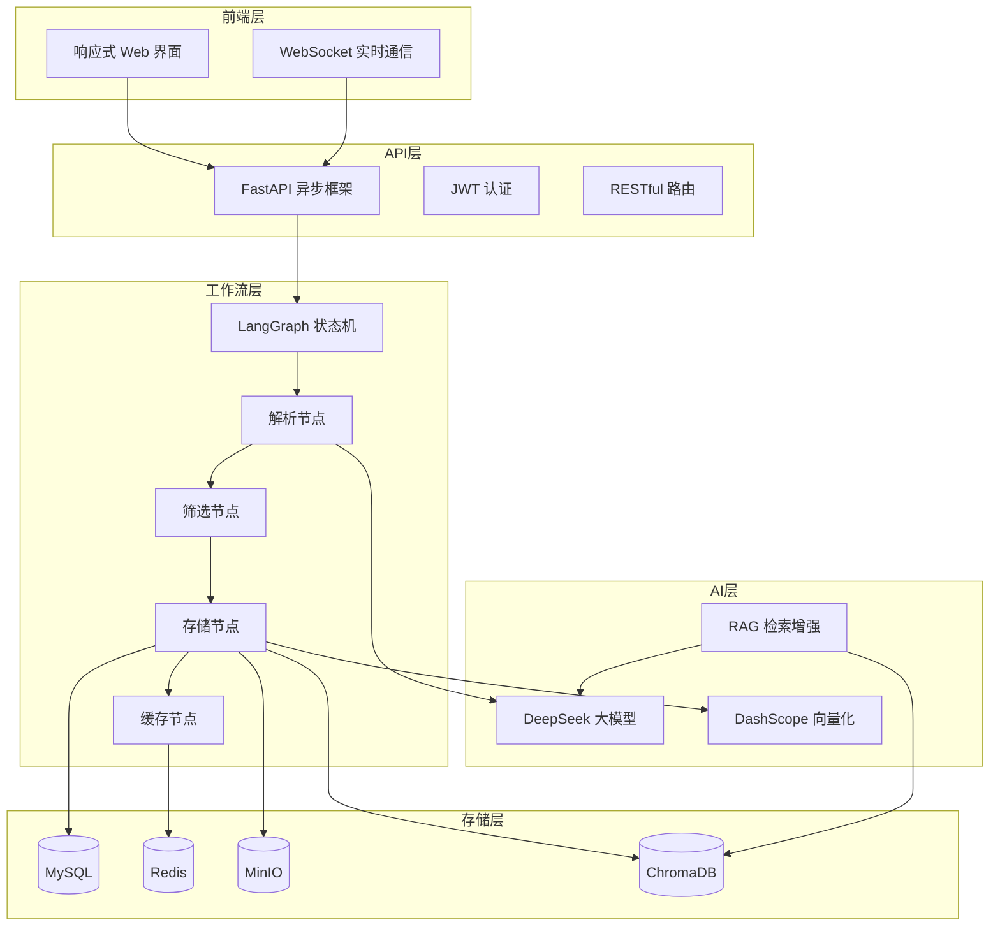

### 3. 功能完整丰富

| 功能模块 | 功能描述 | 技术亮点 |
|----------|----------|----------|
| 简历上传 | 支持 PDF/DOCX 批量上传 | 异步处理、进度实时推送 |
| 智能解析 | 自动提取结构化信息 | LLM 实体提取、人脸检测 |
| 条件筛选 | 多维度智能筛选 | LLM 语义理解、条件组合 |
| 智能问答 | 自然语言查询简历库 | RAG + 向量检索 |
| 系统监控 | 实时监控服务状态 | 健康检查、日志分析 |

### 4. 性能优异

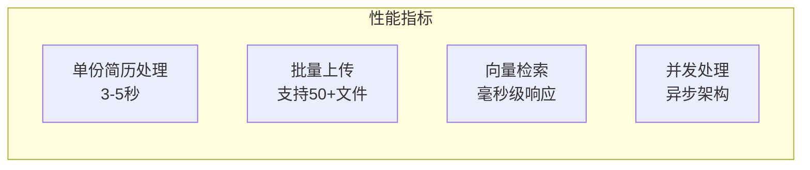

| 指标 | 数值 | 说明 |
|------|------|------|
| 单份简历处理时间 | 3-5 秒 | 含解析、筛选、存储全流程 |
| 批量上传支持 | 50+ 文件 | 异步后台处理 |
| 向量检索延迟 | <100ms | 千级数据量 |
| 系统可用性 | 99.9% | Docker 容器化部署 |

## 系统架构

### 整体架构图

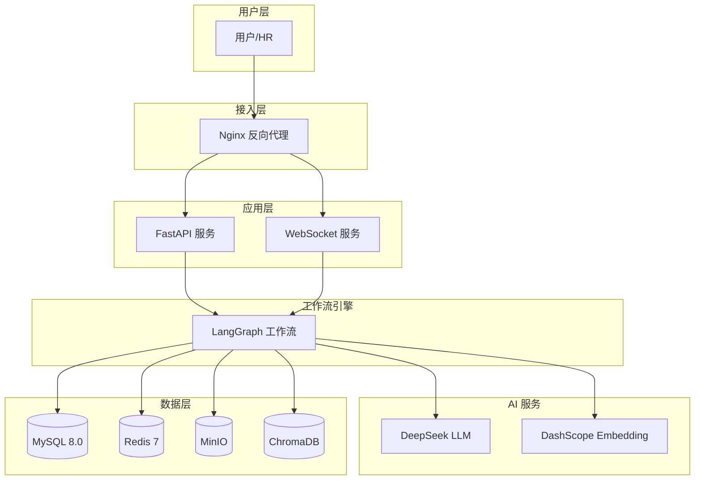

### 技术选型

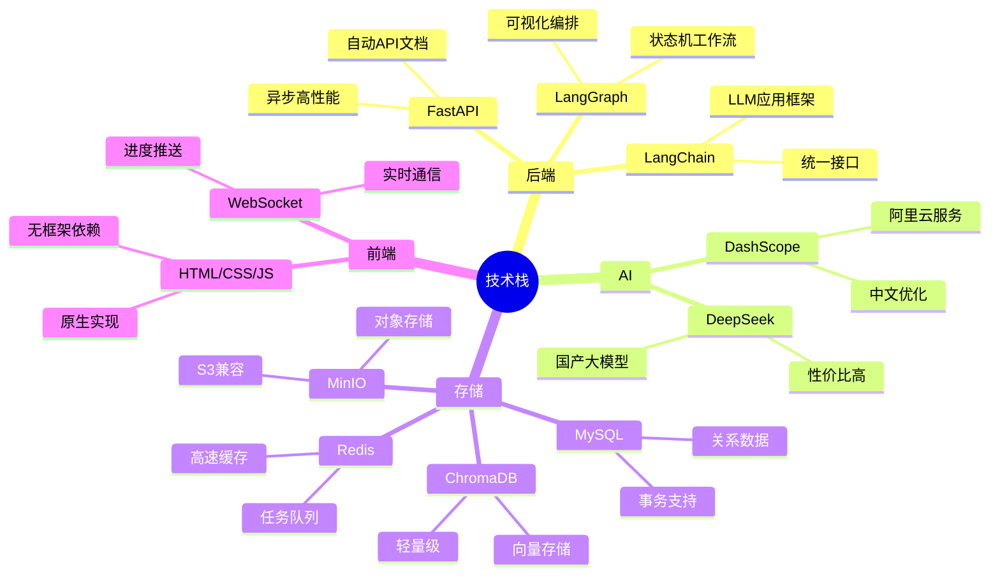

## 核心工作流

### 简历处理流程

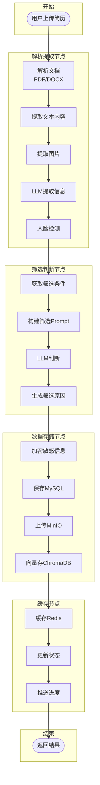

### RAG 智能问答流程

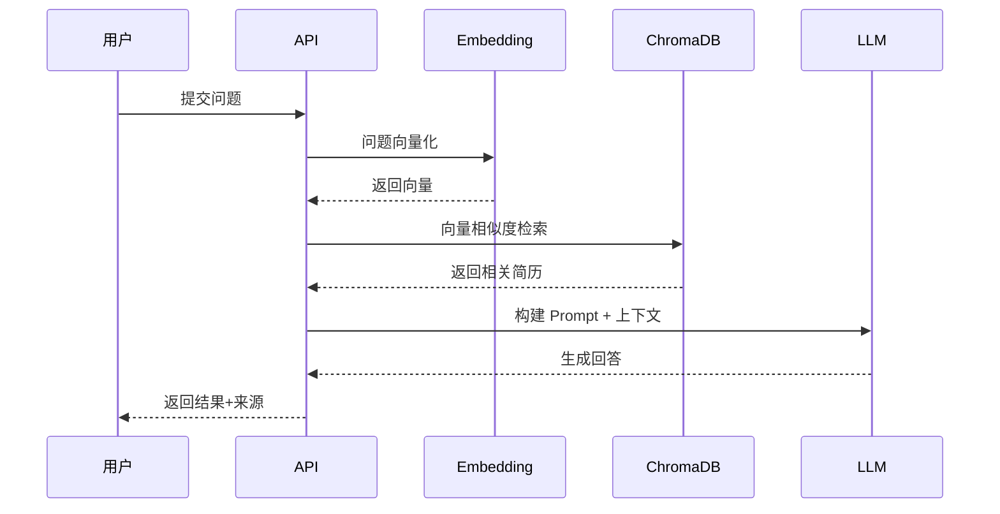

## 功能模块

### 1. 用户认证模块

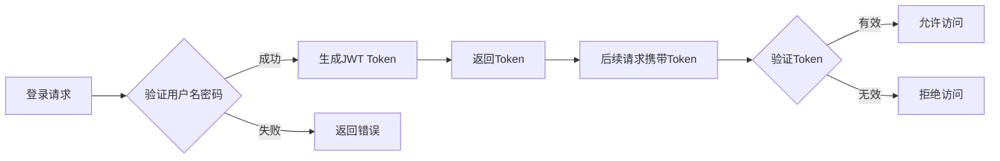

| 功能 | 描述 |
|------|------|
| 用户登录 | 用户名密码登录，返回 JWT Token |
| 权限控制 | admin/hr/viewer 三级权限 |
| Token 刷新 | Token 过期自动刷新机制 |

### 2. 简历管理模块

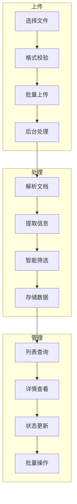

### 3. 筛选条件模块

支持多维度筛选条件组合：

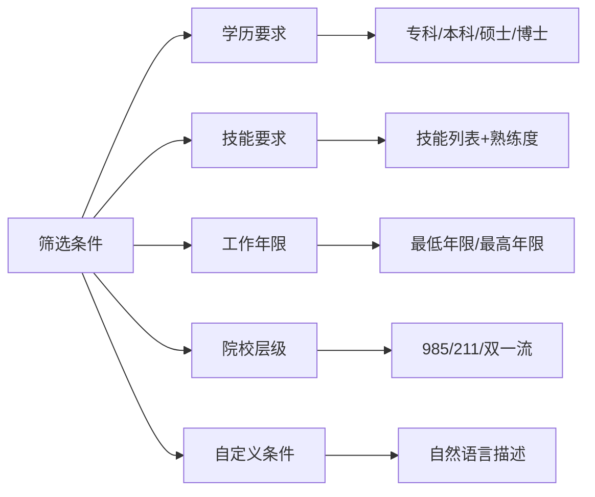

### 4. 智能分析模块

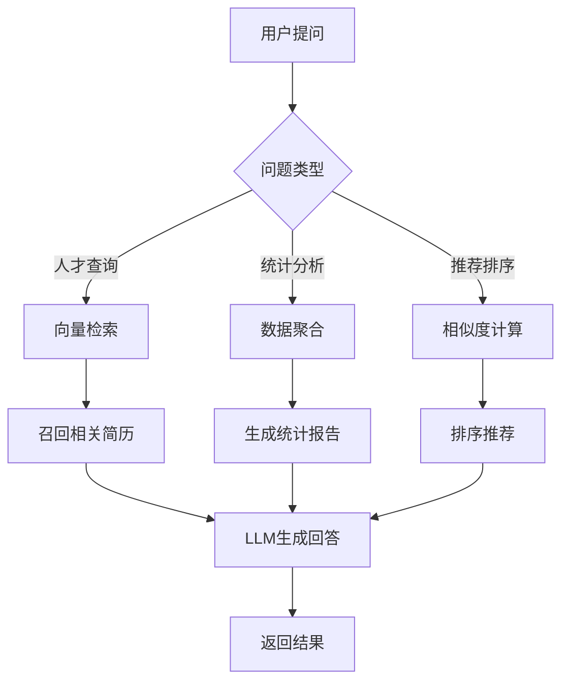

## 数据模型

### ER 图

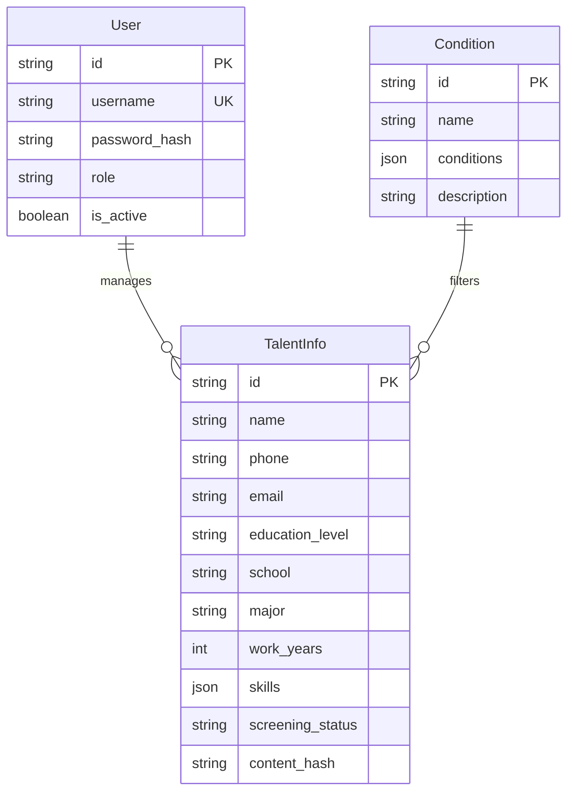

## 快速开始

### 环境要求

| 软件 | 版本 | 说明 |
|------|------|------|
| Python | 3.13+ | 核心开发语言 |
| Docker | 24.0+ | 容器化部署 |
| Docker Compose | 2.20+ | 服务编排 |
| uv | 最新版 | Python 包管理器 |

### 本地开发

```bash
# 1. 克隆项目
git clone https://gitee.com/xt765/resume-screening.git
cd resume-screening

# 2. 安装依赖
uv sync

# 3. 配置环境变量
cp .env.example .env
# 编辑 .env 文件，配置必要参数

# 4. 启动依赖服务
docker-compose up -d mysql redis minio

# 5. 初始化数据库
uv run python scripts/init_db.py
uv run python scripts/init_admin.py

# 6. 启动后端服务
uv run uvicorn src.api.main:app --host 0.0.0.0 --port 8000 --reload

# 7. 启动前端服务（新终端）
cd frontend-new && python -m http.server 3000
```

### Docker 部署

```bash
# 一键启动所有服务
docker-compose up -d

# 查看服务状态
docker-compose ps
```

### 访问地址

| 服务 | 地址 | 说明 |
|------|------|------|
| 前端界面 | http://localhost:3000 | 用户操作界面 |
| API 文档 | http://localhost:8000/docs | Swagger 交互文档 |
| ReDoc | http://localhost:8000/redoc | ReDoc 文档 |
| MinIO 控制台 | http://localhost:9001 | 图片存储管理 |

## 项目结构

```
ResumeScreening/
├── docs/                      # 项目文档
│   ├── architecture.md        # 架构设计
│   ├── api.md                 # API 文档
│   ├── deployment.md          # 部署指南
│   └── development.md         # 开发指南
├── frontend-new/              # 前端代码
│   ├── index.html             # 入口页面
│   ├── css/                   # 样式文件
│   └── js/                    # JavaScript
│       ├── app.js             # 应用入口
│       ├── api.js             # API 封装
│       └── pages/             # 页面模块
├── src/                       # 后端代码
│   ├── api/                   # API 路由
│   ├── core/                  # 核心模块
│   ├── models/                # 数据模型
│   ├── schemas/               # Pydantic 模式
│   ├── services/              # 业务服务
│   ├── storage/               # 存储客户端
│   ├── utils/                 # 工具函数
│   └── workflows/             # LangGraph 工作流
├── scripts/                   # 脚本工具
├── tests/                     # 测试代码
├── docker-compose.yml         # Docker 编排
├── Dockerfile                 # 后端镜像
├── pyproject.toml             # 项目配置
└── README.md                  # 项目说明
```

## 技术亮点

### 1. LangGraph 状态机工作流

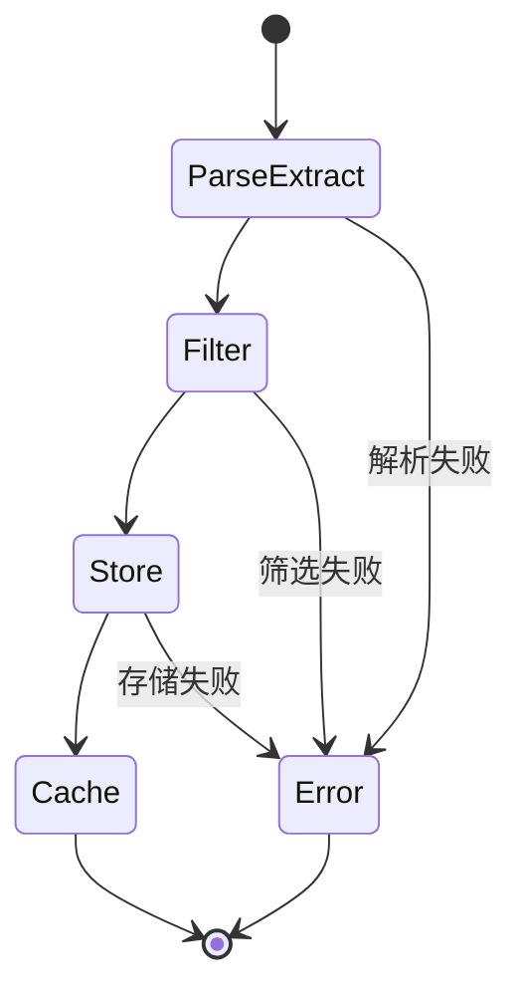

- 状态可持久化，支持断点续传
- 节点可独立测试和复用
- 支持并行节点执行

### 2. RAG 检索增强生成

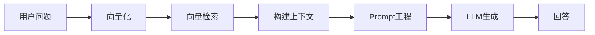

- 简历向量化存储，支持语义检索
- 多轮对话上下文管理
- 检索结果可追溯

### 3. 多级缓存策略

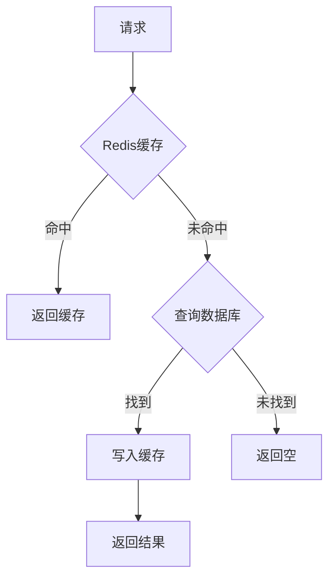

### 4. 安全设计

- **数据加密**：敏感信息（手机号、邮箱）AES 加密存储
- **密码安全**：bcrypt 哈希存储
- **JWT 认证**：无状态 Token 认证
- **权限控制**：三级角色权限体系

## 开发指南

### 代码规范

| 工具 | 用途 |
|------|------|
| ruff | 代码格式化 |
| basedpyright | 类型检查 |
| pytest | 单元测试 |
| pytest-cov | 覆盖率报告 |

### 运行测试

```bash
# 运行所有测试
uv run pytest

# 带覆盖率报告
uv run pytest --cov=src --cov-report=html
```

### 代码检查

```bash
# 格式化
uv run ruff format src/

# 检查
uv run ruff check src/

# 类型检查
uv run basedpyright src/
```

## 文档

- [架构设计文档](docs/architecture.md) - 详细的系统架构设计说明
- [API 接口文档](docs/api.md) - 完整的 REST API 接口文档
- [部署指南](docs/deployment.md) - Docker 部署详细步骤
- [开发指南](docs/development.md) - 开发环境搭建和代码规范

## 许可证

MIT License
