# 简历智能筛选与管理系统

**基于 LangChain + LangGraph + FastAPI 的智能简历筛选平台，集成 LLM 实现智能解析、筛选和 RAG 问答。**

🌐 **语言**: [English](README.md) | 中文

[](https://blog.csdn.net/Yunyi_Chi)
[](https://github.com/xt765/ResumeScreening)
[](https://gitee.com/xt765/resume-screening)


</div>

## 项目背景

在企业招聘过程中，HR 每天需要处理大量简历，传统人工筛选方式存在诸多痛点。本系统应运而生，旨在解决招聘效率低下的问题。

### 传统招聘痛点分析

| 痛点 | 描述 | 影响 |
|------|------|------|
| 效率低下 | 人工阅读一份简历平均需要 3-5 分钟 | 招聘周期长，错失优秀人才 |
| 标准不一 | 不同 HR 筛选标准存在主观差异 | 筛选结果不可控，质量参差不齐 |
| 信息遗漏 | 容易遗漏关键信息或优秀候选人 | 人才流失，招聘成本增加 |
| 难以追溯 | 筛选结果缺乏数据支撑和可追溯性 | 无法复盘优化筛选标准 |
| 查询困难 | 海量简历难以快速检索和统计分析 | 数据价值无法挖掘 |

本系统利用大语言模型（LLM）技术，实现简历的**智能解析**、**自动筛选**和**智能问答**，将传统 3-5 分钟的人工筛选缩短至 3-5 秒，效率提升 **60 倍以上**。

## 核心优势

### 1. 智能化程度高

传统人工筛选与本系统对比如下：

```mermaid
graph LR
    subgraph Legacy [传统招聘流程]
        direction LR
        A1[人工阅读简历] --> A2{主观判断}
        A2 -->|通过| A3[手动录入Excel]
        A2 -->|淘汰| A4[丢弃]
        A3 --> A5[人工检索查找]
    end
    style Legacy fill:#f9fafb,stroke:#e5e7eb
```

```mermaid
graph LR
    subgraph System [智能筛选系统]
        direction LR
        B1[AI自动解析] --> B2{LLM智能筛选}
        B2 -->|自动结构化| B3[多维数据库]
        B3 --> B4[自然语言问答]
    end
    style System fill:#ecfdf5,stroke:#a7f3d0
    style B1 fill:#d1fae5,stroke:#34d399
    style B2 fill:#d1fae5,stroke:#34d399
    style B3 fill:#d1fae5,stroke:#34d399
    style B4 fill:#d1fae5,stroke:#34d399
```





**对比说明**：

| 维度 | 传统方式 | 本系统 | 提升 |
|------|----------|--------|------|
| 处理速度 | 3-5 分钟/份 | 3-5 秒/份 | **60倍** |
| 信息提取 | 手动录入，易遗漏 | AI 自动提取 20+ 字段 | **100%覆盖** |
| 筛选标准 | 主观判断，因人而异 | LLM 语义理解，标准统一 | **一致性保障** |
| 数据检索 | 翻阅文件或 Excel | 自然语言智能问答 | **秒级响应** |

**核心能力**：

- **智能解析**：自动提取姓名、学历、技能、工作经历等 20+ 字段，支持 PDF/DOCX 格式
- **智能筛选**：基于 LLM 的语义理解，支持自然语言描述筛选条件，如"5年以上Java开发经验，本科及以上学历"
- **智能问答**：RAG 技术实现简历库智能问答，如"有哪些 5 年经验的 Java 开发？符合条件的有多少人？"

### 2. 技术架构先进

系统采用分层架构设计，各层职责清晰，便于维护和扩展：

```mermaid
graph TD
    User((用户/HR))
    
    subgraph Frontend [前端交互层]
        UI[Web 界面]
        Monitor[监控面板]
    end

    subgraph Gateway [网关层]
        API_GW[API 网关 / 负载均衡]
    end

    subgraph Service [后端服务层]
        Auth[认证服务]
        Resume[简历管理]
        Analysis[智能分析]
        Workflow[工作流引擎]
    end

    subgraph AI_Core [AI 能力层]
        LLM[DeepSeek LLM]
        Embedding[向量化模型]
        RAG[RAG 检索引擎]
    end

    subgraph Data [数据存储层]
        MySQL[(MySQL)]
        Redis[(Redis)]
        MinIO[(MinIO)]
        Chroma[(ChromaDB)]
    end

    User <--> Frontend
    Frontend <--> Gateway
    Gateway <--> Service
    Service <--> AI_Core
    Service <--> Data

    style User fill:#2563eb,color:#fff
    style Frontend fill:#dbeafe
    style Gateway fill:#f3f4f6
    style Service fill:#d1fae5
    style AI_Core fill:#fae8ff
    style Data fill:#ffedd5
```



**架构设计理念**：

1. **分层解耦**：前端、API、工作流、AI、存储各层独立，降低耦合度
2. **异步处理**：FastAPI 原生支持异步，批量上传后台处理不阻塞
3. **状态管理**：LangGraph 状态机管理工作流，支持断点续传和错误恢复
4. **多模态存储**：关系数据、缓存、对象存储、向量存储各司其职

### 3. 功能完整丰富

系统覆盖简历筛选全流程，功能模块完整：

| 功能模块 | 功能描述 | 技术亮点 | 业务价值 |
|----------|----------|----------|----------|
| 简历上传 | 支持 PDF/DOCX 批量上传，最多 50 个文件 | 异步处理、WebSocket 进度实时推送 | 大幅提升批量处理效率 |
| 智能解析 | 自动提取结构化信息，包括教育、工作、技能等 | LLM 实体提取、人脸检测、敏感信息加密 | 信息提取零遗漏 |
| 条件筛选 | 多维度智能筛选，支持条件组合 | LLM 语义理解、自然语言条件描述 | 筛选标准统一可控 |
| 智能问答 | 自然语言查询简历库 | RAG + 向量检索、来源可追溯 | 秒级获取统计信息 |
| 系统监控 | 实时监控服务状态 | 健康检查、日志分析、性能指标 | 保障系统稳定运行 |

### 4. 性能优异

系统经过优化，各项性能指标表现优异：

```mermaid
graph TD
    subgraph Performance [系统性能指标]
        A[单份简历处理<br/><b>3-5 秒</b>]
        B[批量并发处理<br/><b>50+ 文件</b>]
        C[向量检索响应<br/><b>< 100ms</b>]
        D[系统可用性<br/><b>99.9%</b>]
    end
    
    style Performance fill:#f8fafc,stroke:#e2e8f0
    style A fill:#dbeafe,stroke:#3b82f6
    style B fill:#d1fae5,stroke:#10b981
    style C fill:#fae8ff,stroke:#a855f7
    style D fill:#ffedd5,stroke:#f97316
```



| 指标 | 数值 | 说明 | 对比传统方式 |
|------|------|------|--------------|
| 单份简历处理时间 | 3-5 秒 | 含解析、筛选、存储全流程 | 传统 3-5 分钟 |
| 批量上传支持 | 50+ 文件 | 异步后台处理，不阻塞用户 | 传统逐个处理 |
| 向量检索延迟 | <100ms | 千级数据量下的语义检索 | 传统需翻阅全部简历 |
| 系统可用性 | 99.9% | Docker 容器化部署，自动重启 | - |
| 并发处理能力 | 100+ QPS | 异步架构，充分利用 CPU | - |

## 系统架构

### 整体架构图

系统采用微服务架构思想设计，支持容器化部署和水平扩展：

```mermaid
graph TD
    User((用户)) --> Nginx[Nginx 网关]
    
    subgraph App_Layer [应用服务]
        API[FastAPI 后端]
        WS[WebSocket 服务]
    end
    
    subgraph Workflow_Layer [工作流引擎]
        LangGraph[LangGraph 状态机]
    end
    
    subgraph AI_Layer [AI 能力]
        LLM[DeepSeek API]
        Embedding[DashScope API]
    end
    
    subgraph Data_Layer [数据存储]
        MySQL[(MySQL)]
        Redis[(Redis)]
        MinIO[(MinIO)]
        Chroma[(ChromaDB)]
    end
    
    Nginx --> API
    Nginx --> WS
    
    API --> LangGraph
    WS --> LangGraph
    
    LangGraph --> LLM
    LangGraph --> Embedding
    LangGraph --> Data_Layer
    
    style User fill:#2563eb,color:#fff
    style Nginx fill:#64748b,color:#fff
    style App_Layer fill:#e0f2fe
    style Workflow_Layer fill:#dcfce7
    style AI_Layer fill:#f3e8ff
    style Data_Layer fill:#ffedd5
```



**各层职责说明**：

| 层级 | 组件 | 职责 |
|------|------|------|
| 用户接入层 | 浏览器 | 用户交互界面，响应式设计适配多终端 |
| 网关接入层 | Nginx | 反向代理、负载均衡、SSL 证书、静态资源服务 |
| 应用服务层 | FastAPI + WebSocket | 业务逻辑处理、API 接口、实时通信 |
| 工作流引擎层 | LangGraph | 简历处理流程编排、状态管理、错误处理 |
| AI 能力层 | DeepSeek + DashScope | 文本理解、信息提取、向量化、智能问答 |
| 数据存储层 | MySQL/Redis/MinIO/ChromaDB | 数据持久化、缓存、文件存储、向量检索 |

### 技术选型

技术选型遵循"成熟稳定、开源优先、易于维护"的原则：

| 层级 | 技术选型 | 版本 | 选型理由 |
|------|----------|------|----------|
| **后端框架** | FastAPI | >=0.120.0 | 异步高性能，自动生成 API 文档，类型提示友好 |
| **LLM框架** | LangChain | >=1.2.0 | 成熟的 LLM 应用开发框架，统一的大模型调用接口 |
| **工作流引擎** | LangGraph | >=1.0.0 | 状态机工作流，支持可视化编排，便于复杂业务流程管理 |
| **大模型** | DeepSeek | - | 国产大模型，中文理解能力强，API 价格低廉 |
| **向量化** | DashScope | - | 阿里云服务，中文语义效果好，稳定可靠 |
| **数据库** | MySQL | 8.0 | 成熟的关系数据库，支持事务，社区活跃 |
| **缓存** | Redis | 7 | 高性能内存数据库，支持多种数据结构，可用于缓存和消息队列 |
| **对象存储** | MinIO | - | S3 兼容的私有化对象存储，部署简单，成本低 |
| **向量数据库** | ChromaDB | >=0.5.0 | 轻量级向量存储，无需额外依赖，适合中小规模数据 |
| **前端** | HTML/CSS/JS | - | 原生实现，无框架依赖，加载快速，维护简单 |

## 核心工作流

### 简历处理流程

简历处理采用 LangGraph 状态机工作流，分为 4 个节点顺序执行：

```mermaid
graph TD
    Start([开始]) --> Upload[用户上传简历]
    
    subgraph P1 [阶段一：智能解析]
        direction TB
        Upload --> Parse{文件类型?}
        Parse -->|PDF/DOCX| Extract[文本/图片提取]
        Extract --> LLM1[LLM 信息抽取]
        LLM1 --> Face[人脸检测]
    end
    
    subgraph P2 [阶段二：智能筛选]
        direction TB
        Face --> Cond[加载筛选条件]
        Cond --> Prompt[构建筛选 Prompt]
        Prompt --> LLM2[LLM 语义判断]
        LLM2 --> Reason[生成筛选理由]
    end
    
    subgraph P3 [阶段三：数据存储]
        direction TB
        Reason --> Encrypt[敏感信息加密]
        Encrypt --> SaveDB[(MySQL 存储)]
        SaveDB --> SaveOSS[(MinIO 存储)]
        SaveOSS --> Embed[文本向量化]
        Embed --> SaveVec[(ChromaDB 存储)]
    end
    
    subgraph P4 [阶段四：反馈通知]
        direction TB
        SaveVec --> Cache[Redis 缓存结果]
        Cache --> Notify[WebSocket 推送进度]
    end

    Notify --> End([流程结束])

    style Start fill:#2563eb,color:#fff
    style End fill:#2563eb,color:#fff
    style P1 fill:#eff6ff,stroke:#bfdbfe
    style P2 fill:#f0fdf4,stroke:#bbf7d0
    style P3 fill:#fff7ed,stroke:#fed7aa
    style P4 fill:#faf5ff,stroke:#e9d5ff
```



**各节点详细说明**：

#### ParseExtractNode - 解析提取节点

**职责**：将非结构化简历文档转换为结构化数据

**处理步骤**：
1. **文档解析**：根据文件类型选择解析器
   - PDF：使用 PyMuPDF (fitz) 提取文本和嵌入图片
   - DOCX：使用 python-docx 提取文本和图片
2. **文本提取**：保留段落格式，便于 LLM 理解上下文
3. **图片提取**：提取简历中的证件照
4. **LLM 信息提取**：调用 DeepSeek 大模型，提取 20+ 字段
   - 基本信息：姓名、性别、年龄、联系方式
   - 教育背景：学历、院校、专业、毕业时间
   - 工作经历：公司、职位、时间、职责描述
   - 技能特长：技能列表、熟练程度
5. **人脸检测**：使用 OpenCV Haar 级联分类器检测照片中的人脸

**输出数据**：`text_content`、`images`、`candidate_info`

#### FilterNode - 筛选判断节点

**职责**：根据预设条件判断候选人是否符合要求

**处理步骤**：
1. **获取筛选条件**：从数据库读取条件配置
2. **构建筛选 Prompt**：将条件转换为自然语言描述
3. **LLM 判断**：调用大模型进行语义理解匹配
4. **生成筛选原因**：详细说明符合/不符合的具体原因

**筛选条件支持**：
- 学历要求：专科/本科/硕士/博士
- 技能要求：技能列表 + 熟练程度
- 工作年限：最低年限/最高年限
- 院校层级：985/211/双一流
- 自定义条件：自然语言描述

**输出数据**：`is_qualified`、`qualification_reason`

#### StoreNode - 数据存储节点

**职责**：持久化存储处理结果

**处理步骤**：
1. **加密敏感信息**：使用 AES 对称加密手机号、邮箱
2. **保存 MySQL**：存储人才信息到 `talent_info` 表
3. **上传 MinIO**：存储简历照片，生成访问 URL
4. **向量存储**：生成简历文本向量，存入 ChromaDB

**数据安全**：
- 敏感字段加密存储，密钥由环境变量管理
- 密码使用 bcrypt 哈希，不可逆
- API 返回数据时自动脱敏

**输出数据**：`talent_id`、`photo_urls`

#### CacheNode - 缓存节点

**职责**：缓存处理结果，推送实时进度

**处理步骤**：
1. **缓存 Redis**：存储处理结果，设置过期时间
2. **更新任务状态**：更新数据库中的任务记录
3. **WebSocket 推送**：实时通知前端处理进度

**缓存策略**：
- 筛选条件缓存：5 分钟过期
- 任务状态缓存：任务完成后 1 小时过期
- 支持缓存穿透保护

**输出数据**：任务状态更新、WebSocket 通知

### RAG 智能问答流程

RAG（Retrieval-Augmented Generation）检索增强生成是本系统的核心能力之一：

```mermaid
sequenceDiagram
    participant User as 用户
    participant API as API 服务
    participant Embed as Embedding 服务
    participant DB as 向量数据库 (Chroma)
    participant LLM as 大语言模型 (DeepSeek)
    
    User->>API: 提问: "有哪些5年经验的Java开发?"
    activate API
    
    API->>Embed: 问题向量化
    activate Embed
    Embed-->>API: 返回查询向量
    deactivate Embed
    
    API->>DB: 相似度检索 (Top-K)
    activate DB
    DB-->>API: 返回相关简历片段
    deactivate DB
    
    API->>LLM: 发送 Prompt + 简历上下文
    activate LLM
    LLM-->>API: 生成自然语言回答 + 智能推荐指数
    deactivate LLM
    
    API-->>User: 返回回答、推荐理由及来源链接
    deactivate API
```



**RAG 技术优势**：

| 传统检索 | RAG 检索 |
|----------|----------|
| 关键词匹配，无法理解语义 | 向量检索，理解问题意图 |
| 需要精确匹配字段 | 支持自然语言提问 |
| 结果是原始数据 | 结果是生成的自然语言回答 |
| 无法进行推理总结 | 可以总结、对比、推荐 |

**典型应用场景**：

1. **人才查询**："有哪些 5 年以上经验的 Java 开发工程师？"
2. **统计分析**："本科学历的候选人占比多少？平均工作年限是多少？"
3. **技能推荐**："这个岗位还需要什么技能？哪些候选人最匹配？"
4. **对比分析**："张三和李四谁的 Java 经验更丰富？"

## 数据模型

系统采用关系数据库存储结构化数据，ER 图如下：

```mermaid
erDiagram
    User ||--o{ TalentInfo : "管理"
    Condition ||--o{ TalentInfo : "筛选"
    
    User {
        string id PK "UUID"
        string username "用户名"
        string password_hash "加密密码"
        string role "角色"
    }
    
    TalentInfo {
        string id PK "UUID"
        string name "姓名"
        string education_level "学历"
        int work_years "工龄"
        json skills "技能"
        string screening_status "状态"
    }
    
    Condition {
        string id PK "UUID"
        string name "名称"
        json rules "规则配置"
    }
```



**数据模型说明**：

| 实体 | 说明 | 核心字段 |
|------|------|----------|
| **User** | 系统用户表，存储登录账户信息 | `username`(唯一)、`role`(角色权限) |
| **TalentInfo** | 人才信息表，存储简历提取的结构化数据 | `name`、`school`、`skills`、`screening_status` |
| **Condition** | 筛选条件表，存储自定义筛选规则 | `name`、`conditions`(JSON格式条件) |

**特殊字段说明**：
- `PK`：主键 (Primary Key)，UUID 格式
- `UK`：唯一键 (Unique Key)，保证唯一性
- `phone/email`：使用 AES 加密存储敏感信息
- `content_hash`：简历内容 SHA256 哈希，用于去重
- `skills/work_experience/projects`：JSON 格式存储复杂数据结构

## 快速开始

### 环境要求

| 软件 | 版本 | 说明 | 安装方式 |
|------|------|------|----------|
| Python | 3.10-3.13 | 核心开发语言 (注意：因 pydantic v1 兼容性，不支持 3.14+) | 官网下载或 pyenv |
| Docker | 24.0+ | 容器化部署 | Docker Desktop |
| Docker Compose | 2.20+ | 服务编排 | Docker Desktop 自带 |
| uv | 最新版 | Python 包管理器 | `pip install uv` |

### 本地开发

```bash
# 1. 克隆项目
git clone https://gitee.com/xt765/resume-screening.git
cd resume-screening

# 2. 安装依赖
uv sync

# 3. 配置环境变量
cp .env.example .env
# 编辑 .env 文件，配置必要参数：
# - MYSQL_HOST、MYSQL_PASSWORD
# - DS_API_KEY（DeepSeek API Key）
# - DASHSCOPE_API_KEY（阿里云 DashScope Key）

# 4. 启动依赖服务（MySQL、Redis、MinIO）
docker-compose up -d mysql redis minio

# 5. 初始化数据库和管理员账户
uv run python scripts/init_db.py
uv run python scripts/init_admin.py

# 6. 启动后端服务
uv run uvicorn src.api.main:app --host 0.0.0.0 --port 8000 --reload

# 7. 启动前端服务（新终端）
cd frontend-new && python -m http.server 3000
```

### Docker 部署

```bash
# 一键启动所有服务
docker-compose up -d

# 查看服务状态
docker-compose ps

# 查看日志
docker-compose logs -f backend
```

### 访问地址

| 服务 | 地址 | 说明 |
|------|------|------|
| 前端界面 | http://localhost:3000 | 用户操作界面 |
| API 文档 | http://localhost:8000/docs | Swagger 交互式 API 文档 |
| ReDoc | http://localhost:8000/redoc | ReDoc 格式 API 文档 |
| MinIO 控制台 | http://localhost:9001 | 图片存储管理后台 |

## 项目结构

```
ResumeScreening/
├── docs/                      # 项目文档
├── frontend-new/              # 前端代码
│   ├── index.html             # 入口页面
│   ├── css/                   # 样式文件
│   └── js/                    # JavaScript
├── src/                       # 后端代码
│   ├── api/                   # API 路由
│   ├── core/                  # 核心模块
│   ├── models/                # 数据模型
│   ├── schemas/               # Pydantic 模式
│   ├── services/              # 业务服务
│   ├── storage/               # 存储客户端
│   ├── utils/                 # 工具函数
│   └── workflows/             # LangGraph 工作流
├── scripts/                   # 脚本工具
├── tests/                     # 测试代码
├── docker-compose.yml         # Docker 编排
├── Dockerfile                 # 后端镜像
├── pyproject.toml             # 项目配置
└── README.md                  # 中文说明
```

## 技术亮点

### 1. LangGraph 状态机工作流

系统采用 LangGraph 构建可观测、可恢复的工作流：

```mermaid
stateDiagram-v2
    [*] --> ParseExtract: 提交简历
    
    state ParseExtract {
        [*] --> Analyzing: 文档解析
        Analyzing --> Extracting: 内容提取
        Extracting --> [*]: 提取成功
    }
    
    ParseExtract --> Filter: 解析完成
    ParseExtract --> Error: 解析失败
    
    state Filter {
        [*] --> Matching: 规则匹配
        Matching --> Judging: LLM判断
        Judging --> [*]: 筛选完成
    }
    
    Filter --> Store: 筛选完成
    Filter --> Error: 筛选失败
    
    state Store {
        [*] --> Encrypting: 数据加密
        Encrypting --> Saving: 多库写入
        Saving --> [*]: 存储完成
    }
    
    Store --> Cache: 存储成功
    Store --> Error: 存储失败
    
    Cache --> [*]: 任务结束
    Error --> [*]: 异常终止
    
    note right of Error
        记录错误日志
        通知用户重试
    end note
```



**技术优势**：
- **状态持久化**：每个节点的状态保存到数据库，支持断点续传
- **可视化编排**：工作流可视化，便于理解和调试
- **独立测试**：每个节点可独立单元测试，提高代码质量
- **错误恢复**：失败节点可重试，无需重新执行整个流程

### 2. RAG 检索增强生成

RAG 技术实现简历库的智能问答：

```mermaid
graph LR
    Q[用户问题] --> E[问题向量化<br/>DashScope]
    E --> R[向量检索<br/>ChromaDB]
    R --> C[构建上下文<br/>拼接相关简历]
    C --> P[Prompt工程<br/>结构化提示]
    P --> L[LLM生成<br/>DeepSeek]
    L --> A[自然语言回答]
```



**技术优势**：
- **语义检索**：向量相似度检索，理解问题意图而非关键词匹配
- **来源可追溯**：回答附带来源简历链接，可信度高
- **上下文管理**：支持多轮对话，上下文自动管理
- **实时更新**：新简历入库后立即可检索

### 3. 多级缓存策略

系统采用多级缓存提升性能：

```mermaid
graph TD
    Req[客户端请求] --> Cache{Redis 缓存?}
    
    Cache -->|命中| Return[直接返回结果]
    Cache -->|未命中| DB[(数据库查询)]
    
    DB -->|查询成功| Write[写入缓存]
    Write --> Return
    
    DB -->|查询为空| NullCache[写入空值缓存<br/>(防穿透)]
    NullCache --> Return
    
    style Req fill:#2563eb,color:#fff
    style Cache fill:#fef3c7,stroke:#f59e0b
    style DB fill:#dbeafe,stroke:#3b82f6
    style Return fill:#d1fae5,stroke:#10b981
```

**缓存策略**：
- **筛选条件缓存**：5 分钟过期，条件变更频率低
- **任务状态缓存**：任务完成后 1 小时过期
- **用户信息缓存**：Token 有效期内缓存
- **空值缓存**：30 秒，防止缓存穿透

### 4. 安全设计

系统采用多层安全防护：

| 安全措施 | 说明 | 实现方式 |
|----------|------|----------|
| 数据加密 | 敏感信息加密存储 | AES-256 对称加密 |
| 密码安全 | 密码不可逆存储 | bcrypt 哈希 |
| JWT 认证 | 无状态 Token 认证 | HS256 签名 |
| 权限控制 | 三级角色权限体系 | RBAC 模型 |
| API 限流 | 防止恶意请求 | 令牌桶算法 |
| SQL 注入防护 | 参数化查询 | SQLAlchemy ORM |

## 开发指南

### 代码规范

| 工具 | 用途 | 配置文件 |
|------|------|----------|
| ruff | 代码格式化 + Lint | pyproject.toml |
| basedpyright | 类型检查 | pyproject.toml |
| pytest | 单元测试 | pyproject.toml |
| pytest-cov | 覆盖率报告 | pyproject.toml |

### 运行测试

```bash
# 运行所有测试
uv run pytest

# 带覆盖率报告
uv run pytest --cov=src --cov-report=html

# 运行特定测试
uv run pytest tests/test_workflows.py -v
```

### 代码检查

```bash
# 格式化代码
uv run ruff format src/

# 代码检查
uv run ruff check src/

# 类型检查
uv run basedpyright src/
```

## 文档

- [架构设计文档](docs/architecture.md) - 详细的系统架构设计说明
- [API 接口文档](docs/api.md) - 完整的 REST API 接口文档
- [部署指南](docs/deployment.md) - Docker 部署详细步骤
- [开发指南](docs/development.md) - 开发环境搭建和代码规范
- [使用文档](docs/usage.md) - 用户使用指南
- [技术博客](docs/blog.md) - 项目技术架构深度解析

## 更新日志 (Changelog)

### 2026-02-24
- **架构升级**:
  - 支持纯本地开发模式（Local Fallback），无需依赖 Docker 即可运行核心功能。
  - 支持复杂布尔逻辑筛选（AND/OR/NOT），提升简历筛选准确度。
- **前端优化**:
  - 增强路由健壮性：修复 `Router.navigateTo` 的 Hash 处理逻辑，完善首次访问的重定向判断。
  - 提升用户体验：默认隐藏 `app-container`，消除未登录状态下的页面闪烁问题 (FOUC)。
  - 增强容错性：为 `localStorage` 访问添加异常捕获，防止在隐私模式等受限环境下崩溃。
- **文档更新**:
  - 移除英文文档，统一使用中文文档。
  - 调整文档目录结构，更新开发和部署指南。

## 许可证

MIT License
