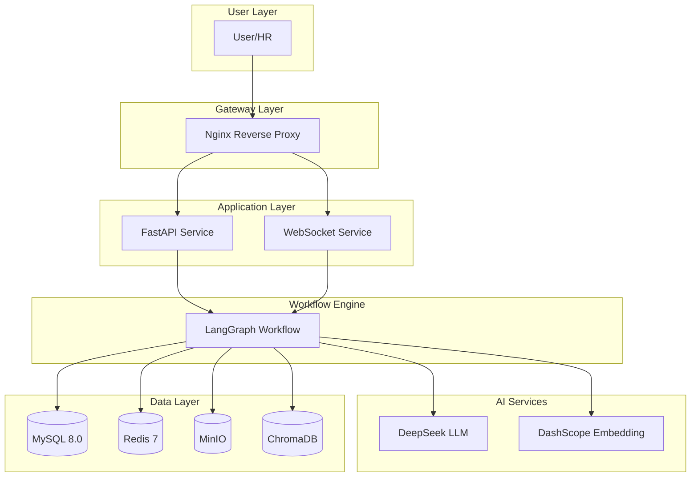

<div align="center">

# Resume Intelligent Screening System

**An intelligent resume screening platform based on LangChain + LangGraph + FastAPI, with LLM for smart parsing, screening and RAG Q&A.**

🌐 **Language**: English | [中文](README_CN.md)

[](https://blog.csdn.net/Yunyi_Chi)
[](https://github.com/xt765/ResumeScreening)
[](https://gitee.com/xt765/resume-screening)


</div>

## Background

In the recruitment process, HR needs to process a large number of resumes every day. Traditional manual screening methods have the following pain points:

| Pain Point | Description | Impact |
|------------|-------------|--------|
| Low Efficiency | Manual review of a resume takes 3-5 minutes on average | Long recruitment cycle, missing excellent candidates |
| Inconsistent Standards | Different HR screening standards vary subjectively | Uncontrollable screening results, uneven quality |
| Information Omission | Easy to miss key information or excellent candidates | Talent loss, increased recruitment costs |
| Difficult to Trace | Screening results lack data support and traceability | Cannot review and optimize screening standards |
| Difficult to Query | Hard to quickly retrieve and statistically analyze massive resumes | Data value cannot be mined |

This system uses Large Language Model (LLM) technology to achieve **intelligent parsing**, **automatic screening**, and **intelligent Q&A** of resumes, reducing traditional 3-5 minutes of manual screening to 3-5 seconds, improving efficiency by **more than 60 times**.

## Core Advantages

### 1. High Intelligence

Comparison between traditional manual screening and this system:


| Dimension | Traditional | This System | Improvement |
|-----------|-------------|-------------|-------------|
| Processing Speed | 3-5 min/resume | 3-5 sec/resume | **60x** |
| Information Extraction | Manual entry, easy to miss | AI auto extracts 20+ fields | **100% coverage** |
| Screening Standards | Subjective judgment, varies by person | LLM semantic understanding, unified standards | **Consistency guaranteed** |
| Data Retrieval | Browse files or Excel | Natural language intelligent Q&A | **Second-level response** |

**Core Capabilities**:
- **Intelligent Parsing**: Auto extract name, education, skills, work experience, etc. (20+ fields), support PDF/DOCX formats
- **Intelligent Screening**: Based on LLM semantic understanding, support natural language screening conditions
- **Intelligent Q&A**: RAG technology for resume library intelligent Q&A

### 2. Advanced Technical Architecture


### 3. Complete and Rich Features

| Feature Module | Description | Technical Highlights |
|----------------|-------------|---------------------|
| Resume Upload | Support PDF/DOCX batch upload | Async processing, real-time progress push |
| Intelligent Parsing | Auto extract structured information | LLM entity extraction, face detection |
| Condition Screening | Multi-dimensional intelligent screening | LLM semantic understanding, condition combination |
| Intelligent Q&A | Natural language query resume library | RAG + vector retrieval |
| System Monitoring | Real-time monitoring service status | Health check, log analysis |

### 4. Excellent Performance

| Metric | Value | Description |
|--------|-------|-------------|
| Single resume processing time | 3-5 sec | Full process including parsing, screening, storage |
| Batch upload support | 50+ files | Async background processing |
| Vector retrieval latency | <100ms | Thousand-level data volume |
| System availability | 99.9% | Docker containerized deployment |

## System Architecture

### Overall Architecture



### Technology Stack

| Category | Technology | Version | Reason for Selection |
|----------|------------|---------|---------------------|
| Backend Framework | FastAPI | >=0.120.0 | Async high performance, auto API documentation |
| LLM Framework | LangChain | >=1.2.0 | Mature LLM application development framework |
| Workflow Engine | LangGraph | >=1.0.0 | State machine workflow, visual orchestration |
| LLM | DeepSeek | - | Domestic LLM, high cost-effectiveness |
| Embedding | DashScope | - | Alibaba Cloud service, good Chinese effect |
| Database | MySQL | 8.0 | Mature and stable, transaction support |
| Cache | Redis | 7 | High-performance cache, multiple data structures |
| Object Storage | MinIO | - | S3 compatible, private deployment |
| Vector Database | ChromaDB | >=0.5.0 | Lightweight vector storage |
| Frontend | HTML/CSS/JS | - | Native implementation, no framework dependency |

## Core Workflow

### Resume Processing Flow


### RAG Intelligent Q&A Flow


## Data Model

### ER Diagram


## Quick Start

### Requirements

| Software | Version | Description |
|----------|---------|-------------|
| Python | 3.13+ | Core development language |
| Docker | 24.0+ | Containerized deployment |
| Docker Compose | 2.20+ | Service orchestration |
| uv | Latest | Python package manager |

### Local Development

```bash
# 1. Clone project
git clone https://gitee.com/xt765/resume-screening.git
cd resume-screening

# 2. Install dependencies
uv sync

# 3. Configure environment variables
cp .env.example .env
# Edit .env file, configure necessary parameters

# 4. Start dependency services
docker-compose up -d mysql redis minio

# 5. Initialize database
uv run python scripts/init_db.py
uv run python scripts/init_admin.py

# 6. Start backend service
uv run uvicorn src.api.main:app --host 0.0.0.0 --port 8000 --reload

# 7. Start frontend service (new terminal)
cd frontend-new && python -m http.server 3000
```

### Docker Deployment

```bash
# Start all services with one command
docker-compose up -d

# View service status
docker-compose ps
```

### Access URLs

| Service | URL | Description |
|---------|-----|-------------|
| Frontend | http://localhost:3000 | User interface |
| API Docs | http://localhost:8000/docs | Swagger interactive documentation |
| ReDoc | http://localhost:8000/redoc | ReDoc documentation |
| MinIO Console | http://localhost:9001 | Image storage management |

## Project Structure

```
ResumeScreening/
├── docs/                      # Documentation
│   ├── zh/                    # Chinese docs
│   └── en/                    # English docs
├── frontend-new/              # Frontend code
│   ├── index.html             # Entry page
│   ├── css/                   # Styles
│   └── js/                    # JavaScript
├── src/                       # Backend code
│   ├── api/                   # API routes
│   ├── core/                  # Core modules
│   ├── models/                # Data models
│   ├── schemas/               # Pydantic schemas
│   ├── services/              # Business services
│   ├── storage/               # Storage clients
│   ├── utils/                 # Utilities
│   └── workflows/             # LangGraph workflows
├── scripts/                   # Scripts
├── tests/                     # Tests
├── docker-compose.yml         # Docker compose
├── Dockerfile                 # Backend image
├── pyproject.toml             # Project config
├── README.md                  # English README
└── README_CN.md               # Chinese README
```

## Technical Highlights

### 1. LangGraph State Machine Workflow

- **State Persistence**: Each node state saved to database, supports checkpoint recovery
- **Visual Orchestration**: Workflow visualization, easy to understand and debug
- **Independent Testing**: Each node can be unit tested independently
- **Error Recovery**: Failed nodes can retry without re-executing the entire flow

### 2. RAG Retrieval Augmented Generation

- **Semantic Retrieval**: Vector similarity search, understands question intent
- **Traceable Sources**: Answers include source resume links, high credibility
- **Context Management**: Supports multi-turn dialogue, automatic context management
- **Real-time Update**: New resumes immediately searchable after storage

### 3. Multi-level Caching Strategy

- **Screening Condition Cache**: 5 min expiration, low change frequency
- **Task Status Cache**: 1 hour expiration after task completion
- **User Info Cache**: Valid during token period
- **Cache Penetration Protection**: Empty result cache for short time

### 4. Security Design

| Security Measure | Description | Implementation |
|------------------|-------------|----------------|
| Data Encryption | Sensitive info encrypted storage | AES-256 symmetric encryption |
| Password Security | Password irreversible storage | bcrypt hash |
| JWT Authentication | Stateless token authentication | HS256 signature |
| Permission Control | Three-level role permission system | RBAC model |

## Documentation

- [Architecture Design](docs/zh/architecture.md) - Detailed system architecture design
- [API Documentation](docs/zh/api.md) - Complete REST API documentation
- [Deployment Guide](docs/zh/deployment.md) - Docker deployment steps
- [Development Guide](docs/zh/development.md) - Development environment setup

## License

MIT License
