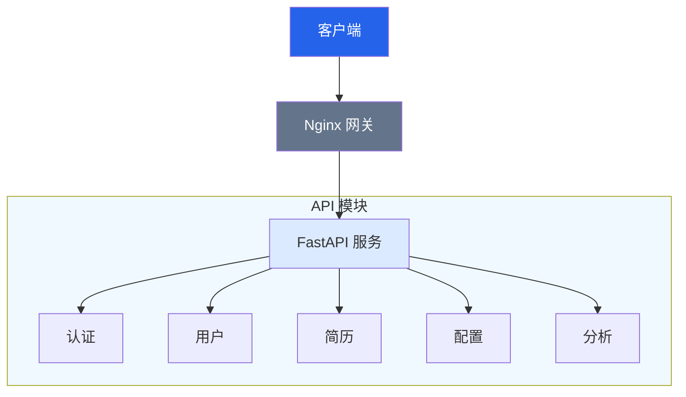
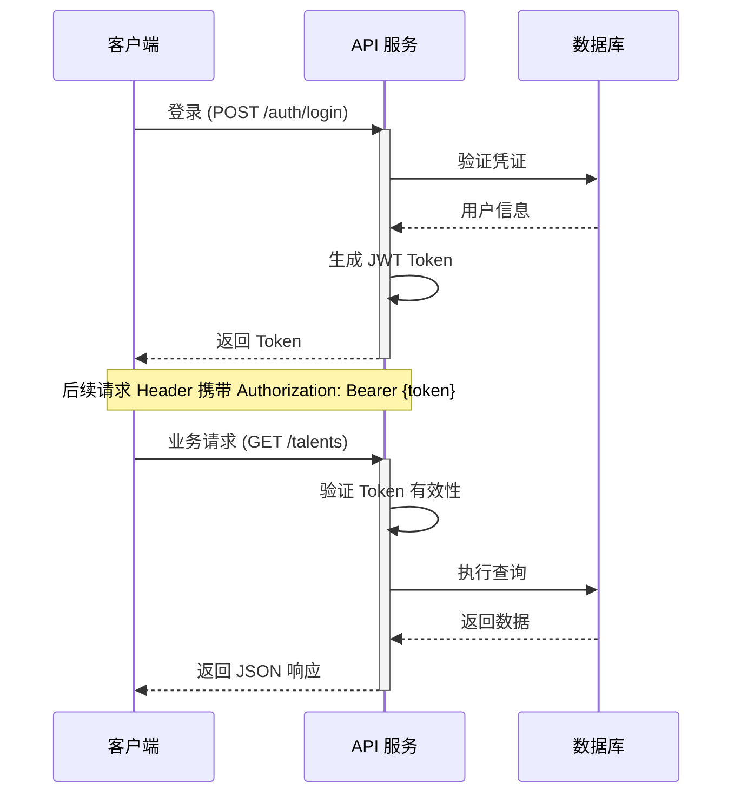
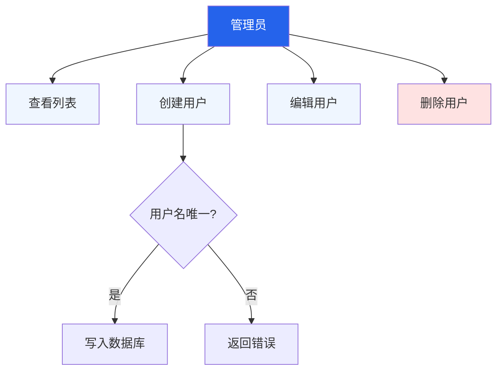
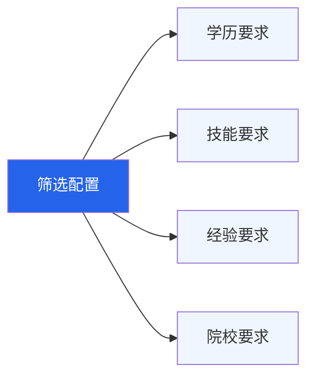
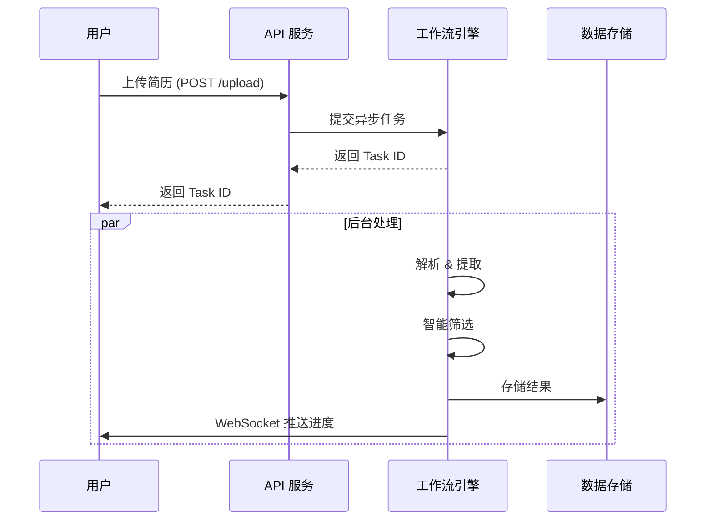
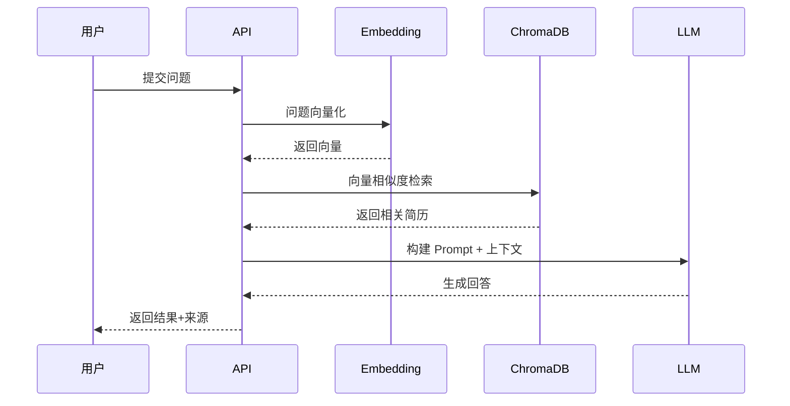
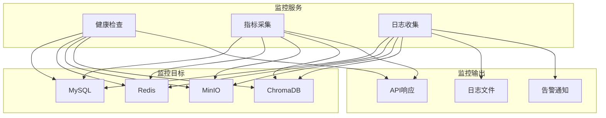
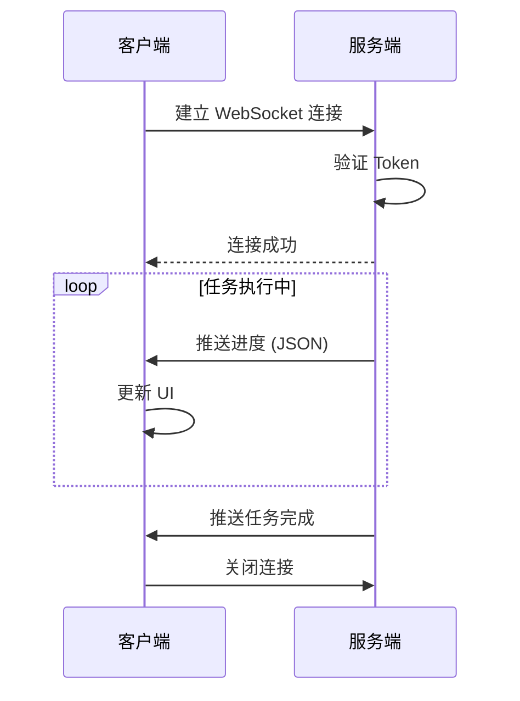

# API 接口文档

## 概述

本文档描述人才简历智能筛选系统的 REST API 接口规范。

| 配置项 | 值 |
|--------|-----|
| Base URL | `http://localhost:8000/api/v1` |
| 认证方式 | JWT Bearer Token |
| 数据格式 | JSON |
| 字符编码 | UTF-8 |

## API 架构



## 认证

### 认证流程



### 登录

```http
POST /auth/login
Content-Type: application/x-www-form-urlencoded

username=admin&password=admin123
```

**响应**:

```json
{
  "success": true,
  "message": "登录成功",
  "data": {
    "access_token": "eyJhbGciOiJIUzI1NiIsInR5cCI6IkpXVCJ9...",
    "token_type": "bearer",
    "user": {
      "id": "xxx",
      "username": "admin",
      "role": "admin"
    }
  }
}
```

### 认证请求

所有需要认证的接口需在请求头中携带 Token：

```http
Authorization: Bearer <access_token>
```

### 权限说明

| 角色 | 权限说明 | 可访问模块 |
|------|----------|------------|
| admin | 系统管理员 | 全部模块 |
| hr | HR人员 | 简历、条件、分析、监控 |
| viewer | 只读用户 | 简历查看、分析查询 |

## 用户管理

### 用户管理流程



### 获取用户列表

```http
GET /users
Authorization: Bearer <token>
```

**查询参数**:

| 参数 | 类型 | 必填 | 说明 |
|------|------|------|------|
| page | int | 否 | 页码，默认 1 |
| page_size | int | 否 | 每页数量，默认 20 |
| role | string | 否 | 角色筛选 |
| keyword | string | 否 | 关键词搜索 |

**响应**:

```json
{
  "success": true,
  "message": "获取成功",
  "data": {
    "items": [
      {
        "id": "xxx",
        "username": "admin",
        "email": "admin@example.com",
        "role": "admin",
        "is_active": true,
        "created_at": "2024-01-01T00:00:00"
      }
    ],
    "total": 100,
    "page": 1,
    "page_size": 20
  }
}
```

### 创建用户

```http
POST /users
Authorization: Bearer <token>
Content-Type: application/json

{
  "username": "newuser",
  "password": "password123",
  "email": "user@example.com",
  "role": "hr"
}
```

### 更新用户

```http
PUT /users/{user_id}
Authorization: Bearer <token>
Content-Type: application/json

{
  "email": "newemail@example.com",
  "role": "admin"
}
```

### 删除用户

```http
DELETE /users/{user_id}
Authorization: Bearer <token>
```

## 筛选条件管理

### 筛选条件结构



### 获取筛选条件列表

```http
GET /conditions
Authorization: Bearer <token>
```

**查询参数**:

| 参数 | 类型 | 必填 | 说明 |
|------|------|------|------|
| page | int | 否 | 页码 |
| page_size | int | 否 | 每页数量 |

**响应**:

```json
{
  "success": true,
  "message": "获取成功",
  "data": {
    "items": [
      {
        "id": "xxx",
        "name": "Java开发工程师",
        "description": "3年以上Java开发经验",
        "conditions": {
          "education_level": ["本科", "硕士"],
          "work_years_min": 3,
          "skills": ["Java", "Spring", "MySQL"],
          "school_tier": ["985", "211"]
        },
        "created_at": "2024-01-01T00:00:00"
      }
    ],
    "total": 50
  }
}
```

### 创建筛选条件

```http
POST /conditions
Authorization: Bearer <token>
Content-Type: application/json

{
  "name": "前端开发工程师",
  "description": "2年以上前端开发经验",
  "conditions": {
    "education_level": ["本科"],
    "work_years_min": 2,
    "skills": ["Vue", "React", "TypeScript"],
    "school_tier": []
  }
}
```

### 更新筛选条件

```http
PUT /conditions/{condition_id}
Authorization: Bearer <token>
Content-Type: application/json

{
  "name": "高级前端开发工程师",
  "conditions": {
    "work_years_min": 5
  }
}
```

### 删除筛选条件

```http
DELETE /conditions/{condition_id}
Authorization: Bearer <token>
```

## 人才管理

### 简历处理流程



### 获取人才列表

```http
GET /talents
Authorization: Bearer <token>
```

**查询参数**:

| 参数 | 类型 | 必填 | 说明 |
|------|------|------|------|
| page | int | 否 | 页码 |
| page_size | int | 否 | 每页数量 |
| screening_status | string | 否 | 筛选状态：qualified, unqualified |
| education_level | string | 否 | 学历筛选 |
| keyword | string | 否 | 关键词搜索 |
| skills | string | 否 | 技能筛选，逗号分隔 |

**响应**:

```json
{
  "success": true,
  "message": "获取成功",
  "data": {
    "items": [
      {
        "id": "xxx",
        "name": "张三",
        "education_level": "本科",
        "school": "清华大学",
        "major": "计算机科学",
        "work_years": 5,
        "skills": ["Java", "Python", "MySQL"],
        "screening_status": "qualified",
        "created_at": "2024-01-01T00:00:00"
      }
    ],
    "total": 200
  }
}
```

### 获取人才详情

```http
GET /talents/{talent_id}
Authorization: Bearer <token>
```

**响应**:

```json
{
  "success": true,
  "message": "获取成功",
  "data": {
    "id": "xxx",
    "name": "张三",
    "phone": "138****1234",
    "email": "zhang***@example.com",
    "education_level": "本科",
    "school": "清华大学",
    "major": "计算机科学",
    "graduation_date": "2019-06",
    "work_years": 5,
    "skills": ["Java", "Python", "MySQL", "Redis"],
    "work_experience": [
      {
        "company": "某科技公司",
        "position": "高级开发工程师",
        "duration": "2020-2024"
      }
    ],
    "projects": [
      {
        "name": "电商平台",
        "role": "技术负责人",
        "description": "负责整体架构设计"
      }
    ],
    "screening_status": "qualified",
    "qualification_reason": "符合所有筛选条件",
    "photo_urls": ["http://minio:9000/..."],
    "created_at": "2024-01-01T00:00:00"
  }
}
```

### 上传单个简历

```http
POST /talents/upload
Authorization: Bearer <token>
Content-Type: multipart/form-data

file: <简历文件>
condition_id: xxx
```

**响应**:

```json
{
  "success": true,
  "message": "简历处理完成",
  "data": {
    "talent_id": "xxx",
    "is_qualified": true,
    "qualification_reason": "符合所有筛选条件",
    "processing_time": 3500
  }
}
```

### 批量上传简历

```http
POST /talents/batch-upload
Authorization: Bearer <token>
Content-Type: multipart/form-data

files: <简历文件1>
files: <简历文件2>
...
condition_id: xxx
```

**响应**:

```json
{
  "success": true,
  "message": "批量上传任务已创建",
  "data": {
    "task_id": "xxx",
    "file_count": 10
  }
}
```

### 更新人才信息

```http
PUT /talents/{talent_id}
Authorization: Bearer <token>
Content-Type: application/json

{
  "name": "李四",
  "skills": ["Java", "Spring", "Kubernetes"]
}
```

### 删除人才

```http
DELETE /talents/{talent_id}
Authorization: Bearer <token>
```

### 恢复已删除人才

```http
POST /talents/{talent_id}/restore
Authorization: Bearer <token>
```

### 批量删除人才

```http
POST /talents/batch-delete
Authorization: Bearer <token>
Content-Type: application/json

{
  "ids": ["id1", "id2", "id3"]
}
```

### 批量更新筛选状态

```http
POST /talents/batch-update-status
Authorization: Bearer <token>
Content-Type: application/json

{
  "ids": ["id1", "id2"],
  "screening_status": "qualified"
}
```

### 同步 ChromaDB 数据

```http
POST /talents/sync-chroma
Authorization: Bearer <token>
```

**响应**:

```json
{
  "success": true,
  "message": "同步完成，修复了 5 条记录",
  "data": {
    "mysql_count": 100,
    "chroma_count": 95,
    "missing_in_chroma": ["id1", "id2"],
    "extra_in_chroma": ["id3"],
    "status_mismatch": ["id4", "id5"],
    "fixed_count": 5
  }
}
```

### 获取任务状态

```http
GET /talents/tasks/{task_id}
Authorization: Bearer <token>
```

**响应**:

```json
{
  "success": true,
  "message": "获取成功",
  "data": {
    "id": "xxx",
    "name": "批量上传简历 (10 个文件)",
    "status": "running",
    "progress": {
      "current": 5,
      "total": 10,
      "percentage": 50.0,
      "message": "正在处理第 5 个文件"
    },
    "created_at": "2024-01-01T00:00:00"
  }
}
```

### 取消任务

```http
POST /talents/tasks/{task_id}/cancel
Authorization: Bearer <token>
```

## RAG 智能分析

### RAG 查询流程



### 异步智能问答（推荐）

创建异步 RAG 查询任务，支持后台处理和进度追踪：

```http
POST /analysis/query-async
Authorization: Bearer <token>
Content-Type: application/json

{
  "query": "有哪些5年以上工作经验的Java开发工程师？",
  "top_k": 10,
  "filters": null
}
```

**响应**:

```json
{
  "success": true,
  "message": "任务已创建",
  "data": {
    "task_id": "xxx-xxx-xxx",
    "status": "pending",
    "message": "RAG 查询任务已创建，正在后台处理"
  }
}
```

### 获取分析任务状态

```http
GET /analysis/tasks/{task_id}
Authorization: Bearer <token>
```

**响应**:

```json
{
  "success": true,
  "message": "获取成功",
  "data": {
    "id": "xxx-xxx-xxx",
    "name": "rag_query",
    "status": "running",
    "progress": {
      "current": 2,
      "total": 3,
      "percentage": 66.67,
      "message": "正在生成分析结论..."
    },
    "result": null,
    "error": null,
    "created_at": "2024-01-01T10:00:00",
    "updated_at": "2024-01-01T10:00:05"
  }
}
```

**任务状态说明**:

| 状态 | 说明 |
|------|------|
| pending | 任务等待执行 |
| running | 任务执行中 |
| completed | 任务完成 |
| failed | 任务失败 |
| cancelled | 任务已取消 |

### 导出分析报告

```http
GET /analysis/tasks/{task_id}/export
Authorization: Bearer <token>
```

**响应**: Markdown 文件下载

### 同步智能问答

```http
POST /analysis/query
Authorization: Bearer <token>
Content-Type: application/json

{
  "question": "有哪些5年以上工作经验的Java开发工程师？",
  "top_k": 10
}
```

**响应**:

```json
{
  "success": true,
  "message": "查询成功",
  "data": {
    "answer": "根据简历库查询，共有 15 位候选人符合条件...",
    "sources": [
      {
        "id": "xxx",
        "name": "张三",
        "school": "清华大学",
        "similarity": 0.92,
        "content": "简历摘要..."
      }
    ],
    "analytics": {
      "total_count": 15,
      "avg_similarity": 0.85,
      "by_education": {"本科": 10, "硕士": 5},
      "top_skills": [
        {"name": "Java", "count": 15},
        {"name": "Spring", "count": 12}
      ]
    }
  }
}
```

### 获取查询历史

```http
GET /analysis/history
Authorization: Bearer <token>
```

**查询参数**:

| 参数 | 类型 | 必填 | 说明 |
|------|------|------|------|
| page | int | 否 | 页码 |
| page_size | int | 否 | 每页数量 |

## 系统监控

### 监控架构



### 获取系统指标

```http
GET /monitor/metrics
Authorization: Bearer <token>
```

**响应**:

```json
{
  "success": true,
  "message": "获取成功",
  "data": {
    "cpu_percent": 45.5,
    "memory_percent": 62.3,
    "disk_percent": 35.0,
    "uptime": 86400,
    "talent_count": 1000,
    "qualified_count": 650,
    "unqualified_count": 350
  }
}
```

### 获取系统日志

```http
GET /monitor/logs
Authorization: Bearer <token>
```

**查询参数**:

| 参数 | 类型 | 必填 | 说明 |
|------|------|------|------|
| level | string | 否 | 日志级别：DEBUG, INFO, WARNING, ERROR |
| limit | int | 否 | 返回条数，默认 100 |

### 获取服务状态

```http
GET /monitor/services
Authorization: Bearer <token>
```

**响应**:

```json
{
  "success": true,
  "message": "获取成功",
  "data": {
    "mysql": {"status": "healthy"},
    "redis": {"status": "healthy"},
    "minio": {"status": "healthy"},
    "chromadb": {"status": "healthy"}
  }
}
```

## WebSocket 接口

### 连接流程



### 连接

```javascript
const ws = new WebSocket('ws://localhost:8000/ws/tasks');
```

### 消息格式

**服务端推送**:

```json
{
  "type": "task_update",
  "task_id": "xxx",
  "data": {
    "status": "running",
    "progress": {
      "current": 5,
      "total": 10,
      "percentage": 50.0,
      "message": "正在处理第 5 个文件"
    }
  }
}
```

## 错误响应

所有接口错误响应格式：

```json
{
  "success": false,
  "message": "错误描述",
  "data": null
}
```

### 常见错误码

| HTTP 状态码 | 说明 | 处理建议 |
|------------|------|----------|
| 400 | 请求参数错误 | 检查请求参数格式 |
| 401 | 未认证 | 重新登录获取Token |
| 403 | 权限不足 | 联系管理员提升权限 |
| 404 | 资源不存在 | 检查资源ID是否正确 |
| 500 | 服务器内部错误 | 联系技术支持 |

## 分页格式

列表接口统一返回分页格式：

```json
{
  "success": true,
  "message": "获取成功",
  "data": {
    "items": [...],
    "total": 100,
    "page": 1,
    "page_size": 20,
    "pages": 5
  }
}
```

## API 调用示例

### Python 示例

```python
import requests

# 登录获取Token
response = requests.post(
    "http://localhost:8000/api/v1/auth/login",
    data={"username": "admin", "password": "admin123"}
)
token = response.json()["data"]["access_token"]

# 使用Token访问API
headers = {"Authorization": f"Bearer {token}"}
response = requests.get(
    "http://localhost:8000/api/v1/talents",
    headers=headers
)
print(response.json())
```

### JavaScript 示例

```javascript
// 登录获取Token
const loginRes = await fetch('http://localhost:8000/api/v1/auth/login', {
    method: 'POST',
    headers: {'Content-Type': 'application/x-www-form-urlencoded'},
    body: 'username=admin&password=admin123'
});
const {data: {access_token}} = await loginRes.json();

// 使用Token访问API
const res = await fetch('http://localhost:8000/api/v1/talents', {
    headers: {'Authorization': `Bearer ${access_token}`}
});
const data = await res.json();
console.log(data);
```
