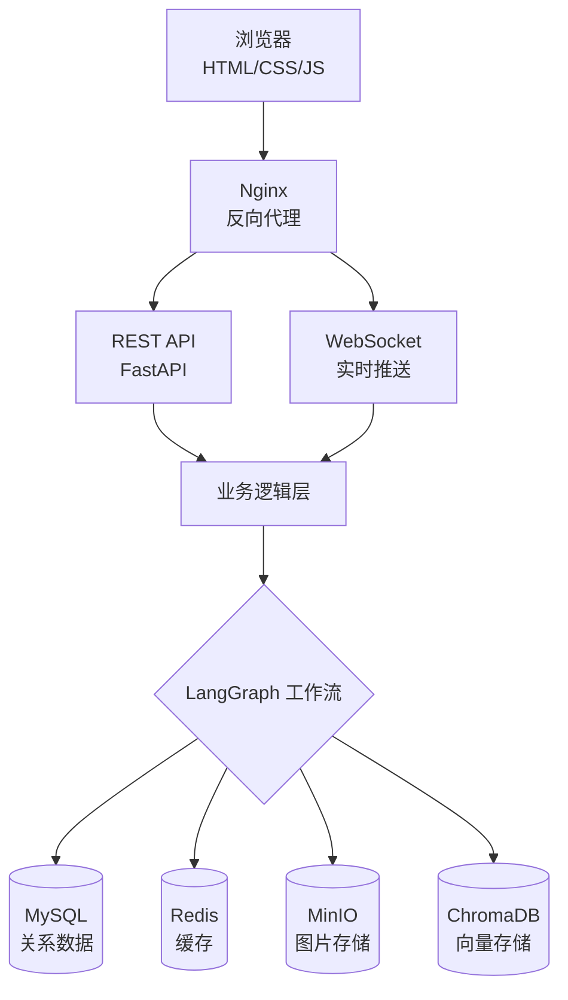
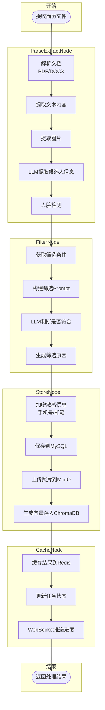
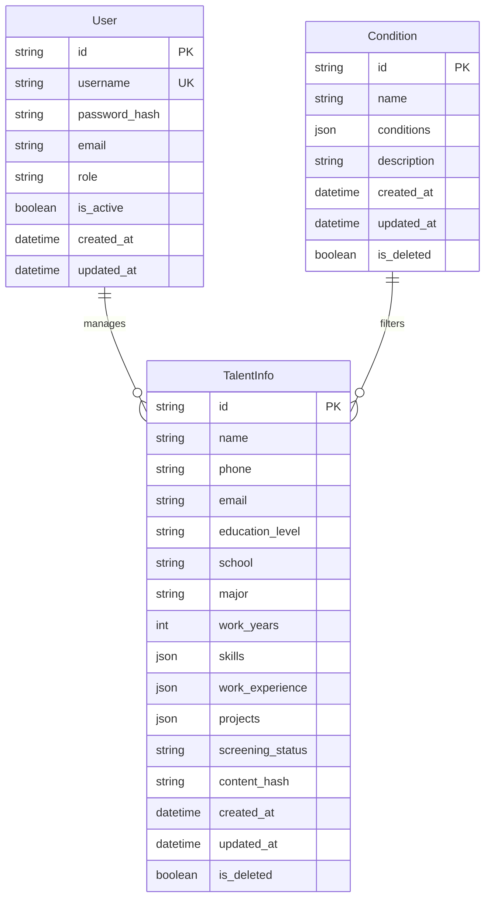

# 系统架构设计文档

## 1. 系统概述

人才简历智能筛选系统是一个基于 LLM 的智能简历处理平台，实现简历自动解析、信息提取、智能筛选和 RAG 问答功能。

### 1.1 设计目标

- **智能化**: 利用 LLM 实现简历信息自动提取和智能筛选
- **高性能**: 异步处理架构，支持批量简历上传
- **可扩展**: 模块化设计，便于功能扩展
- **高可用**: 容器化部署，支持水平扩展

### 1.2 技术选型

| 层级 | 技术选型 | 选型理由 |
|------|----------|----------|
| 后端框架 | FastAPI | 高性能异步框架，原生支持 OpenAPI |
| LLM 框架 | LangChain | 成熟的 LLM 应用开发框架 |
| 工作流引擎 | LangGraph | 状态图工作流，适合复杂业务流程 |
| 关系数据库 | MySQL 8.0 | 成熟稳定，支持事务 |
| 缓存 | Redis 7 | 高性能缓存，支持多种数据结构 |
| 对象存储 | MinIO | S3 兼容，私有化部署 |
| 向量数据库 | ChromaDB | 轻量级向量存储，易于集成 |
| LLM | DeepSeek | 国产大模型，性价比高 |
| Embedding | DashScope | 阿里云服务，中文效果好 |

## 2. 系统架构

### 2.1 整体架构图



### 2.2 核心模块架构

#### 2.2.1 API 层

```
src/api/
├── main.py              # FastAPI 应用入口
├── deps.py              # 依赖注入
└── v1/                  # v1 版本 API
    ├── auth.py          # 认证接口
    ├── users.py         # 用户管理接口
    ├── conditions.py    # 筛选条件接口
    ├── talents.py       # 简历管理接口
    ├── analysis.py      # RAG 分析接口
    ├── monitor.py       # 系统监控接口
    └── websocket.py     # WebSocket 接口
```

#### 2.2.2 工作流层

```
src/workflows/
├── state.py              # 状态定义 (ResumeState)
├── resume_workflow.py    # 工作流编排
├── parse_extract_node.py # 解析提取节点
├── filter_node.py        # 筛选判断节点
├── store_node.py         # 存储节点
└── cache_node.py         # 缓存节点
```

#### 2.2.3 存储层

```
src/storage/
├── chroma_client.py      # ChromaDB 客户端
├── minio_client.py       # MinIO 客户端
└── redis_client.py       # Redis 客户端
```

## 3. 核心工作流设计

### 3.1 简历处理工作流

系统采用 LangGraph 构建 4 节点状态图工作流：



#### 各节点职责

| 节点 | 职责 | 输入 | 输出 |
|------|------|------|------|
| **ParseExtractNode** | 解析文档并提取候选人信息 | 简历文件路径 | `text_content`、`images`、`candidate_info` |
| **FilterNode** | 根据筛选条件判断是否符合要求 | `candidate_info`、筛选条件 | `is_qualified`、`qualification_reason` |
| **StoreNode** | 持久化存储处理结果 | 全部状态数据 | `talent_id`、`photo_urls` |
| **CacheNode** | 缓存处理结果 | 全部状态数据 | 任务状态更新、WebSocket推送 |

### 3.2 状态定义

```python
class ResumeState(BaseModel):
    # 输入数据
    file_path: str                    # 简历文件路径
    file_content: bytes | None        # 文件二进制内容
    file_type: str | None             # 文件类型
    content_hash: str | None          # 内容哈希（去重）

    # 解析提取结果
    text_content: str | None          # 提取的文本
    images: list[bytes] | None        # 提取的图片

    # LLM 提取结果
    candidate_info: dict | None       # 候选人信息

    # 筛选条件
    condition_id: str | None          # 筛选条件 ID
    condition_config: dict | None     # 筛选条件配置

    # 筛选结果
    is_qualified: bool | None         # 是否符合条件
    qualification_reason: str | None  # 筛选原因

    # 存储结果
    talent_id: str | None             # 人才 ID
    photo_urls: list[str] | None      # 照片 URL

    # 错误处理
    error_message: str | None         # 错误信息
    error_node: str | None            # 错误节点

    # 工作流状态
    workflow_status: str              # 工作流状态
    processing_time: int | None       # 处理耗时
```

## 4. 数据模型设计

### 4.1 ER 图



#### 图表说明

**实体关系**：
- **User → TalentInfo**：一对多关系，一个用户可以管理多个人才信息
- **Condition → TalentInfo**：一对多关系，一个筛选条件可以应用于多个人才

**核心实体**：

| 实体 | 说明 | 核心字段 |
|------|------|----------|
| **User** | 系统用户表，存储登录账户信息 | `username`(唯一)、`role`(角色权限) |
| **TalentInfo** | 人才信息表，存储简历提取的结构化数据 | `name`、`school`、`skills`、`screening_status` |
| **Condition** | 筛选条件表，存储自定义筛选规则 | `name`、`conditions`(JSON格式条件) |

**特殊字段说明**：
- `PK`：主键 (Primary Key)
- `UK`：唯一键 (Unique Key)
- `phone/email`：使用 AES 加密存储敏感信息
- `content_hash`：简历内容哈希，用于去重
- `skills/work_experience/projects`：JSON 格式存储复杂数据

### 4.2 核心表结构

#### 4.2.1 User 表

| 字段 | 类型 | 说明 |
|------|------|------|
| id | VARCHAR(36) | 主键，UUID |
| username | VARCHAR(50) | 用户名，唯一 |
| password_hash | VARCHAR(255) | 密码哈希 |
| email | VARCHAR(100) | 邮箱 |
| role | ENUM | 角色：admin, hr, viewer |
| is_active | BOOLEAN | 是否激活 |
| created_at | DATETIME | 创建时间 |
| updated_at | DATETIME | 更新时间 |

#### 4.2.2 TalentInfo 表

| 字段 | 类型 | 说明 |
|------|------|------|
| id | VARCHAR(36) | 主键，UUID |
| name | VARCHAR(50) | 姓名 |
| phone | VARCHAR(255) | 手机号（AES 加密） |
| email | VARCHAR(255) | 邮箱（AES 加密） |
| education_level | VARCHAR(20) | 学历 |
| school | VARCHAR(100) | 毕业院校 |
| major | VARCHAR(100) | 专业 |
| work_years | INT | 工作年限 |
| skills | JSON | 技能列表 |
| work_experience | JSON | 工作经历 |
| projects | JSON | 项目经历 |
| screening_status | ENUM | 筛选状态 |
| content_hash | VARCHAR(64) | 内容哈希 |
| created_at | DATETIME | 创建时间 |
| updated_at | DATETIME | 更新时间 |
| is_deleted | BOOLEAN | 是否删除 |

#### 4.2.3 Condition 表

| 字段 | 类型 | 说明 |
|------|------|------|
| id | VARCHAR(36) | 主键，UUID |
| name | VARCHAR(100) | 条件名称 |
| conditions | JSON | 筛选条件配置 |
| description | TEXT | 条件描述 |
| created_at | DATETIME | 创建时间 |
| updated_at | DATETIME | 更新时间 |
| is_deleted | BOOLEAN | 是否删除 |

## 5. 安全设计

### 5.1 认证授权

- **JWT Token**: 使用 JWT 进行身份认证
- **角色权限**: admin > hr > viewer 三级权限
- **Token 过期**: 默认 24 小时过期

### 5.2 数据加密

- **敏感字段加密**: 手机号、邮箱使用 AES 加密存储
- **密码哈希**: 使用 bcrypt 进行密码哈希
- **传输加密**: HTTPS 传输

### 5.3 接口安全

- **请求验证**: Pydantic 模型验证
- **权限检查**: 装饰器权限验证
- **SQL 注入防护**: SQLAlchemy ORM

## 6. 性能优化

### 6.1 异步处理

- 所有 I/O 操作使用 async/await
- 批量上传使用后台任务
- WebSocket 实时推送进度

### 6.2 缓存策略

- **Redis 缓存**: 筛选条件、任务状态
- **内存缓存**: LLM 客户端、Embedding 服务
- **缓存过期**: 5 分钟自动过期

### 6.3 数据库优化

- **索引优化**: content_hash、name、school 等字段索引
- **连接池**: SQLAlchemy 异步连接池
- **批量操作**: 批量插入、批量查询

## 7. 监控与日志

### 7.1 日志系统

- **Loguru**: 结构化 JSON 日志
- **日志轮转**: 按日轮转，保留 30 天
- **异常追踪**: 完整异常堆栈记录

### 7.2 健康检查

- **MySQL**: 连接测试
- **Redis**: PING 命令
- **MinIO**: 健康检查 API
- **ChromaDB**: 心跳检测

### 7.3 系统监控

- CPU、内存使用率
- 请求响应时间
- 任务处理统计
