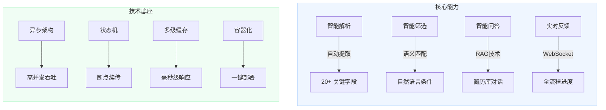
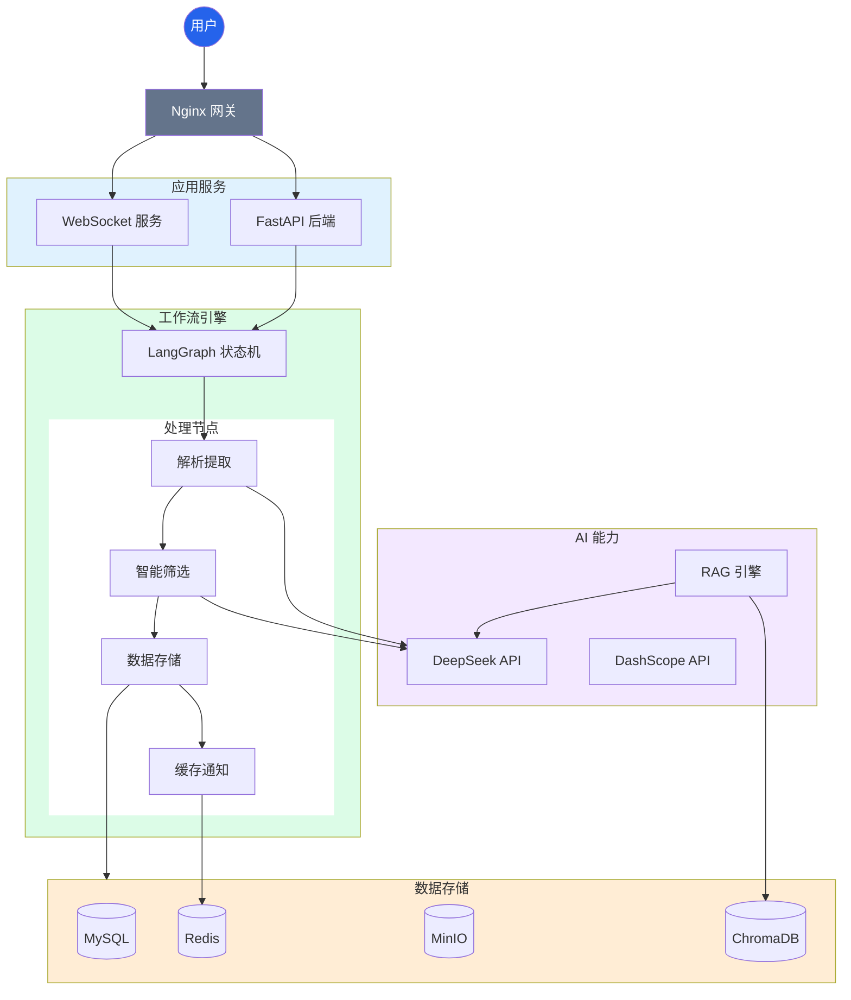
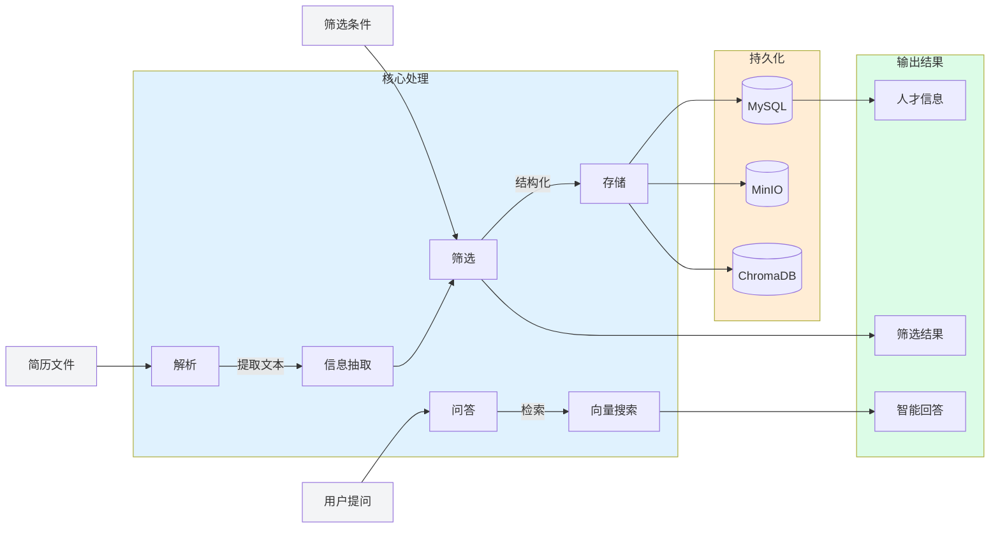
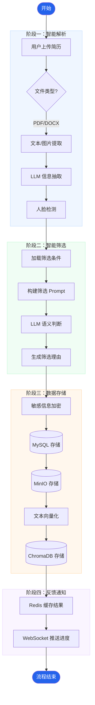
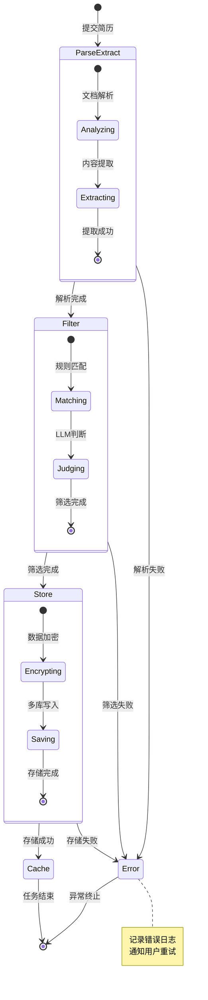
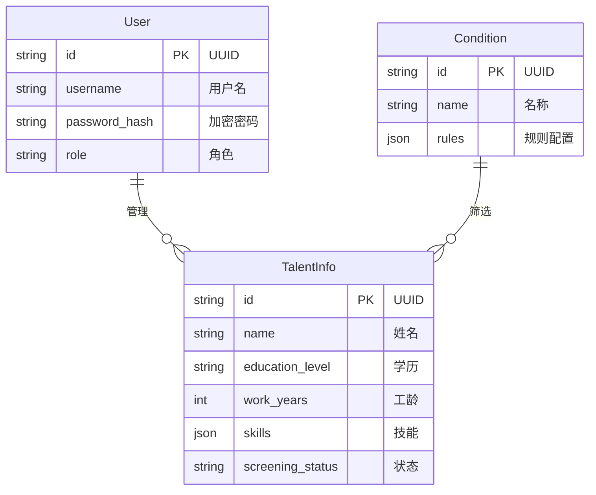
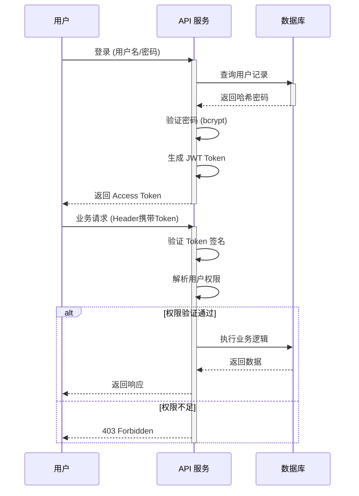
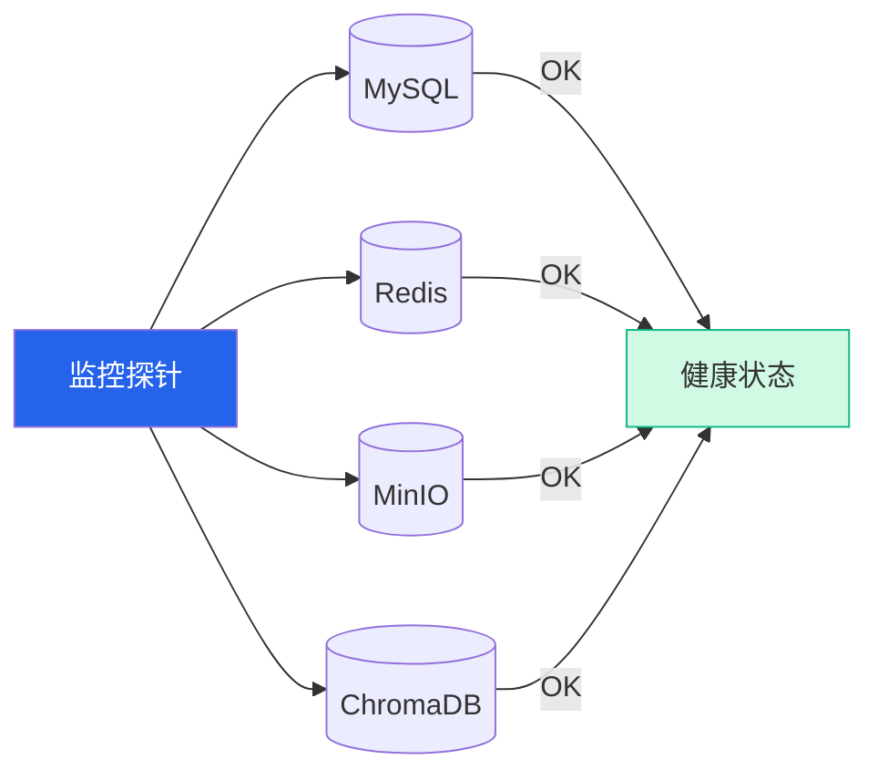

# 系统架构设计文档

## 1. 系统概述

人才简历智能筛选系统是一个基于大语言模型（LLM）的企业级智能简历处理平台，集成 LangChain、LangGraph、FastAPI 等先进技术，实现简历自动解析、智能筛选和 RAG 智能问答功能。

### 1.1 设计目标

| 目标             | 说明                                    | 实现方式                      |
| ---------------- | --------------------------------------- | ----------------------------- |
| **智能化** | 利用 LLM 实现简历信息自动提取和智能筛选 | DeepSeek 大模型 + LangChain   |
| **高性能** | 异步处理架构，支持批量简历上传          | FastAPI 异步 + 后台任务       |
| **可扩展** | 模块化设计，便于功能扩展                | LangGraph 工作流 + 微服务架构 |
| **高可用** | 容器化部署，支持水平扩展                | Docker + Docker Compose       |
| **安全性** | 多层安全防护，保护敏感数据              | AES 加密 + JWT 认证           |

### 1.2 技术选型

技术选型遵循"成熟稳定、开源优先、易于维护"的原则：

| 层级       | 技术选型  | 版本      | 选型理由                                       |
| ---------- | --------- | --------- | ---------------------------------------------- |
| 后端框架   | FastAPI   | >=0.120.0 | 高性能异步框架，原生支持 OpenAPI，类型提示友好 |
| LLM 框架   | LangChain | >=1.2.0   | 成熟的 LLM 应用开发框架，统一的大模型调用接口  |
| 工作流引擎 | LangGraph | >=1.0.0   | 状态图工作流，适合复杂业务流程，支持断点续传   |
| 关系数据库 | MySQL     | 8.0       | 成熟稳定，支持事务，社区活跃                   |
| 缓存       | Redis     | 7         | 高性能缓存，支持多种数据结构，可用于消息队列   |
| 对象存储   | MinIO     | -         | S3 兼容的私有化对象存储，部署简单，成本低      |
| 向量数据库 | ChromaDB  | >=0.5.0   | 轻量级向量存储，易于集成，无需额外依赖         |
| LLM        | DeepSeek  | -         | 国产大模型，中文理解能力强，性价比高           |
| Embedding  | DashScope | -         | 阿里云服务，中文语义效果好，稳定可靠           |

### 1.3 系统特性



## 2. 系统架构

### 2.1 整体架构图

系统采用分层架构设计，各层职责清晰，便于维护和扩展：



**各层职责说明**：

| 层级         | 组件                       | 职责                                   | 关键技术            |
| ------------ | -------------------------- | -------------------------------------- | ------------------- |
| 用户接入层   | 浏览器                     | 用户交互界面，响应式设计               | HTML/CSS/JavaScript |
| 网关接入层   | Nginx                      | 反向代理、负载均衡、SSL 证书、静态资源 | Nginx 配置          |
| 应用服务层   | FastAPI                    | 业务逻辑处理、API 接口                 | FastAPI、Pydantic   |
| 实时通信     | WebSocket                  | 实时进度推送                           | WebSocket 协议      |
| 工作流引擎层 | LangGraph                  | 简历处理流程编排、状态管理             | LangGraph 状态机    |
| AI 能力层    | DeepSeek + DashScope       | 文本理解、信息提取、向量化             | LLM、Embedding      |
| 数据存储层   | MySQL/Redis/MinIO/ChromaDB | 数据持久化、缓存、文件存储、向量检索   | 各存储引擎          |

### 2.2 核心模块架构

#### 2.2.1 API 层

API 层采用 FastAPI 框架，提供 RESTful API 接口：

```
src/api/
├── main.py              # FastAPI 应用入口，路由注册
├── deps.py              # 依赖注入，数据库会话、认证
└── v1/                  # v1 版本 API
    ├── auth.py          # 认证接口：登录、登出
    ├── users.py         # 用户管理：CRUD 操作
    ├── conditions.py    # 筛选条件：条件配置管理
    ├── talents.py       # 简历管理：上传、查询、状态更新
    ├── analysis.py      # RAG 分析：智能问答
    ├── monitor.py       # 系统监控：健康检查、指标
    └── websocket.py     # WebSocket：实时进度推送
```

**API 设计原则**：

- **RESTful 风格**：遵循 REST 规范，资源导向设计
- **版本控制**：通过 URL 路径 `/api/v1/` 进行版本控制
- **统一响应**：所有接口返回统一的 `APIResponse` 格式
- **异常处理**：全局异常处理器，统一错误响应

#### 2.2.2 工作流层

工作流层采用 LangGraph 构建 4 节点状态机：

```
src/workflows/
├── state.py              # 状态定义 (ResumeState)
├── resume_workflow.py    # 工作流编排，节点连接
├── parse_extract_node.py # 解析提取节点
├── filter_node.py        # 筛选判断节点
├── store_node.py         # 存储节点
└── cache_node.py         # 缓存节点
```

**工作流设计优势**：

| 特性       | 说明                                   |
| ---------- | -------------------------------------- |
| 状态持久化 | 每个节点状态保存到数据库，支持断点续传 |
| 可视化编排 | 工作流可视化，便于理解和调试           |
| 独立测试   | 每个节点可独立单元测试                 |
| 错误恢复   | 失败节点可重试，无需重新执行整个流程   |

#### 2.2.3 存储层

存储层采用多模态存储策略，支持本地回退（Local Fallback）：

```
src/storage/
├── chroma_client.py      # ChromaDB 客户端，向量存储
├── minio_client.py       # MinIO 客户端，图片存储（支持本地文件系统回退）
└── redis_client.py       # Redis 客户端，缓存（支持内存字典回退）
```

**存储策略**：

| 存储类型 | 用途           | 数据示例                     | 备选方案 |
| -------- | -------------- | ---------------------------- | -------- |
| MySQL    | 结构化数据存储 | 人才信息、筛选条件、用户数据 | SQLite (开发环境) |
| Redis    | 缓存、任务状态 | 筛选条件缓存、任务进度       | 内存字典 (MemoryCache) |
| MinIO    | 图片对象存储   | 简历照片、证件照             | 本地文件系统 (LocalFileStorage) |
| ChromaDB | 向量数据存储   | 简历文本向量                 | - |

### 2.3 数据流图



## 3. 核心工作流设计

### 3.1 简历处理工作流

系统采用 LangGraph 构建 4 节点状态图工作流，每个节点职责明确：



#### 各节点详细说明

##### ParseExtractNode - 解析提取节点

**职责**：将非结构化简历文档转换为结构化数据

**处理步骤**：

| 步骤     | 说明                     | 技术实现                          |
| -------- | ------------------------ | --------------------------------- |
| 文档解析 | 根据文件类型选择解析器   | PyMuPDF (PDF)、python-docx (DOCX) |
| 文本提取 | 提取文本内容，保留格式   | 正则表达式、文本处理              |
| 图片提取 | 提取嵌入图片             | 文档解析库                        |
| LLM 提取 | 调用大模型提取结构化信息 | DeepSeek API                      |
| 人脸检测 | 检测照片中的人脸         | OpenCV Haar 级联分类器            |

**输出数据**：

- `text_content`：提取的文本内容
- `images`：提取的图片列表
- `candidate_info`：LLM 提取的候选人信息

##### FilterNode - 筛选判断节点

**职责**：根据预设条件判断候选人是否符合要求

**处理步骤**：

| 步骤        | 说明                       | 技术实现     |
| ----------- | -------------------------- | ------------ |
| 获取条件    | 从数据库读取筛选条件配置   | MySQL 查询   |
| 构建 Prompt | 将条件转换为自然语言描述   | Prompt 模板  |
| LLM 判断    | 调用大模型进行语义理解匹配 | DeepSeek API |
| 生成原因    | 详细说明符合/不符合的原因  | LLM 生成     |

**输出数据**：

- `is_qualified`：是否符合条件（布尔值）
- `qualification_reason`：筛选原因（文本）

##### StoreNode - 数据存储节点

**职责**：持久化存储处理结果

**处理步骤**：

| 步骤         | 说明                   | 技术实现             |
| ------------ | ---------------------- | -------------------- |
| 加密敏感信息 | 对手机号、邮箱进行加密 | AES-256 对称加密     |
| 保存 MySQL   | 存储人才信息到数据库   | SQLAlchemy ORM       |
| 上传 MinIO   | 存储简历照片           | MinIO SDK            |
| 向量存储     | 生成文本向量并存储     | DashScope + ChromaDB |

**输出数据**：

- `talent_id`：人才 ID
- `photo_urls`：照片 URL 列表

##### CacheNode - 缓存节点

**职责**：缓存处理结果，推送实时进度

**处理步骤**：

| 步骤           | 说明               | 技术实现       |
| -------------- | ------------------ | -------------- |
| 缓存 Redis     | 存储处理结果       | Redis SETEX    |
| 更新状态       | 更新数据库任务记录 | MySQL UPDATE   |
| WebSocket 推送 | 实时通知前端       | WebSocket 协议 |

**输出数据**：

- 任务状态更新
- WebSocket 通知

### 3.2 状态定义

工作流状态使用 Pydantic BaseModel 定义：

```python
class ResumeState(BaseModel):
    """简历处理工作流状态。"""
  
    # 输入数据
    file_path: str                    # 简历文件路径
    file_content: bytes | None        # 文件二进制内容
    file_type: str | None             # 文件类型 (pdf/docx)
    content_hash: str | None          # 内容哈希（去重）

    # 解析提取结果
    text_content: str | None          # 提取的文本
    images: list[bytes] | None        # 提取的图片

    # LLM 提取结果
    candidate_info: dict | None       # 候选人信息字典

    # 筛选条件
    condition_id: str | None          # 筛选条件 ID
    condition_config: dict | None     # 筛选条件配置

    # 筛选结果
    is_qualified: bool | None         # 是否符合条件
    qualification_reason: str | None  # 筛选原因

    # 存储结果
    talent_id: str | None             # 人才 ID
    photo_urls: list[str] | None      # 照片 URL 列表

    # 错误处理
    error_message: str | None         # 错误信息
    error_node: str | None            # 错误节点名称

    # 工作流状态
    workflow_status: str              # 工作流状态
    processing_time: int | None       # 处理耗时（毫秒）
```

### 3.3 工作流状态机



## 4. 数据模型设计

### 4.1 ER 图

系统数据模型包含三个核心实体：



### 4.2 实体关系说明

| 关系                    | 类型   | 说明                           |
| ----------------------- | ------ | ------------------------------ |
| User → TalentInfo      | 一对多 | 一个用户可以管理多个人才信息   |
| Condition → TalentInfo | 一对多 | 一个筛选条件可以应用于多个人才 |

### 4.3 核心表结构

#### 4.3.1 User 表

| 字段          | 类型         | 约束         | 说明                    |
| ------------- | ------------ | ------------ | ----------------------- |
| id            | VARCHAR(36)  | PK           | 主键，UUID 格式         |
| username      | VARCHAR(50)  | UK, NOT NULL | 用户名，唯一            |
| password_hash | VARCHAR(255) | NOT NULL     | 密码哈希，bcrypt        |
| email         | VARCHAR(100) |              | 邮箱地址                |
| role          | ENUM         | NOT NULL     | 角色：admin, hr, viewer |
| is_active     | BOOLEAN      | DEFAULT TRUE | 是否激活                |
| created_at    | DATETIME     | NOT NULL     | 创建时间                |
| updated_at    | DATETIME     | NOT NULL     | 更新时间                |

**索引设计**：

- `uk_username`：用户名唯一索引
- `idx_role`：角色索引，用于权限查询

#### 4.3.2 TalentInfo 表

| 字段             | 类型         | 约束          | 说明                             |
| ---------------- | ------------ | ------------- | -------------------------------- |
| id               | VARCHAR(36)  | PK            | 主键，UUID 格式                  |
| name             | VARCHAR(50)  | NOT NULL      | 姓名                             |
| phone            | VARCHAR(255) |               | 手机号，AES 加密                 |
| email            | VARCHAR(255) |               | 邮箱，AES 加密                   |
| education_level  | VARCHAR(20)  |               | 学历                             |
| school           | VARCHAR(100) |               | 毕业院校                         |
| major            | VARCHAR(100) |               | 专业                             |
| work_years       | INT          |               | 工作年限                         |
| skills           | JSON         |               | 技能列表                         |
| work_experience  | JSON         |               | 工作经历                         |
| projects         | JSON         |               | 项目经历                         |
| screening_status | ENUM         |               | 筛选状态：qualified, unqualified |
| content_hash     | VARCHAR(64)  | UK            | 内容哈希，去重                   |
| created_at       | DATETIME     | NOT NULL      | 创建时间                         |
| updated_at       | DATETIME     | NOT NULL      | 更新时间                         |
| is_deleted       | BOOLEAN      | DEFAULT FALSE | 是否删除                         |

**索引设计**：

- `uk_content_hash`：内容哈希唯一索引，用于去重
- `idx_name`：姓名索引，用于模糊搜索
- `idx_school`：院校索引，用于筛选
- `idx_screening_status`：筛选状态索引，用于列表查询

#### 4.3.3 Condition 表

| 字段        | 类型         | 约束          | 说明            |
| ----------- | ------------ | ------------- | --------------- |
| id          | VARCHAR(36)  | PK            | 主键，UUID 格式 |
| name        | VARCHAR(100) | NOT NULL      | 条件名称        |
| conditions  | JSON         | NOT NULL      | 筛选条件配置    |
| description | TEXT         |               | 条件描述        |
| created_at  | DATETIME     | NOT NULL      | 创建时间        |
| updated_at  | DATETIME     | NOT NULL      | 更新时间        |
| is_deleted  | BOOLEAN      | DEFAULT FALSE | 是否删除        |

**conditions 字段格式**：

```json
{
  "education_level": ["本科", "硕士"],
  "skills": [
    {"name": "Java", "level": "精通"},
    {"name": "Spring", "level": "熟练"}
  ],
  "work_years_min": 5,
  "work_years_max": 10,
  "school_tier": ["985", "211"]
}
```

## 5. 安全设计

### 5.1 认证授权流程



### 5.2 数据加密

| 加密类型   | 算法    | 用途             | 密钥管理     |
| ---------- | ------- | ---------------- | ------------ |
| 密码哈希   | bcrypt  | 用户密码存储     | 自动加盐     |
| 敏感字段   | AES-256 | 手机号、邮箱加密 | 环境变量配置 |
| Token 签名 | HS256   | JWT 签名         | 环境变量配置 |
| 传输加密   | TLS     | HTTPS 传输       | SSL 证书     |

### 5.3 权限体系


### 5.4 安全措施

| 安全措施     | 说明              | 实现方式         |
| ------------ | ----------------- | ---------------- |
| JWT 认证     | 无状态 Token 认证 | python-jose 库   |
| 密码安全     | 密码不可逆存储    | bcrypt 哈希      |
| 数据加密     | 敏感信息加密存储  | AES-256 对称加密 |
| 权限控制     | 三级角色权限体系  | RBAC 模型        |
| API 限流     | 防止恶意请求      | 令牌桶算法       |
| SQL 注入防护 | 参数化查询        | SQLAlchemy ORM   |
| XSS 防护     | 输出转义          | 前端转义处理     |

## 6. 性能优化

### 6.1 异步处理架构


### 6.2 缓存策略


**缓存配置**：

| 缓存类型 | 过期时间     | 说明           |
| -------- | ------------ | -------------- |
| 筛选条件 | 5 分钟       | 条件变更频率低 |
| 任务状态 | 1 小时       | 任务完成后过期 |
| 用户信息 | Token 有效期 | 与 JWT 同步    |
| 空值缓存 | 30 秒        | 防止缓存穿透   |

### 6.3 数据库优化

| 优化措施   | 说明                   |
| ---------- | ---------------------- |
| 索引优化   | 为常用查询字段创建索引 |
| 连接池     | SQLAlchemy 异步连接池  |
| 批量操作   | 批量插入、批量查询     |
| 慢查询监控 | 开启慢查询日志         |

## 7. 监控与日志

### 7.1 日志系统

系统使用 Loguru 进行结构化日志记录：

| 配置项   | 值       | 说明                 |
| -------- | -------- | -------------------- |
| 日志格式 | JSON     | 结构化日志，便于分析 |
| 日志级别 | INFO     | 生产环境使用 INFO    |
| 轮转策略 | 按日轮转 | 每天一个日志文件     |
| 保留时间 | 30 天    | 保留最近 30 天日志   |
| 异常追踪 | 完整堆栈 | 记录完整异常信息     |

### 7.2 健康检查



### 7.3 监控指标

| 指标类型 | 指标名称     | 说明             |
| -------- | ------------ | ---------------- |
| 系统指标 | CPU 使用率   | 服务器 CPU 占用  |
| 系统指标 | 内存使用率   | 服务器内存占用   |
| 系统指标 | 磁盘使用率   | 磁盘空间占用     |
| 业务指标 | 简历处理量   | 累计处理简历数   |
| 业务指标 | 筛选合格率   | 合格简历占比     |
| 性能指标 | API 响应时间 | 接口平均响应时间 |
| 性能指标 | 任务处理时间 | 简历处理平均耗时 |
