<div align="center">
  
  <h1><strong>玄同 765</strong></h1>
  <p><strong>大语言模型 (LLM) 开发工程师 | 中国传媒大学 · 数字媒体技术（智能交互与游戏设计）</strong></p>
  <p>
    <a href="https://blog.csdn.net/Yunyi_Chi" target="_blank" style="text-decoration: none;">
      <span style="background-color: #f39c12; color: white; padding: 2px 8px; border-radius: 4px; font-size: 12px; font-weight: bold; display: inline-block;">CSDN · 个人主页 |</span>
    </a>
    <a href="https://github.com/xt765" target="_blank" style="text-decoration: none; margin-left: 8px;">
      <span style="background-color: #24292e; color: white; padding: 2px 8px; border-radius: 4px; font-size: 12px; font-weight: bold; display: inline-block;">GitHub · Follow</span>
    </a>
  </p>
</div>

---

### **关于作者**

- **深耕领域**：大语言模型开发 / RAG 知识库 / AI Agent 落地 / 模型微调
- **技术栈**：Python | RAG (LangChain / Dify + Milvus) | FastAPI + Docker
- **工程能力**：专注模型工程化部署、知识库构建与优化，擅长全流程解决方案

> **「让 AI 交互更智能，让技术落地更高效」**
> 欢迎技术探讨与项目合作，解锁大模型与智能交互的无限可能！

---
# 【开源发布】简历智能筛选系统 - 基于 LangGraph 的企业级招聘自动化方案

> 作者：玄同765 (xt765)
> 
> 项目地址：[GitHub - ResumeScreening](https://github.com/xt765/resume-screening)
> 
> 国内镜像：[Gitee - ResumeScreening](https://gitee.com/xt765/resume-screening)

---

## 摘要

简历智能筛选系统是一个基于 LangChain v1.2 和 LangGraph v1.0 构建的企业级智能简历处理平台。它不是又一个简单的 LLM 封装，而是一个深思熟虑的架构设计，专注于解决招聘领域的核心痛点：

- **如何让简历处理效率提升 60 倍？** — 通过 LangGraph 状态机工作流
- **如何让筛选标准统一可控？** — 通过 LLM 语义理解 + 复杂布尔逻辑
- **如何让简历库智能问答？** — 通过 RAG 检索增强生成技术
- **如何实现零依赖极速部署？** — 通过 Local Fallback 本地回退机制

本文将深入剖析系统的架构设计，带你了解一个生产级简历筛选系统的诞生过程。

---

## 一、为什么需要智能简历筛选？

### 1.1 传统招聘的痛点

在 AI 技术飞速发展的今天，企业招聘依然面临着效率瓶颈。作为一名深耕大语言模型开发的工程师，我在观察 HR 日常工作后发现：

| 痛点 | 描述 | 影响 |
|------|------|------|
| 效率低下 | 人工阅读一份简历平均需要 3-5 分钟 | 招聘周期长，错失优秀人才 |
| 标准不一 | 不同 HR 筛选标准存在主观差异 | 筛选结果不可控，质量参差不齐 |
| 信息遗漏 | 容易遗漏关键信息或优秀候选人 | 人才流失，招聘成本增加 |
| 难以追溯 | 筛选结果缺乏数据支撑和可追溯性 | 无法复盘优化筛选标准 |
| 查询困难 | 海量简历难以快速检索和统计分析 | 数据价值无法挖掘 |

### 1.2 传统方案 vs 本系统

传统人工筛选与本系统对比如下：

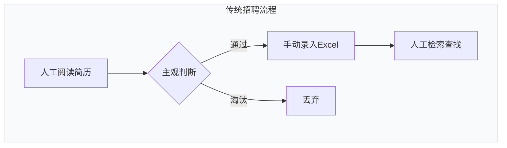
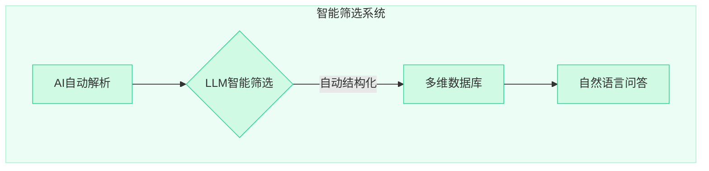


**对比说明**：

| 维度 | 传统方式 | 本系统 | 提升 |
|------|----------|--------|------|
| 处理速度 | 3-5 分钟/份 | 3-5 秒/份 | **60倍** |
| 信息提取 | 手动录入，易遗漏 | AI 自动提取 20+ 字段 | **100%覆盖** |
| 筛选标准 | 主观判断，因人而异 | LLM 语义理解，标准统一 | **一致性保障** |
| 数据检索 | 翻阅文件或 Excel | 自然语言智能问答 | **秒级响应** |

### 1.3 为什么选择 LLM + LangGraph？

传统方案如规则引擎、关键词匹配存在明显局限：

| 对比维度 | 传统方案 | LLM + LangGraph |
|----------|----------|-----------------|
| 信息提取 | 规则/正则 | 语义理解，自动提取 20+ 字段 |
| 筛选判断 | 关键词匹配 | 自然语言条件，语义匹配 |
| 数据检索 | SQL 查询 | RAG 智能问答 |
| 可扩展性 | 需修改代码 | 配置化，零代码扩展 |
| 处理速度 | 依赖人工 | 3-5 秒/份，效率提升 60 倍 |

---

## 二、系统架构设计

### 2.1 整体架构

系统采用分层架构设计，各层职责清晰：

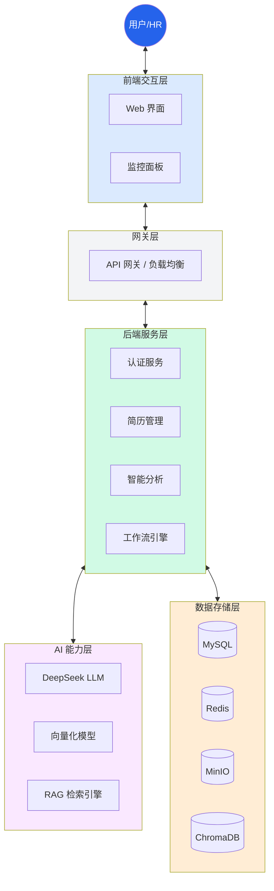

**架构设计理念**：

1. **分层解耦**：前端、API、工作流、AI、存储各层独立，降低耦合度
2. **异步处理**：FastAPI 原生支持异步，批量上传后台处理不阻塞
3. **状态管理**：LangGraph 状态机管理工作流，支持断点续传和错误恢复
4. **多模态存储与回退**：支持 MySQL/Redis/MinIO 标准模式，同时也支持 SQLite/Memory/LocalFS 的纯本地开发模式，实现"零依赖"快速启动。

### 2.2 微服务架构

系统采用微服务架构思想设计，支持容器化部署和水平扩展：

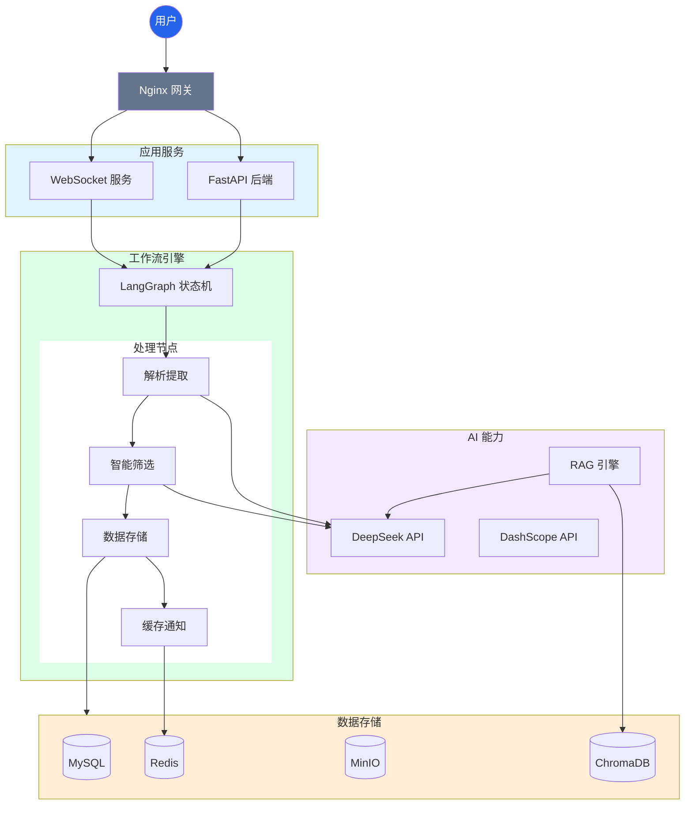

**各层职责说明**：

| 层级 | 组件 | 职责 |
|------|------|------|
| 用户接入层 | 浏览器 | 用户交互界面，响应式设计适配多终端 |
| 网关接入层 | Nginx | 反向代理、负载均衡、SSL 证书、静态资源服务 |
| 应用服务层 | FastAPI + WebSocket | 业务逻辑处理、API 接口、实时通信 |
| 工作流引擎层 | LangGraph | 简历处理流程编排、状态管理、错误处理 |
| AI 能力层 | DeepSeek + DashScope | 文本理解、信息提取、向量化、智能问答 |
| 数据存储层 | MySQL/Redis/MinIO/ChromaDB | 数据持久化、缓存、文件存储、向量检索 |

### 2.3 核心技术选型

| 层级 | 技术选型 | 版本 | 选型理由 |
|------|----------|------|----------|
| 后端框架 | FastAPI | >=0.120.0 | 异步高性能，自动生成 API 文档，类型提示友好 |
| LLM 框架 | LangChain | >=1.2.0 | 成熟的 LLM 应用开发框架，统一的大模型调用接口 |
| 工作流引擎 | LangGraph | >=1.0.0 | 状态机工作流，支持可视化编排，便于复杂业务流程管理 |
| 大模型 | DeepSeek | - | 国产大模型，中文理解能力强，API 价格低廉 |
| 向量化 | DashScope | - | 阿里云服务，中文语义效果好，稳定可靠 |
| 数据库 | MySQL | 8.0 | 成熟的关系数据库，支持事务，社区活跃 |
| 缓存 | Redis | 7 | 高性能内存数据库，支持多种数据结构 |
| 对象存储 | MinIO | - | S3 兼容的私有化对象存储，部署简单 |
| 向量数据库 | ChromaDB | >=0.5.0 | 轻量级向量存储，无需额外依赖 |

---

## 三、LangGraph 工作流设计

### 3.1 为什么选择 LangGraph？

在简历处理场景中，我们需要处理复杂的业务流程：

1. 文档解析（PDF/DOCX）
2. 信息提取（LLM）
3. 智能筛选（LLM）
4. 数据存储（多存储）
5. 结果缓存（Redis）

传统方案如 Celery 任务队列存在以下问题：

| 痛点 | Celery | LangGraph |
|------|--------|-----------|
| 状态管理 | 需要额外实现 | 内置状态持久化 |
| 流程可视化 | 不支持 | 原生支持 |
| 错误恢复 | 手动重试 | 节点级重试 |
| 调试困难 | 需要查看日志 | 可视化追踪 |

### 3.2 四节点状态机设计

简历处理采用 LangGraph 状态机工作流，分为 4 个节点顺序执行：

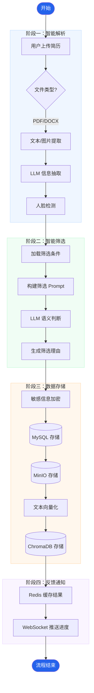

**各节点详细说明**：

#### ParseExtractNode - 解析提取节点

**职责**：将非结构化简历文档转换为结构化数据

**处理步骤**：
1. **文档解析**：根据文件类型选择解析器
   - PDF：使用 PyMuPDF (fitz) 提取文本和嵌入图片
   - DOCX：使用 python-docx 提取文本和图片
2. **文本提取**：保留段落格式，便于 LLM 理解上下文
3. **图片提取**：提取简历中的证件照
4. **LLM 信息提取**：调用 DeepSeek 大模型，提取 20+ 字段
5. **人脸检测**：使用 OpenCV Haar 级联分类器检测照片中的人脸

#### FilterNode - 筛选判断节点

**职责**：根据预设条件判断候选人是否符合要求

**处理步骤**：
1. **获取筛选条件**：从数据库读取条件配置
2. **构建筛选 Prompt**：将条件转换为自然语言描述
3. **LLM 判断**：调用大模型进行语义理解匹配
4. **复杂逻辑运算**：支持 AND/OR/NOT 等复杂布尔逻辑组合，确保筛选结果的精确性
5. **生成筛选原因**：详细说明符合/不符合的具体原因

#### StoreNode - 数据存储节点

**职责**：持久化存储处理结果

**处理步骤**：
1. **加密敏感信息**：使用 AES 对称加密手机号、邮箱
2. **保存 MySQL**：存储人才信息到 `talent_info` 表
3. **上传 MinIO**：存储简历照片，生成访问 URL
4. **向量存储**：生成简历文本向量，存入 ChromaDB

#### CacheNode - 缓存节点

**职责**：缓存处理结果，推送实时进度

**处理步骤**：
1. **缓存 Redis**：存储处理结果，设置过期时间
2. **更新任务状态**：更新数据库中的任务记录
3. **WebSocket 推送**：实时通知前端处理进度

### 3.3 工作流状态机图

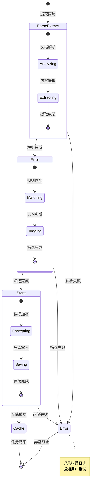

**技术优势**：
- **状态持久化**：每个节点的状态保存到数据库，支持断点续传
- **可视化编排**：工作流可视化，便于理解和调试
- **独立测试**：每个节点可独立单元测试，提高代码质量
- **错误恢复**：失败节点可重试，无需重新执行整个流程

---

## 四、RAG 智能问答设计

### 4.1 为什么需要 RAG？

简历库的价值不仅在于存储，更在于智能检索和分析。传统 SQL 查询存在明显局限：

| 查询类型 | SQL 查询 | RAG 智能问答 |
|----------|----------|--------------|
| "有哪些5年以上经验的Java开发？" | 需要编写复杂 JOIN | 自然语言直接提问 |
| "本科学历占比多少？" | 需要编写聚合查询 | 自动统计并生成图表 |
| "张三和李四谁更合适？" | 无法回答 | 对比分析并给出建议 |

### 4.2 RAG 智能问答流程

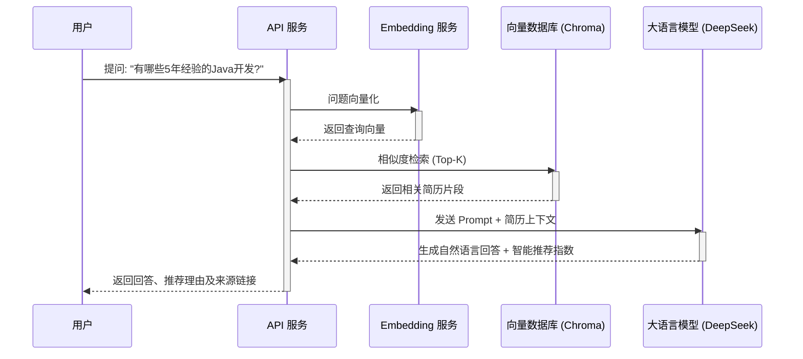

**RAG 技术优势**：

| 传统检索 | RAG 检索 |
|----------|----------|
| 关键词匹配，无法理解语义 | 向量检索，理解问题意图 |
| 需要精确匹配字段 | 支持自然语言提问 |
| 结果是原始数据 | 结果是生成的自然语言回答 |
| 无法进行推理总结 | 可以总结、对比、推荐 |

### 4.3 RAG 检索增强生成流程

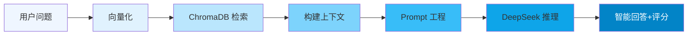

**技术优势**：
- **语义检索**：向量相似度检索，理解问题意图而非关键词匹配
- **来源可追溯**：回答附带来源简历链接，可信度高
- **上下文管理**：支持多轮对话，上下文自动管理
- **实时更新**：新简历入库后立即可检索

---

## 五、数据模型设计

### 5.1 ER 图

系统采用关系数据库存储结构化数据：

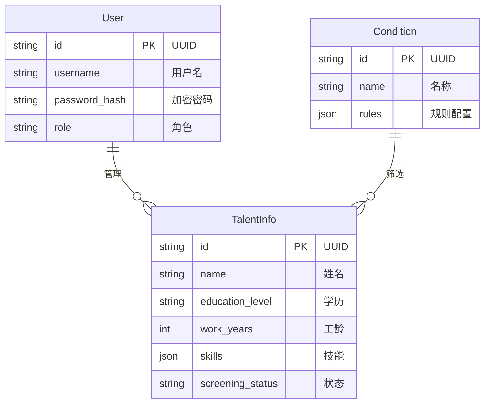

**数据模型说明**：

| 实体 | 说明 | 核心字段 |
|------|------|----------|
| **User** | 系统用户表，存储登录账户信息 | `username`(唯一)、`role`(角色权限) |
| **TalentInfo** | 人才信息表，存储简历提取的结构化数据 | `name`、`school`、`skills`、`screening_status` |
| **Condition** | 筛选条件表，存储自定义筛选规则 | `name`、`conditions`(JSON格式条件) |

---

## 六、性能优化

### 6.1 性能指标

系统经过优化，各项性能指标表现优异：

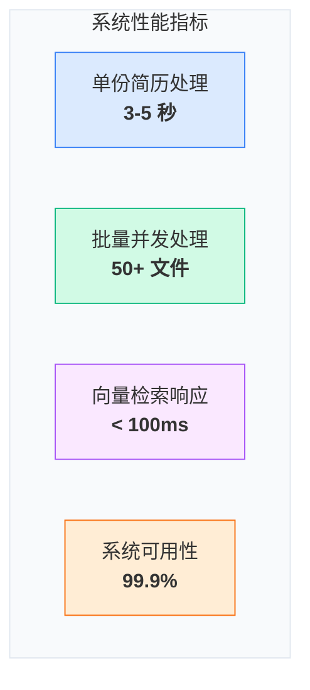

| 指标 | 数值 | 说明 | 对比传统方式 |
|------|------|------|--------------|
| 单份简历处理时间 | 3-5 秒 | 含解析、筛选、存储全流程 | 传统 3-5 分钟 |
| 批量上传支持 | 50+ 文件 | 异步后台处理，不阻塞用户 | 传统逐个处理 |
| 向量检索延迟 | <100ms | 千级数据量下的语义检索 | 传统需翻阅全部简历 |
| 系统可用性 | 99.9% | Docker 容器化部署，自动重启 | - |
| 并发处理能力 | 100+ QPS | 异步架构，充分利用 CPU | - |

### 6.2 多级缓存策略

系统采用多级缓存提升性能：

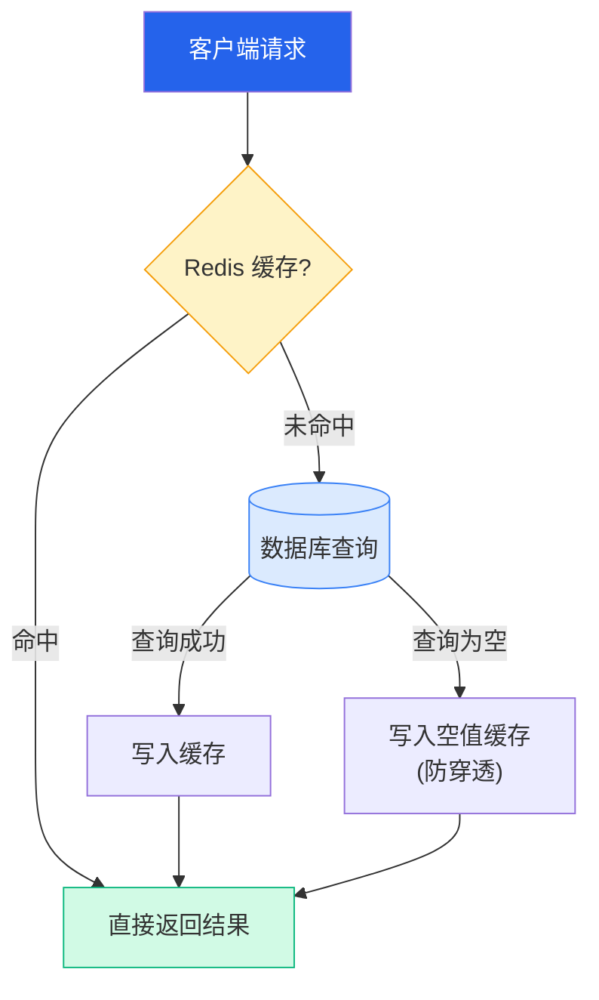

**缓存策略**：
- **筛选条件缓存**：5 分钟过期，条件变更频率低
- **任务状态缓存**：任务完成后 1 小时过期
- **用户信息缓存**：Token 有效期内缓存
- **空值缓存**：30 秒，防止缓存穿透

---

## 七、安全设计

### 7.1 多层安全防护

在处理简历这种敏感数据时，安全性至关重要：

| 安全措施 | 说明 | 实现方式 |
|----------|------|----------|
| 数据加密 | 敏感信息加密存储 | AES-256 对称加密 |
| 密码安全 | 密码不可逆存储 | bcrypt 哈希 |
| JWT 认证 | 无状态 Token 认证 | HS256 签名 |
| 权限控制 | 三级角色权限体系 | RBAC 模型 |
| API 限流 | 防止恶意请求 | 令牌桶算法 |
| SQL 注入防护 | 参数化查询 | SQLAlchemy ORM |

---

## 八、快速开始

### 8.1 环境要求

- Python 3.13+
- Docker 24.0+
- Docker Compose 2.20+

### 8.2 三步启动

```bash
# 第一步：克隆项目
git clone https://gitee.com/xt765/resume-screening.git
cd resume-screening

# 第二步：配置环境变量
cp .env.example .env
# 编辑 .env 文件，配置 API Key

# 第三步：一键启动
docker-compose up -d
```

### 8.3 访问系统

| 服务 | 地址 |
|------|------|
| 前端界面 | http://localhost:3000 |
| API 文档 | http://localhost:8000/docs |
| MinIO 控制台 | http://localhost:9001 |

### 8.4 纯本地开发 (Local Fallback)

无需安装 Docker，直接使用本地环境运行：

```bash
# 1. 修改 .env 配置
MINIO_ENDPOINT=local_storage
REDIS_HOST=memory

# 2. 启动服务
uv run uvicorn src.api.main:app --reload
```

---

## 九、总结与展望

### 9.1 项目亮点

本项目通过 LangChain + LangGraph + FastAPI 的组合，实现了：

- **效率提升 60 倍**：从 3-5 分钟缩短到 3-5 秒
- **标准统一可控**：LLM 语义理解，支持复杂布尔逻辑
- **智能问答检索**：RAG 技术，秒级响应
- **生产级稳定**：Docker 容器化，99.9% 可用性
- **开发极简**：Local Fallback 机制，零依赖启动

### 9.2 未来规划

- [ ] 支持更多简历格式（图片 OCR）
- [ ] 多租户架构
- [ ] 更丰富的统计分析
- [ ] 移动端适配

---

## 关于作者

深耕领域：大语言模型开发 / RAG 知识库 / AI Agent 落地 / 模型微调

技术栈：Python | RAG (LangChain / Dify + Milvus) | FastAPI + Docker

工程能力：专注模型工程化部署、知识库构建与优化，擅长全流程解决方案

「让 AI 交互更智能，让技术落地更高效」

欢迎技术探讨与项目合作，解锁大模型与智能交互的无限可能！

---

**项目地址**：[GitHub](https://github.com/xt765/ResumeScreening) | [Gitee](https://gitee.com/xt765/resume-screening)

**CSDN 博客**：[玄同765](https://blog.csdn.net/Yunyi_Chi)
