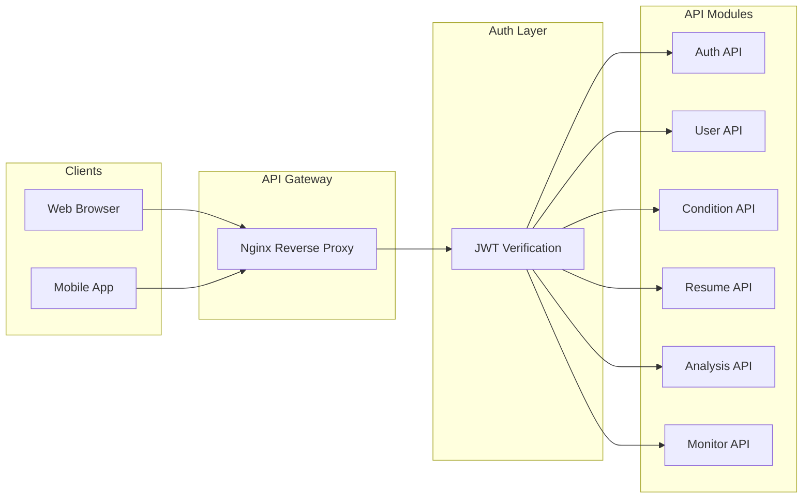
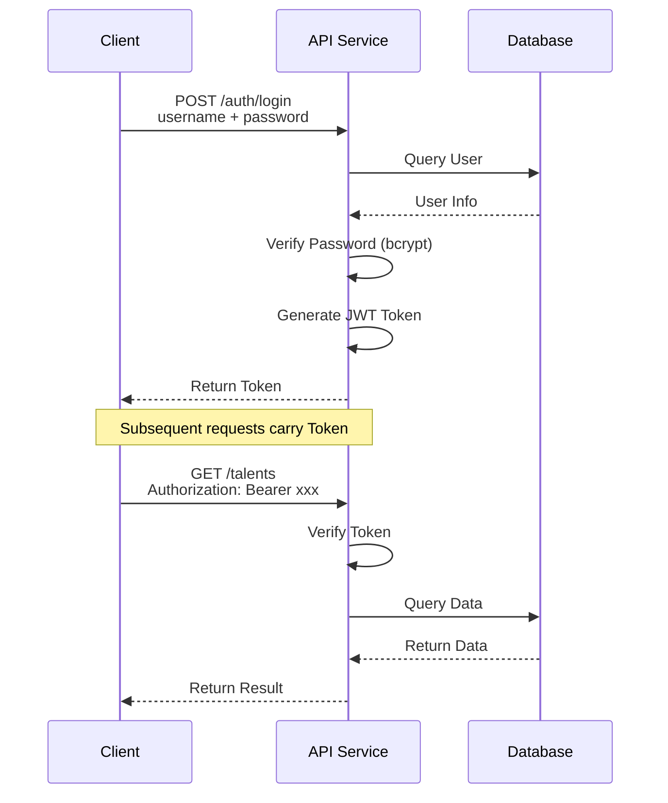
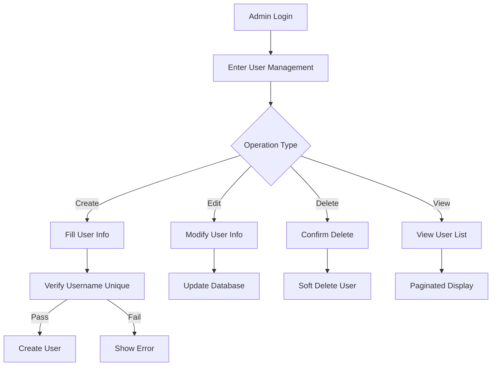
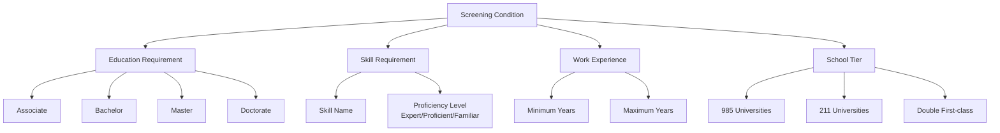
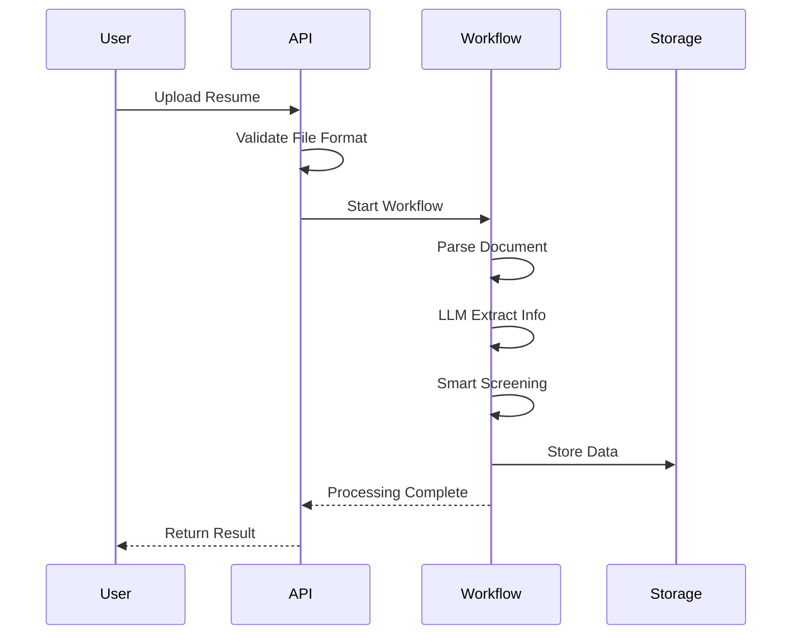
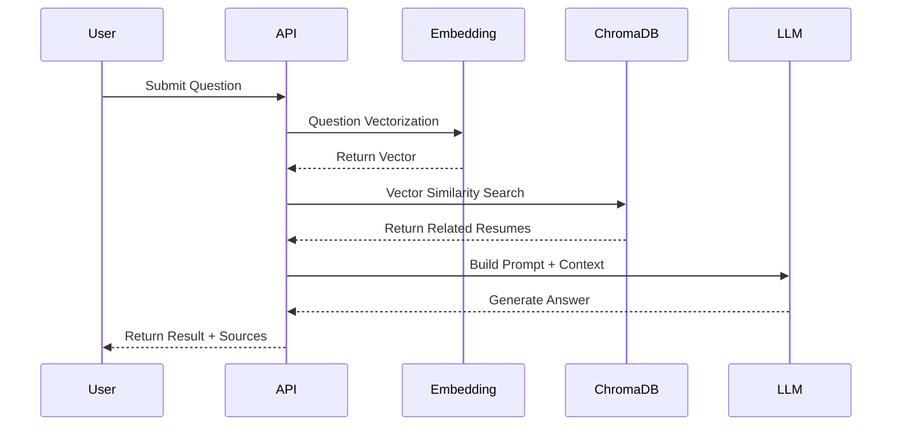
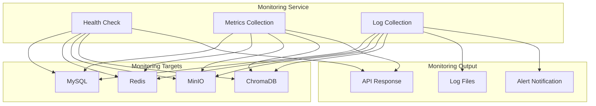
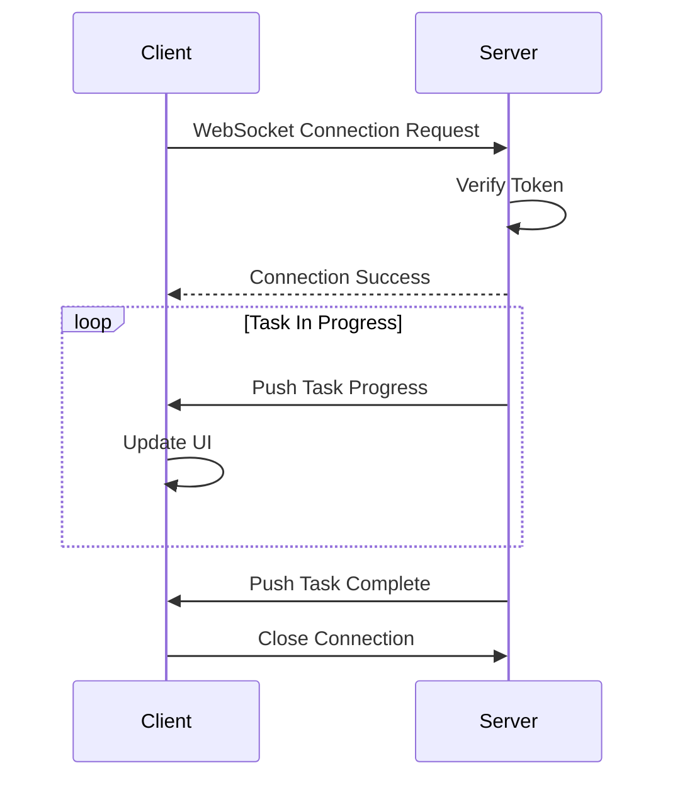

# API Documentation

## Overview

This document describes the REST API specifications for the Intelligent Resume Screening System.

| Config | Value |
|--------|-------|
| Base URL | `http://localhost:8000/api/v1` |
| Authentication | JWT Bearer Token |
| Data Format | JSON |
| Character Encoding | UTF-8 |

## API Architecture



## Authentication

### Authentication Flow



### Login

```http
POST /auth/login
Content-Type: application/x-www-form-urlencoded

username=admin&password=admin123
```

**Response**:

```json
{
  "success": true,
  "message": "Login successful",
  "data": {
    "access_token": "eyJhbGciOiJIUzI1NiIsInR5cCI6IkpXVCJ9...",
    "token_type": "bearer",
    "user": {
      "id": "xxx",
      "username": "admin",
      "role": "admin"
    }
  }
}
```

### Authenticated Request

All authenticated endpoints require the Token in the request header:

```http
Authorization: Bearer <access_token>
```

### Permission Description

| Role | Description | Accessible Modules |
|------|-------------|-------------------|
| admin | System Administrator | All modules |
| hr | HR Staff | Resume, Condition, Analysis, Monitor |
| viewer | Read-only User | Resume view, Analysis query |

## User Management

### User Management Flow



### Get User List

```http
GET /users
Authorization: Bearer <token>
```

**Query Parameters**:

| Parameter | Type | Required | Description |
|-----------|------|----------|-------------|
| page | int | No | Page number, default 1 |
| page_size | int | No | Items per page, default 20 |
| role | string | No | Role filter |
| keyword | string | No | Keyword search |

**Response**:

```json
{
  "success": true,
  "message": "Success",
  "data": {
    "items": [
      {
        "id": "xxx",
        "username": "admin",
        "email": "admin@example.com",
        "role": "admin",
        "is_active": true,
        "created_at": "2024-01-01T00:00:00"
      }
    ],
    "total": 100,
    "page": 1,
    "page_size": 20
  }
}
```

### Create User

```http
POST /users
Authorization: Bearer <token>
Content-Type: application/json

{
  "username": "newuser",
  "password": "password123",
  "email": "user@example.com",
  "role": "hr"
}
```

### Update User

```http
PUT /users/{user_id}
Authorization: Bearer <token>
Content-Type: application/json

{
  "email": "newemail@example.com",
  "role": "admin"
}
```

### Delete User

```http
DELETE /users/{user_id}
Authorization: Bearer <token>
```

## Screening Condition Management

### Condition Structure



### Get Condition List

```http
GET /conditions
Authorization: Bearer <token>
```

**Query Parameters**:

| Parameter | Type | Required | Description |
|-----------|------|----------|-------------|
| page | int | No | Page number |
| page_size | int | No | Items per page |

**Response**:

```json
{
  "success": true,
  "message": "Success",
  "data": {
    "items": [
      {
        "id": "xxx",
        "name": "Java Developer",
        "description": "3+ years Java development experience",
        "conditions": {
          "education_level": ["Bachelor", "Master"],
          "work_years_min": 3,
          "skills": ["Java", "Spring", "MySQL"],
          "school_tier": ["985", "211"]
        },
        "created_at": "2024-01-01T00:00:00"
      }
    ],
    "total": 50
  }
}
```

### Create Screening Condition

```http
POST /conditions
Authorization: Bearer <token>
Content-Type: application/json

{
  "name": "Frontend Developer",
  "description": "2+ years frontend development experience",
  "conditions": {
    "education_level": ["Bachelor"],
    "work_years_min": 2,
    "skills": ["Vue", "React", "TypeScript"],
    "school_tier": []
  }
}
```

### Update Screening Condition

```http
PUT /conditions/{condition_id}
Authorization: Bearer <token>
Content-Type: application/json

{
  "name": "Senior Frontend Developer",
  "conditions": {
    "work_years_min": 5
  }
}
```

### Delete Screening Condition

```http
DELETE /conditions/{condition_id}
Authorization: Bearer <token>
```

## Talent Management

### Resume Processing Flow



### Get Talent List

```http
GET /talents
Authorization: Bearer <token>
```

**Query Parameters**:

| Parameter | Type | Required | Description |
|-----------|------|----------|-------------|
| page | int | No | Page number |
| page_size | int | No | Items per page |
| screening_status | string | No | Screening status: qualified, unqualified |
| education_level | string | No | Education filter |
| keyword | string | No | Keyword search |
| skills | string | No | Skill filter, comma separated |

**Response**:

```json
{
  "success": true,
  "message": "Success",
  "data": {
    "items": [
      {
        "id": "xxx",
        "name": "John Doe",
        "education_level": "Bachelor",
        "school": "Tsinghua University",
        "major": "Computer Science",
        "work_years": 5,
        "skills": ["Java", "Python", "MySQL"],
        "screening_status": "qualified",
        "created_at": "2024-01-01T00:00:00"
      }
    ],
    "total": 200
  }
}
```

### Get Talent Detail

```http
GET /talents/{talent_id}
Authorization: Bearer <token>
```

**Response**:

```json
{
  "success": true,
  "message": "Success",
  "data": {
    "id": "xxx",
    "name": "John Doe",
    "phone": "138****1234",
    "email": "john***@example.com",
    "education_level": "Bachelor",
    "school": "Tsinghua University",
    "major": "Computer Science",
    "graduation_date": "2019-06",
    "work_years": 5,
    "skills": ["Java", "Python", "MySQL", "Redis"],
    "work_experience": [
      {
        "company": "Tech Company",
        "position": "Senior Developer",
        "duration": "2020-2024"
      }
    ],
    "projects": [
      {
        "name": "E-commerce Platform",
        "role": "Tech Lead",
        "description": "Responsible for overall architecture design"
      }
    ],
    "screening_status": "qualified",
    "qualification_reason": "Meets all screening criteria",
    "photo_urls": ["http://minio:9000/..."],
    "created_at": "2024-01-01T00:00:00"
  }
}
```

### Upload Single Resume

```http
POST /talents/upload
Authorization: Bearer <token>
Content-Type: multipart/form-data

file: <resume_file>
condition_id: xxx
```

**Response**:

```json
{
  "success": true,
  "message": "Resume processing complete",
  "data": {
    "talent_id": "xxx",
    "is_qualified": true,
    "qualification_reason": "Meets all screening criteria",
    "processing_time": 3500
  }
}
```

### Batch Upload Resumes

```http
POST /talents/batch-upload
Authorization: Bearer <token>
Content-Type: multipart/form-data

files: <resume_file_1>
files: <resume_file_2>
...
condition_id: xxx
```

**Response**:

```json
{
  "success": true,
  "message": "Batch upload task created",
  "data": {
    "task_id": "xxx",
    "file_count": 10
  }
}
```

### Update Talent Info

```http
PUT /talents/{talent_id}
Authorization: Bearer <token>
Content-Type: application/json

{
  "name": "Jane Doe",
  "skills": ["Java", "Spring", "Kubernetes"]
}
```

### Delete Talent

```http
DELETE /talents/{talent_id}
Authorization: Bearer <token>
```

### Restore Deleted Talent

```http
POST /talents/{talent_id}/restore
Authorization: Bearer <token>
```

### Batch Delete Talents

```http
POST /talents/batch-delete
Authorization: Bearer <token>
Content-Type: application/json

{
  "ids": ["id1", "id2", "id3"]
}
```

### Batch Update Screening Status

```http
POST /talents/batch-update-status
Authorization: Bearer <token>
Content-Type: application/json

{
  "ids": ["id1", "id2"],
  "screening_status": "qualified"
}
```

### Sync ChromaDB Data

```http
POST /talents/sync-chroma
Authorization: Bearer <token>
```

**Response**:

```json
{
  "success": true,
  "message": "Sync complete, fixed 5 records",
  "data": {
    "mysql_count": 100,
    "chroma_count": 95,
    "missing_in_chroma": ["id1", "id2"],
    "extra_in_chroma": ["id3"],
    "status_mismatch": ["id4", "id5"],
    "fixed_count": 5
  }
}
```

### Get Task Status

```http
GET /talents/tasks/{task_id}
Authorization: Bearer <token>
```

**Response**:

```json
{
  "success": true,
  "message": "Success",
  "data": {
    "id": "xxx",
    "name": "Batch Upload Resume (10 files)",
    "status": "running",
    "progress": {
      "current": 5,
      "total": 10,
      "percentage": 50.0,
      "message": "Processing file 5"
    },
    "created_at": "2024-01-01T00:00:00"
  }
}
```

### Cancel Task

```http
POST /talents/tasks/{task_id}/cancel
Authorization: Bearer <token>
```

## RAG Intelligent Analysis

### RAG Query Flow



### Async Intelligent Q&A (Recommended)

Create async RAG query task, supports background processing and progress tracking:

```http
POST /analysis/query-async
Authorization: Bearer <token>
Content-Type: application/json

{
  "query": "Find Java developers with 5+ years of experience?",
  "top_k": 10,
  "filters": null
}
```

**Response**:

```json
{
  "success": true,
  "message": "Task created",
  "data": {
    "task_id": "xxx-xxx-xxx",
    "status": "pending",
    "message": "RAG query task created, processing in background"
  }
}
```

### Get Analysis Task Status

```http
GET /analysis/tasks/{task_id}
Authorization: Bearer <token>
```

**Response**:

```json
{
  "success": true,
  "message": "Success",
  "data": {
    "id": "xxx-xxx-xxx",
    "name": "rag_query",
    "status": "running",
    "progress": {
      "current": 2,
      "total": 3,
      "percentage": 66.67,
      "message": "Generating analysis conclusion..."
    },
    "result": null,
    "error": null,
    "created_at": "2024-01-01T10:00:00",
    "updated_at": "2024-01-01T10:00:05"
  }
}
```

**Task Status Description**:

| Status | Description |
|--------|-------------|
| pending | Task waiting to execute |
| running | Task executing |
| completed | Task completed |
| failed | Task failed |
| cancelled | Task cancelled |

### Export Analysis Report

```http
GET /analysis/tasks/{task_id}/export
Authorization: Bearer <token>
```

**Response**: Markdown file download

### Sync Intelligent Q&A

```http
POST /analysis/query
Authorization: Bearer <token>
Content-Type: application/json

{
  "question": "Find Java developers with 5+ years of experience?",
  "top_k": 10
}
```

**Response**:

```json
{
  "success": true,
  "message": "Query successful",
  "data": {
    "answer": "Based on resume database query, 15 candidates meet the criteria...",
    "sources": [
      {
        "id": "xxx",
        "name": "John Doe",
        "school": "Tsinghua University",
        "similarity": 0.92,
        "content": "Resume summary..."
      }
    ],
    "analytics": {
      "total_count": 15,
      "avg_similarity": 0.85,
      "by_education": {"Bachelor": 10, "Master": 5},
      "top_skills": [
        {"name": "Java", "count": 15},
        {"name": "Spring", "count": 12}
      ]
    }
  }
}
```

### Get Query History

```http
GET /analysis/history
Authorization: Bearer <token>
```

**Query Parameters**:

| Parameter | Type | Required | Description |
|-----------|------|----------|-------------|
| page | int | No | Page number |
| page_size | int | No | Items per page |

## System Monitoring

### Monitoring Architecture



### Get System Metrics

```http
GET /monitor/metrics
Authorization: Bearer <token>
```

**Response**:

```json
{
  "success": true,
  "message": "Success",
  "data": {
    "cpu_percent": 45.5,
    "memory_percent": 62.3,
    "disk_percent": 35.0,
    "uptime": 86400,
    "talent_count": 1000,
    "qualified_count": 650,
    "unqualified_count": 350
  }
}
```

### Get System Logs

```http
GET /monitor/logs
Authorization: Bearer <token>
```

**Query Parameters**:

| Parameter | Type | Required | Description |
|-----------|------|----------|-------------|
| level | string | No | Log level: DEBUG, INFO, WARNING, ERROR |
| limit | int | No | Return count, default 100 |

### Get Service Status

```http
GET /monitor/services
Authorization: Bearer <token>
```

**Response**:

```json
{
  "success": true,
  "message": "Success",
  "data": {
    "mysql": {"status": "healthy"},
    "redis": {"status": "healthy"},
    "minio": {"status": "healthy"},
    "chromadb": {"status": "healthy"}
  }
}
```

## WebSocket Interface

### Connection Flow



### Connect

```javascript
const ws = new WebSocket('ws://localhost:8000/ws/tasks');
```

### Message Format

**Server Push**:

```json
{
  "type": "task_update",
  "task_id": "xxx",
  "data": {
    "status": "running",
    "progress": {
      "current": 5,
      "total": 10,
      "percentage": 50.0,
      "message": "Processing file 5"
    }
  }
}
```

## Error Response

All API error response format:

```json
{
  "success": false,
  "message": "Error description",
  "data": null
}
```

### Common Error Codes

| HTTP Status | Description | Suggestion |
|-------------|-------------|------------|
| 400 | Bad Request | Check request parameter format |
| 401 | Unauthorized | Re-login to get Token |
| 403 | Forbidden | Contact admin for permission upgrade |
| 404 | Not Found | Check if resource ID is correct |
| 500 | Internal Server Error | Contact technical support |

## Pagination Format

List endpoints return unified pagination format:

```json
{
  "success": true,
  "message": "Success",
  "data": {
    "items": [...],
    "total": 100,
    "page": 1,
    "page_size": 20,
    "pages": 5
  }
}
```

## API Usage Examples

### Python Example

```python
import requests

# Login to get Token
response = requests.post(
    "http://localhost:8000/api/v1/auth/login",
    data={"username": "admin", "password": "admin123"}
)
token = response.json()["data"]["access_token"]

# Use Token to access API
headers = {"Authorization": f"Bearer {token}"}
response = requests.get(
    "http://localhost:8000/api/v1/talents",
    headers=headers
)
print(response.json())
```

### JavaScript Example

```javascript
// Login to get Token
const loginRes = await fetch('http://localhost:8000/api/v1/auth/login', {
    method: 'POST',
    headers: {'Content-Type': 'application/x-www-form-urlencoded'},
    body: 'username=admin&password=admin123'
});
const {data: {access_token}} = await loginRes.json();

// Use Token to access API
const res = await fetch('http://localhost:8000/api/v1/talents', {
    headers: {'Authorization': `Bearer ${access_token}`}
});
const data = await res.json();
console.log(data);
```
