# System Architecture Design Document

## 1. System Overview

The Intelligent Resume Screening System is an enterprise-level intelligent resume processing platform based on Large Language Models (LLM), integrating advanced technologies such as LangChain, LangGraph, and FastAPI to achieve automatic resume parsing, intelligent screening, and RAG intelligent Q&A functions.

### 1.1 Design Goals

| Goal | Description | Implementation |
|------|-------------|----------------|
| **Intelligence** | Use LLM for automatic resume information extraction and intelligent screening | DeepSeek LLM + LangChain |
| **High Performance** | Asynchronous processing architecture, supporting batch resume upload | FastAPI async + background tasks |
| **Scalability** | Modular design, easy to extend functionality | LangGraph workflow + microservices architecture |
| **High Availability** | Containerized deployment, supporting horizontal scaling | Docker + Docker Compose |
| **Security** | Multi-layer security protection, protecting sensitive data | AES encryption + JWT authentication |

### 1.2 Technology Stack

Technology selection follows the principle of "mature, stable, open-source first, easy to maintain":

| Layer | Technology | Version | Reason |
|-------|------------|---------|--------|
| Backend Framework | FastAPI | >=0.120.0 | High-performance async framework, native OpenAPI support, type-hint friendly |
| LLM Framework | LangChain | >=1.2.0 | Mature LLM application development framework, unified model calling interface |
| Workflow Engine | LangGraph | >=1.0.0 | State graph workflow, suitable for complex business processes, supports checkpoint recovery |
| Relational Database | MySQL | 8.0 | Mature and stable, supports transactions, active community |
| Cache | Redis | 7 | High-performance cache, supports multiple data structures, can be used as message queue |
| Object Storage | MinIO | - | S3 compatible, private deployment, low cost |
| Vector Database | ChromaDB | >=0.5.0 | Lightweight vector storage, easy to integrate, no extra dependencies |
| LLM | DeepSeek | - | Domestic LLM, strong Chinese understanding, cost-effective |
| Embedding | DashScope | - | Alibaba Cloud service, good Chinese semantic effect, stable and reliable |

### 1.3 System Features

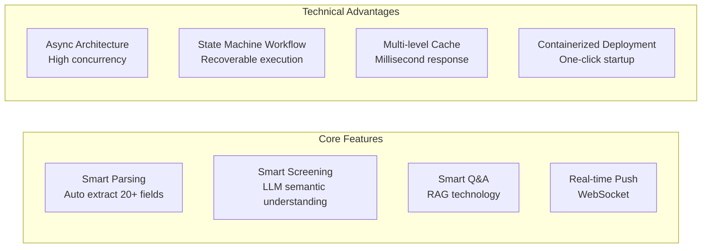

## 2. System Architecture

### 2.1 Overall Architecture Diagram

The system adopts a layered architecture design with clear responsibilities for each layer, easy to maintain and extend:

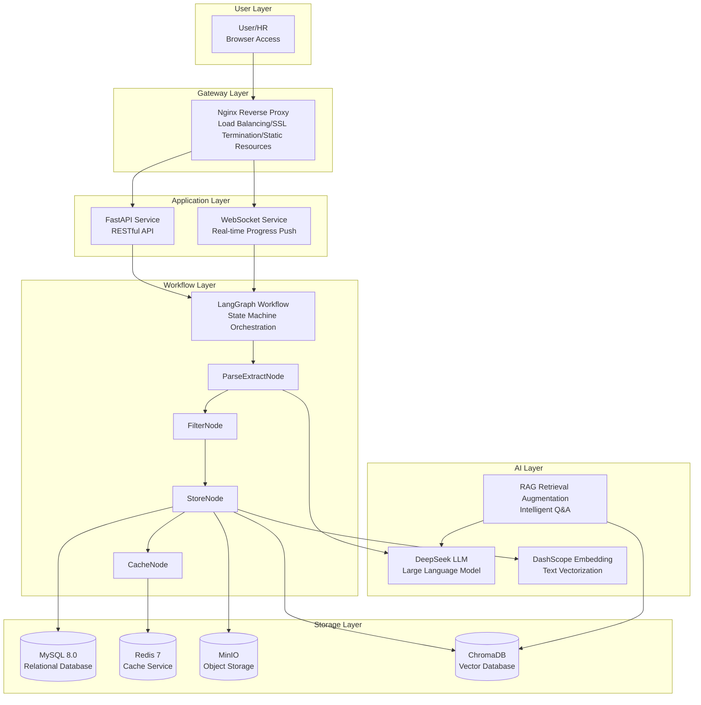

**Layer Responsibilities**:

| Layer | Component | Responsibility | Key Technology |
|-------|-----------|----------------|----------------|
| User Access Layer | Browser | User interaction interface, responsive design | HTML/CSS/JavaScript |
| Gateway Layer | Nginx | Reverse proxy, load balancing, SSL certificate, static resources | Nginx configuration |
| Application Layer | FastAPI | Business logic processing, API interfaces | FastAPI, Pydantic |
| Real-time Communication | WebSocket | Real-time progress push | WebSocket protocol |
| Workflow Engine Layer | LangGraph | Resume processing orchestration, state management | LangGraph state machine |
| AI Capability Layer | DeepSeek + DashScope | Text understanding, information extraction, vectorization | LLM, Embedding |
| Data Storage Layer | MySQL/Redis/MinIO/ChromaDB | Data persistence, cache, file storage, vector retrieval | Various storage engines |

### 2.2 Core Module Architecture

#### 2.2.1 API Layer

The API layer uses FastAPI framework to provide RESTful API interfaces:

```
src/api/
├── main.py              # FastAPI application entry, route registration
├── deps.py              # Dependency injection, database session, authentication
└── v1/                  # v1 version API
    ├── auth.py          # Authentication: login, logout
    ├── users.py         # User management: CRUD operations
    ├── conditions.py    # Screening conditions: condition configuration management
    ├── talents.py       # Resume management: upload, query, status update
    ├── analysis.py      # RAG analysis: intelligent Q&A
    ├── monitor.py       # System monitoring: health check, metrics
    └── websocket.py     # WebSocket: real-time progress push
```

**API Design Principles**:

- **RESTful Style**: Follow REST specifications, resource-oriented design
- **Version Control**: Version control via URL path `/api/v1/`
- **Unified Response**: All interfaces return unified `APIResponse` format
- **Exception Handling**: Global exception handler, unified error response

#### 2.2.2 Workflow Layer

The workflow layer uses LangGraph to build a 4-node state machine:

```
src/workflows/
├── state.py              # State definition (ResumeState)
├── resume_workflow.py    # Workflow orchestration, node connection
├── parse_extract_node.py # Parse extract node
├── filter_node.py        # Filter judgment node
├── store_node.py         # Store node
└── cache_node.py         # Cache node
```

**Workflow Design Advantages**:

| Feature | Description |
|---------|-------------|
| State Persistence | Each node state saved to database, supports checkpoint recovery |
| Visual Orchestration | Workflow visualization, easy to understand and debug |
| Independent Testing | Each node can be independently unit tested |
| Error Recovery | Failed nodes can retry without re-executing the entire process |

#### 2.2.3 Storage Layer

The storage layer adopts a multi-modal storage strategy:

```
src/storage/
├── chroma_client.py      # ChromaDB client, vector storage
├── minio_client.py       # MinIO client, image storage
└── redis_client.py       # Redis client, cache
```

**Storage Strategy**:

| Storage Type | Purpose | Data Example |
|--------------|---------|--------------|
| MySQL | Structured data storage | Talent info, screening conditions, user data |
| Redis | Cache, task status | Screening condition cache, task progress |
| MinIO | Image object storage | Resume photos, ID photos |
| ChromaDB | Vector data storage | Resume text vectors |

### 2.3 Data Flow Diagram

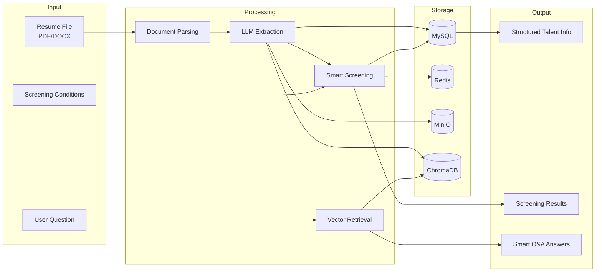

## 3. Core Workflow Design

### 3.1 Resume Processing Workflow

The system uses LangGraph to build a 4-node state graph workflow, with clear responsibilities for each node:

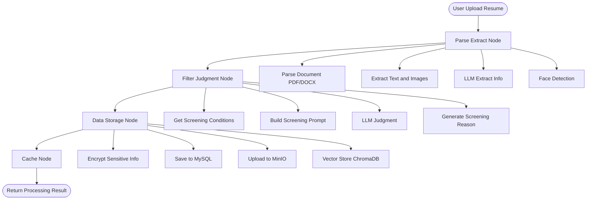

#### Node Details

##### ParseExtractNode - Parse Extract Node

**Responsibility**: Convert unstructured resume documents to structured data

**Processing Steps**:

| Step | Description | Implementation |
|------|-------------|----------------|
| Document Parsing | Select parser based on file type | PyMuPDF (PDF), python-docx (DOCX) |
| Text Extraction | Extract text content, preserve format | Regular expressions, text processing |
| Image Extraction | Extract embedded images | Document parsing library |
| LLM Extraction | Call LLM to extract structured info | DeepSeek API |
| Face Detection | Detect faces in photos | OpenCV Haar Cascade Classifier |

**Output Data**:

- `text_content`: Extracted text content
- `images`: Extracted image list
- `candidate_info`: Candidate info extracted by LLM

##### FilterNode - Filter Judgment Node

**Responsibility**: Judge whether candidate meets requirements based on preset conditions

**Processing Steps**:

| Step | Description | Implementation |
|------|-------------|----------------|
| Get Conditions | Read screening condition config from database | MySQL query |
| Build Prompt | Convert conditions to natural language description | Prompt template |
| LLM Judgment | Call LLM for semantic understanding matching | DeepSeek API |
| Generate Reason | Detailed explanation of qualified/unqualified reasons | LLM generation |

**Output Data**:

- `is_qualified`: Whether meets conditions (boolean)
- `qualification_reason`: Screening reason (text)

##### StoreNode - Data Storage Node

**Responsibility**: Persist processing results

**Processing Steps**:

| Step | Description | Implementation |
|------|-------------|----------------|
| Encrypt Sensitive Info | Encrypt phone number, email | AES-256 symmetric encryption |
| Save MySQL | Store talent info to database | SQLAlchemy ORM |
| Upload MinIO | Store resume photos | MinIO SDK |
| Vector Storage | Generate text vectors and store | DashScope + ChromaDB |

**Output Data**:

- `talent_id`: Talent ID
- `photo_urls`: Photo URL list

##### CacheNode - Cache Node

**Responsibility**: Cache processing results, push real-time progress

**Processing Steps**:

| Step | Description | Implementation |
|------|-------------|----------------|
| Cache Redis | Store processing results | Redis SETEX |
| Update Status | Update database task record | MySQL UPDATE |
| WebSocket Push | Real-time notification to frontend | WebSocket protocol |

**Output Data**:

- Task status update
- WebSocket notification

### 3.2 State Definition

Workflow state is defined using Pydantic BaseModel:

```python
class ResumeState(BaseModel):
    """Resume processing workflow state."""
  
    # Input data
    file_path: str                    # Resume file path
    file_content: bytes | None        # File binary content
    file_type: str | None             # File type (pdf/docx)
    content_hash: str | None          # Content hash (deduplication)

    # Parse extract results
    text_content: str | None          # Extracted text
    images: list[bytes] | None        # Extracted images

    # LLM extraction results
    candidate_info: dict | None       # Candidate info dictionary

    # Screening conditions
    condition_id: str | None          # Screening condition ID
    condition_config: dict | None     # Screening condition config

    # Screening results
    is_qualified: bool | None         # Whether qualified
    qualification_reason: str | None  # Screening reason

    # Storage results
    talent_id: str | None             # Talent ID
    photo_urls: list[str] | None      # Photo URL list

    # Error handling
    error_message: str | None         # Error message
    error_node: str | None            # Error node name

    # Workflow status
    workflow_status: str              # Workflow status
    processing_time: int | None       # Processing time (milliseconds)
```

### 3.3 Workflow State Machine

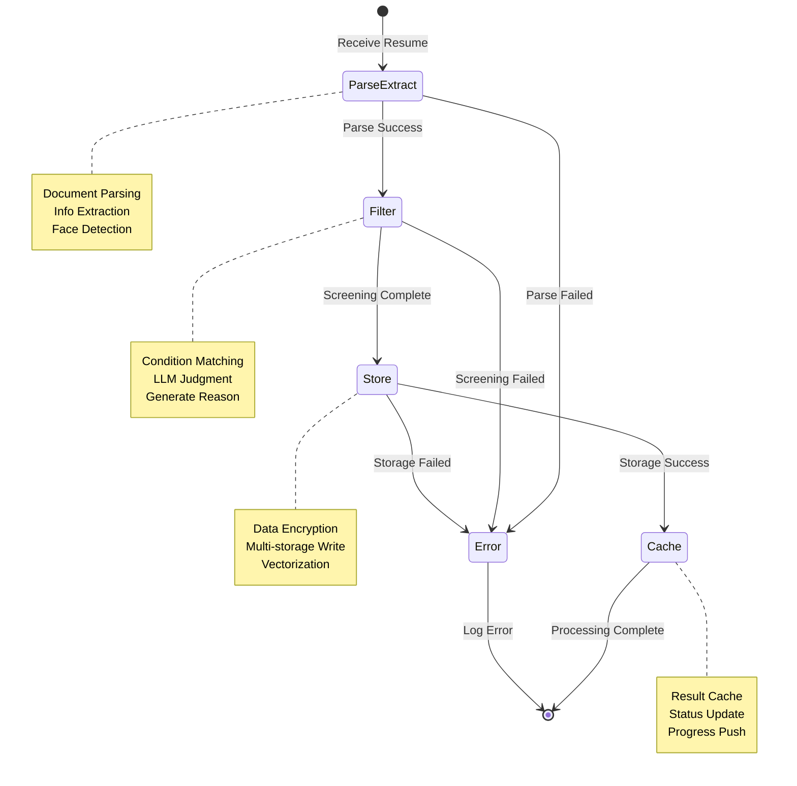

## 4. Data Model Design

### 4.1 ER Diagram

The system data model contains three core entities:

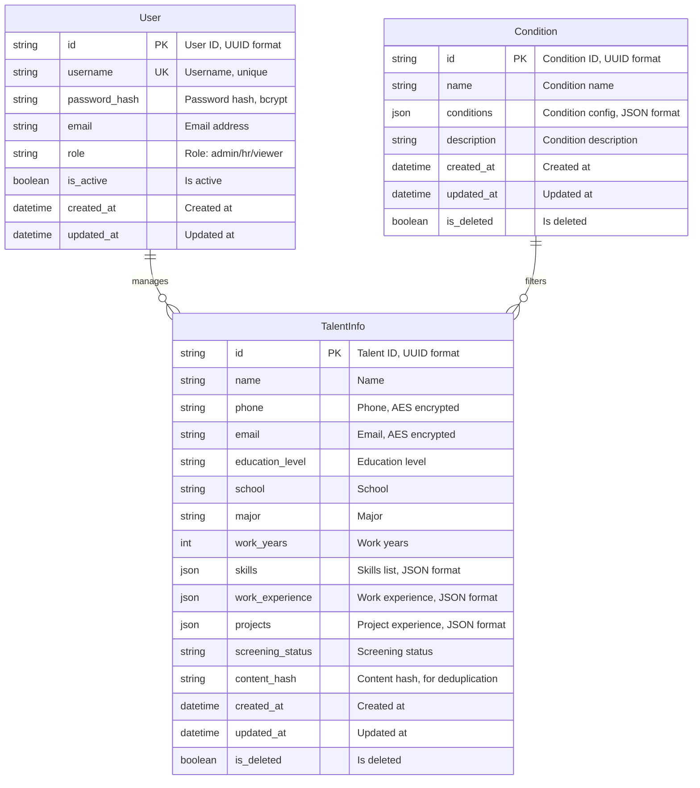

### 4.2 Entity Relationship Description

| Relationship | Type | Description |
|--------------|------|-------------|
| User → TalentInfo | One-to-Many | One user can manage multiple talent info |
| Condition → TalentInfo | One-to-Many | One screening condition can apply to multiple talents |

### 4.3 Core Table Structure

#### 4.3.1 User Table

| Field | Type | Constraint | Description |
|-------|------|------------|-------------|
| id | VARCHAR(36) | PK | Primary key, UUID format |
| username | VARCHAR(50) | UK, NOT NULL | Username, unique |
| password_hash | VARCHAR(255) | NOT NULL | Password hash, bcrypt |
| email | VARCHAR(100) | | Email address |
| role | ENUM | NOT NULL | Role: admin, hr, viewer |
| is_active | BOOLEAN | DEFAULT TRUE | Is active |
| created_at | DATETIME | NOT NULL | Created at |
| updated_at | DATETIME | NOT NULL | Updated at |

**Index Design**:

- `uk_username`: Username unique index
- `idx_role`: Role index, for permission queries

#### 4.3.2 TalentInfo Table

| Field | Type | Constraint | Description |
|-------|------|------------|-------------|
| id | VARCHAR(36) | PK | Primary key, UUID format |
| name | VARCHAR(50) | NOT NULL | Name |
| phone | VARCHAR(255) | | Phone, AES encrypted |
| email | VARCHAR(255) | | Email, AES encrypted |
| education_level | VARCHAR(20) | | Education level |
| school | VARCHAR(100) | | School |
| major | VARCHAR(100) | | Major |
| work_years | INT | | Work years |
| skills | JSON | | Skills list |
| work_experience | JSON | | Work experience |
| projects | JSON | | Project experience |
| screening_status | ENUM | | Screening status: qualified, unqualified |
| content_hash | VARCHAR(64) | UK | Content hash, for deduplication |
| created_at | DATETIME | NOT NULL | Created at |
| updated_at | DATETIME | NOT NULL | Updated at |
| is_deleted | BOOLEAN | DEFAULT FALSE | Is deleted |

**Index Design**:

- `uk_content_hash`: Content hash unique index, for deduplication
- `idx_name`: Name index, for fuzzy search
- `idx_school`: School index, for filtering
- `idx_screening_status`: Screening status index, for list queries

#### 4.3.3 Condition Table

| Field | Type | Constraint | Description |
|-------|------|------------|-------------|
| id | VARCHAR(36) | PK | Primary key, UUID format |
| name | VARCHAR(100) | NOT NULL | Condition name |
| conditions | JSON | NOT NULL | Screening condition config |
| description | TEXT | | Condition description |
| created_at | DATETIME | NOT NULL | Created at |
| updated_at | DATETIME | NOT NULL | Updated at |
| is_deleted | BOOLEAN | DEFAULT FALSE | Is deleted |

**conditions Field Format**:

```json
{
  "education_level": ["Bachelor", "Master"],
  "skills": [
    {"name": "Java", "level": "Expert"},
    {"name": "Spring", "level": "Proficient"}
  ],
  "work_years_min": 5,
  "work_years_max": 10,
  "school_tier": ["985", "211"]
}
```

## 5. Security Design

### 5.1 Authentication Authorization Flow

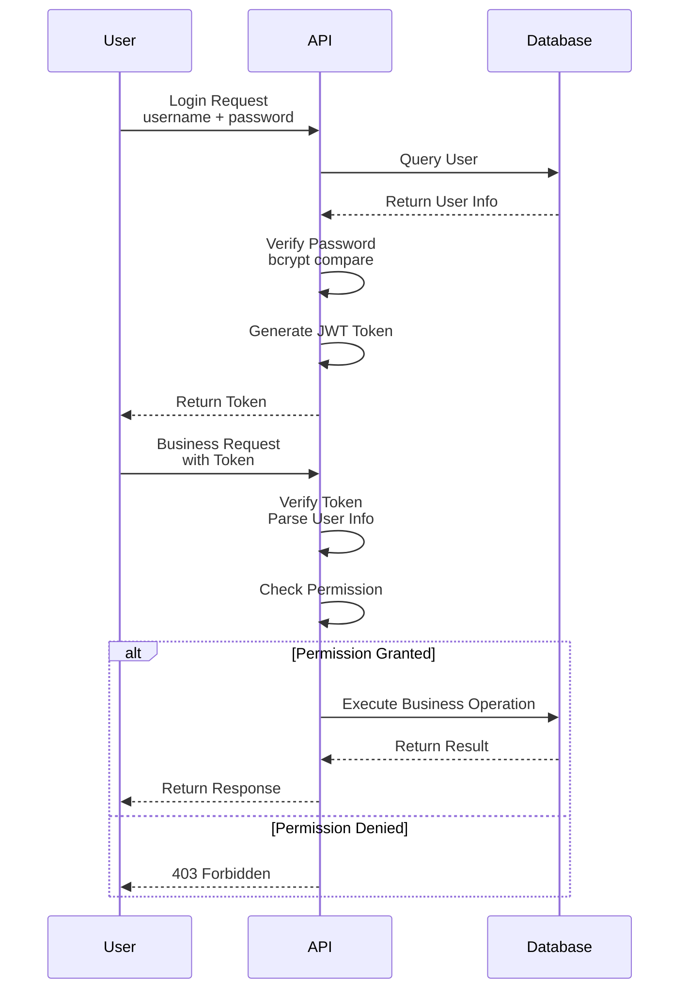

### 5.2 Data Encryption

| Encryption Type | Algorithm | Purpose | Key Management |
|-----------------|-----------|---------|----------------|
| Password Hash | bcrypt | User password storage | Auto salt |
| Sensitive Fields | AES-256 | Phone, email encryption | Environment variable config |
| Token Signing | HS256 | JWT signing | Environment variable config |
| Transport Encryption | TLS | HTTPS transport | SSL certificate |

### 5.3 Permission System

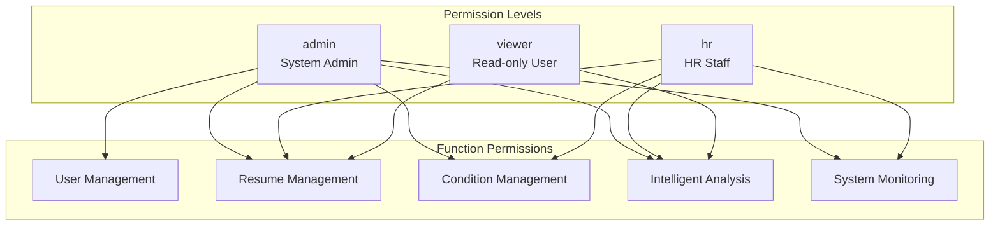

### 5.4 Security Measures

| Security Measure | Description | Implementation |
|------------------|-------------|----------------|
| JWT Authentication | Stateless token authentication | python-jose library |
| Password Security | Irreversible password storage | bcrypt hash |
| Data Encryption | Sensitive info encrypted storage | AES-256 symmetric encryption |
| Permission Control | Three-level role permission system | RBAC model |
| API Rate Limiting | Prevent malicious requests | Token bucket algorithm |
| SQL Injection Protection | Parameterized queries | SQLAlchemy ORM |
| XSS Protection | Output escaping | Frontend escaping |

## 6. Performance Optimization

### 6.1 Asynchronous Processing Architecture

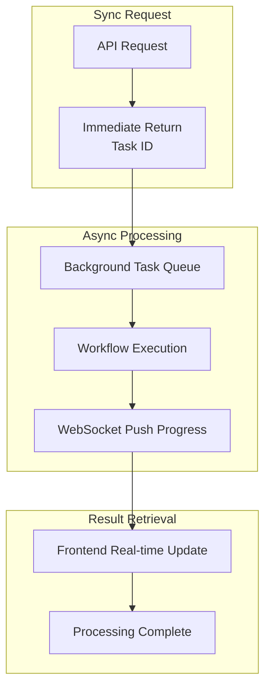

**Async Processing Advantages**:

| Advantage | Description |
|-----------|-------------|
| Non-blocking | Batch upload doesn't block user operations |
| High Concurrency | Fully utilize CPU resources |
| Real-time Feedback | WebSocket real-time progress push |
| Scalable | Supports horizontal scaling |

### 6.2 Cache Strategy

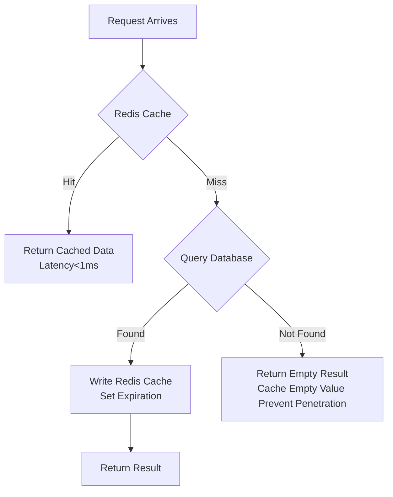

**Cache Configuration**:

| Cache Type | Expiration | Description |
|------------|------------|-------------|
| Screening Conditions | 5 minutes | Low change frequency |
| Task Status | 1 hour | Expires after task completion |
| User Info | Token validity | Sync with JWT |
| Empty Value Cache | 30 seconds | Prevent cache penetration |

### 6.3 Database Optimization

| Optimization Measure | Description |
|---------------------|-------------|
| Index Optimization | Create indexes for commonly queried fields |
| Connection Pool | SQLAlchemy async connection pool |
| Batch Operations | Batch insert, batch query |
| Slow Query Monitoring | Enable slow query log |

## 7. Monitoring and Logging

### 7.1 Logging System

The system uses Loguru for structured logging:

| Config Item | Value | Description |
|-------------|-------|-------------|
| Log Format | JSON | Structured logging, easy to analyze |
| Log Level | INFO | Use INFO in production |
| Rotation Strategy | Daily rotation | One log file per day |
| Retention Time | 30 days | Keep last 30 days logs |
| Exception Tracing | Full stack | Record complete exception info |

### 7.2 Health Check

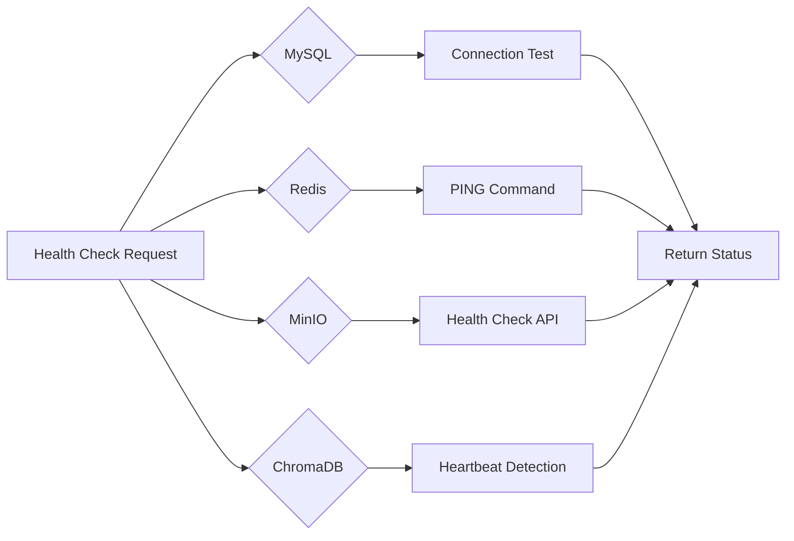

### 7.3 Monitoring Metrics

| Metric Type | Metric Name | Description |
|-------------|-------------|-------------|
| System Metrics | CPU Usage | Server CPU occupancy |
| System Metrics | Memory Usage | Server memory occupancy |
| System Metrics | Disk Usage | Disk space occupancy |
| Business Metrics | Resume Processing Volume | Cumulative processed resumes |
| Business Metrics | Screening Pass Rate | Qualified resume percentage |
| Performance Metrics | API Response Time | Average interface response time |
| Performance Metrics | Task Processing Time | Average resume processing time |
