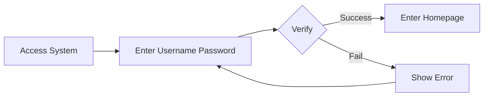
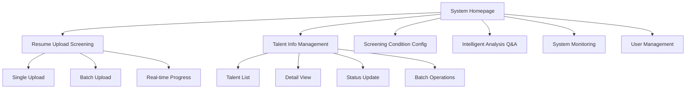
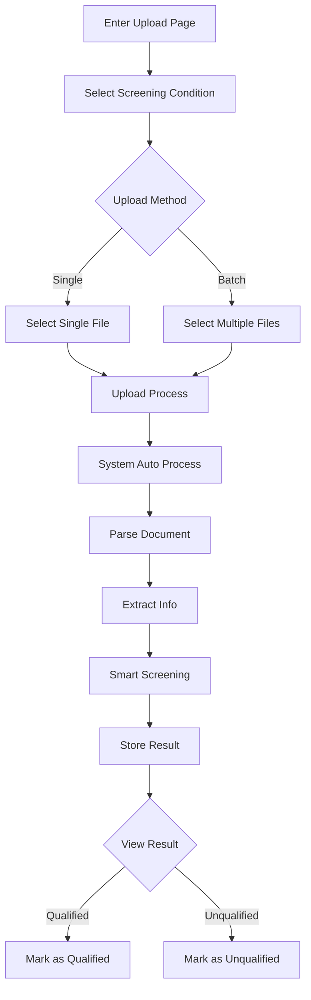
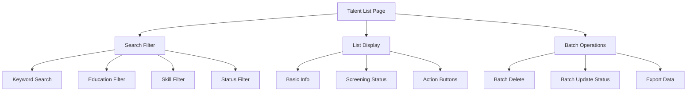
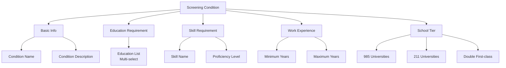
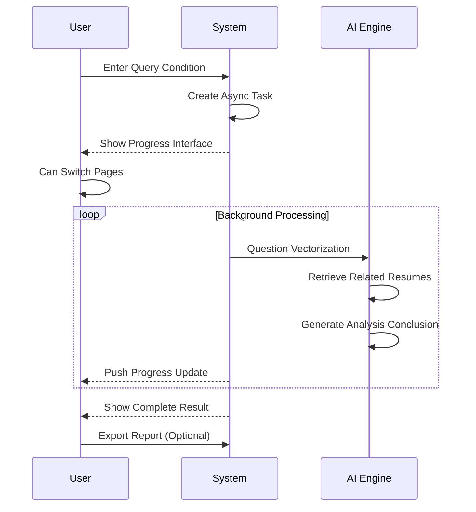
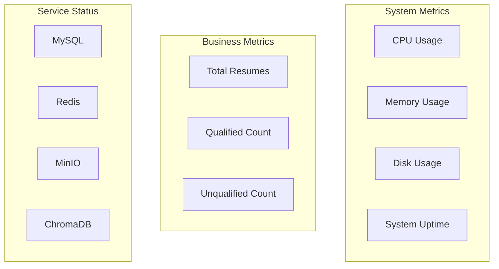
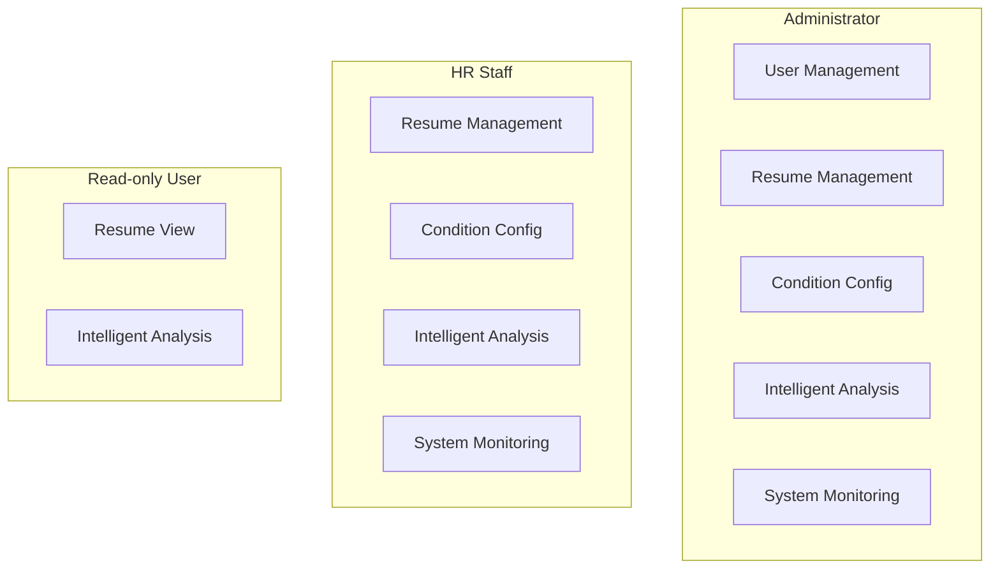

# User Guide

## System Login

### Login Flow

### Default Accounts

| Role | Username | Password | Permission Description |
|------|----------|----------|------------------------|
| Administrator | admin | admin123 | All features |
| HR | hr | hr123 | Resume management, condition config, intelligent analysis |
| Read-only User | viewer | viewer123 | View only |

### Login Steps

1. Open browser and access system address `http://localhost:3000`
2. Enter username and password on login page
3. Click "Login" button
4. Automatically redirect to homepage after successful login

## Feature Module Overview

## Resume Upload Screening

### Feature Description

Resume upload screening is the core feature of the system, supporting single and batch resume upload. The system automatically parses, extracts information, and performs intelligent screening.

### Operation Flow

### Single Resume Upload

1. Click "Resume Upload Screening" in left menu
2. Select preset screening condition in "Screening Condition" dropdown
3. Click "Select File" button, choose a resume (PDF or DOCX format)
4. Click "Upload" button
5. Wait for system processing (about 3-5 seconds)
6. View processing result, including extracted info and screening conclusion

### Batch Resume Upload

1. Click "Resume Upload Screening" in left menu
2. Select preset screening condition in "Screening Condition" dropdown
3. Click "Select File" button, choose multiple resumes (up to 50 files)
4. Click "Batch Upload" button
5. System displays progress bar, updates processing progress in real-time
6. After processing, view all results in talent list

### Supported File Formats

| Format | Extension | Description |
|--------|-----------|-------------|
| PDF | .pdf | Recommended, best parsing result |
| Word | .docx | Recommended, good parsing result |
| Legacy Word | .doc | Supported, but recommend converting to .docx |

### Notes

- Single file size limit: 10MB
- Batch upload supports up to 50 files
- Duplicate resumes with same content are automatically deduplicated
- Do not close browser during processing

## Talent Info Management

### Feature Description

Talent info management module is used to view, search, and manage uploaded resume information.

### Talent List

### Search and Filter

| Filter Condition | Description |
|------------------|-------------|
| Keyword | Search name, school, major and other fields |
| Screening Status | Qualified/Unqualified/Not screened |
| Education | Associate/Bachelor/Master/Doctorate |
| Skills | Filter by skill tags |

### View Talent Detail

1. Click "View" button for a record in talent list
2. Enter detail page to view complete info:
   - Basic Info: Name, contact, education, etc.
   - Work Experience: Company, position, time
   - Project Experience: Project name, role, description
   - Skills List: Skill name and proficiency level
   - Screening Result: Whether qualified and reason
   - Resume Photos: Extracted photos

### Update Talent Status

1. Click "Edit" button on talent detail page
2. Modify screening status (Qualified/Unqualified)
3. Click "Save" button

### Batch Operations

1. Check talents to operate in talent list
2. Click "Batch Operations" button at top
3. Select operation type:
   - Batch Delete: Soft delete selected talents
   - Batch Update Status: Modify screening status
4. Confirm operation

## Screening Condition Configuration

### Feature Description

Screening condition configuration module is used to create and manage resume screening rules. The system automatically judges whether candidates meet requirements based on these rules.

### Condition Structure

### Create Screening Condition

1. Click "Screening Condition Config" in left menu
2. Click "New Condition" button
3. Fill in condition info:
   - **Condition Name**: e.g., "Java Developer"
   - **Condition Description**: Detailed screening requirements
   - **Education Requirement**: Check required education levels
   - **Skill Requirement**: Add skills and proficiency levels
   - **Work Experience**: Set minimum and maximum years
   - **School Tier**: Check required school tiers
4. Click "Save" button

### Condition Configuration Example

**Java Developer Screening Condition**:

| Config Item | Value |
|-------------|-------|
| Condition Name | Java Developer |
| Education Requirement | Bachelor, Master |
| Skill Requirement | Java (Expert), Spring (Proficient), MySQL (Proficient) |
| Work Experience | Minimum 3 years |
| School Tier | 985, 211 |

**Frontend Developer Screening Condition**:

| Config Item | Value |
|-------------|-------|
| Condition Name | Frontend Developer |
| Education Requirement | Bachelor |
| Skill Requirement | Vue (Proficient), React (Familiar), TypeScript (Proficient) |
| Work Experience | Minimum 2 years |
| School Tier | No requirement |

### Edit and Delete Conditions

- **Edit**: Click "Edit" button in condition list, modify and save
- **Delete**: Click "Delete" button in condition list, confirm to delete

## Intelligent Analysis Q&A

### Feature Description

Intelligent analysis Q&A module is based on RAG technology, supporting natural language queries on resume database to get intelligent analysis results.

### Feature Highlights

- **Async Task Processing**: Query tasks execute in background, non-blocking page operations
- **Real-time Progress Display**: Show task processing progress (retrieval, analysis, generation)
- **Page Switch Persistence**: Can switch to other pages, task continues executing
- **Markdown Rendering**: Analysis conclusions support titles, tables, lists and other formats
- **Result Export**: Support exporting Markdown format analysis reports

### Q&A Flow

### Supported Question Types

| Question Type | Example Question | Return Result |
|---------------|------------------|---------------|
| Talent Query | "Find Java developers with 5+ years experience?" | Candidate list + analysis table |
| Statistical Analysis | "What's the percentage of bachelor's degree?" | Statistics + charts |
| Skill Recommendation | "What other skills are needed for this position?" | Skill suggestions |
| Comparative Analysis | "Who is more suitable between John and Jane?" | Comparison table |

### Usage Method

1. Click "Data Analysis" in left menu
2. Enter query condition in input box
3. Select return count (5/10/15/20/50 items)
4. Click "Start Analysis" button
5. View task progress:
   - Generating query vector...
   - Retrieving related candidates...
   - Generating analysis conclusion...
6. View analysis result after task completion:
   - Intelligent analysis conclusion (Markdown format)
   - Candidate overview table
   - Statistical charts (education distribution, experience distribution, popular skills)
   - Candidate list (with similarity score)
7. Click "Export Report" to download Markdown file

### Question Examples

**Talent Query Type**:
- "Find Java developers with 5+ years of experience?"
- "Find candidates graduated from Tsinghua University"
- "How many people are expert in Spring framework?"

**Statistical Analysis Type**:
- "What's the percentage of bachelor's degree in resume database?"
- "What's the average work experience?"
- "What are the most common skills?"

**Comparative Analysis Type**:
- "Compare skills between John and Jane"
- "Which candidate has more Java experience?"

### View Candidate Detail

Click "View Detail" button in candidate list to see complete info:
- Basic Info: Name, education, school, major, work years
- Skill Tags: List of skills mastered by candidate
- Resume Content: Complete resume text
- Screening Info: Status, date, etc.

### Export Analysis Report

Click "Export Report" button to download a Markdown file containing:
- Query condition
- Analysis conclusion
- Candidate overview table
- Statistical data
- Generation time and task ID

## System Monitoring

### Feature Description

System monitoring module is used to view system running status and performance metrics.

### Monitoring Dashboard

### View System Metrics

1. Click "System Monitoring" in left menu
2. View real-time system metrics:
   - CPU Usage
   - Memory Usage
   - Disk Usage
   - System Uptime

### View Service Status

View health status of each service on monitoring page:
- MySQL: Database service
- Redis: Cache service
- MinIO: Image storage service
- ChromaDB: Vector database service

### View System Logs

1. Click "Logs" tab
2. Filter by log level:
   - DEBUG: Debug info
   - INFO: General info
   - WARNING: Warning info
   - ERROR: Error info

## User Management

### Feature Description

User management module is used to manage system user accounts (admin only).

### User Role Permissions

### Create User

1. Click "User Management" in left menu
2. Click "New User" button
3. Fill in user info:
   - Username (unique)
   - Password
   - Email
   - Role
4. Click "Save" button

### Edit User

1. Click "Edit" button in user list
2. Modify user info
3. Click "Save" button

### Disable/Enable User

1. Click "Disable" or "Enable" button in user list
2. Confirm operation

## FAQ

### Q1: Resume upload shows "Parse Failed"

**Possible Causes**:
- Incorrect file format
- Corrupted file
- Empty file content

**Solutions**:
- Confirm file format is PDF or DOCX
- Try reopening file to confirm content is normal
- If .doc format, convert to .docx and retry

### Q2: Batch upload progress stuck

**Possible Causes**:
- Network connection interrupted
- Server processing busy

**Solutions**:
- Refresh page and re-upload
- Reduce batch upload file count
- Check network connection

### Q3: Intelligent Q&A returns empty result

**Possible Causes**:
- No related data in resume database
- Unclear question expression

**Solutions**:
- Confirm there is data in resume database
- Try asking in a different way
- Use more specific keywords

### Q4: "Permission Denied" after login

**Possible Causes**:
- User role permission insufficient
- Account disabled

**Solutions**:
- Contact admin to confirm account status
- Confirm accessed feature is within permission scope

### Q5: Resume photos not displaying

**Possible Causes**:
- MinIO service abnormal
- No photo in resume
- Unsupported photo format

**Solutions**:
- Check MinIO service status
- Confirm resume contains photo
- Contact technical support

## Keyboard Shortcuts

| Shortcut | Function |
|----------|----------|
| Ctrl + F | Focus search box |
| Esc | Close popup |
| Enter | Confirm submit |
| Ctrl + S | Save (edit page) |

## Technical Support

If you encounter other issues, please contact technical support:
- Provide problem description and screenshots
- Provide operation steps
- Provide browser version info
