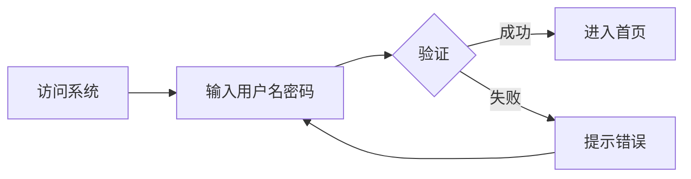
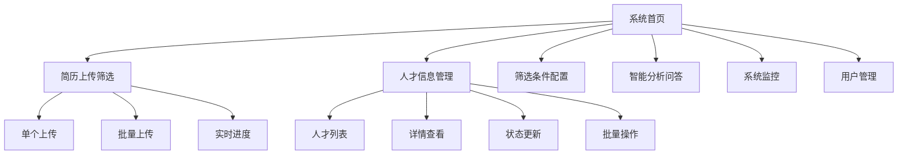
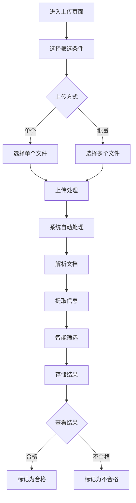
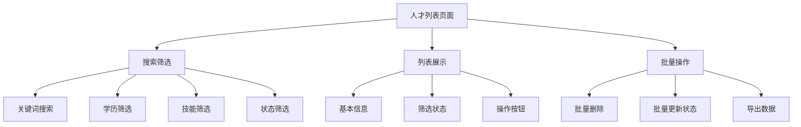
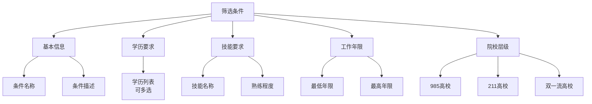
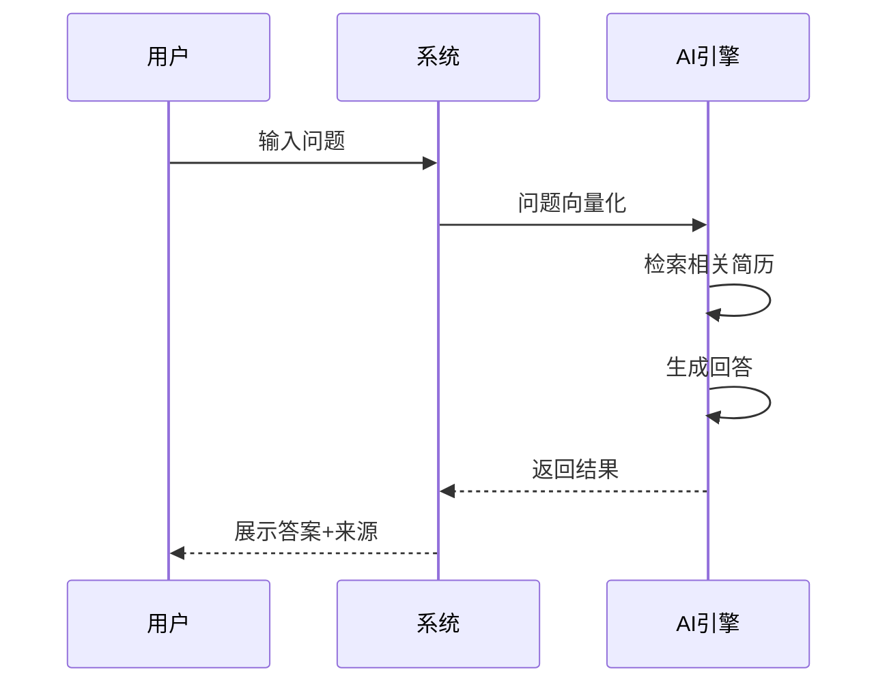
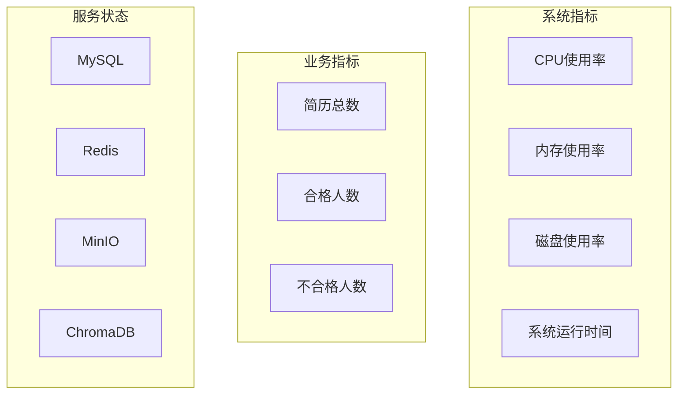
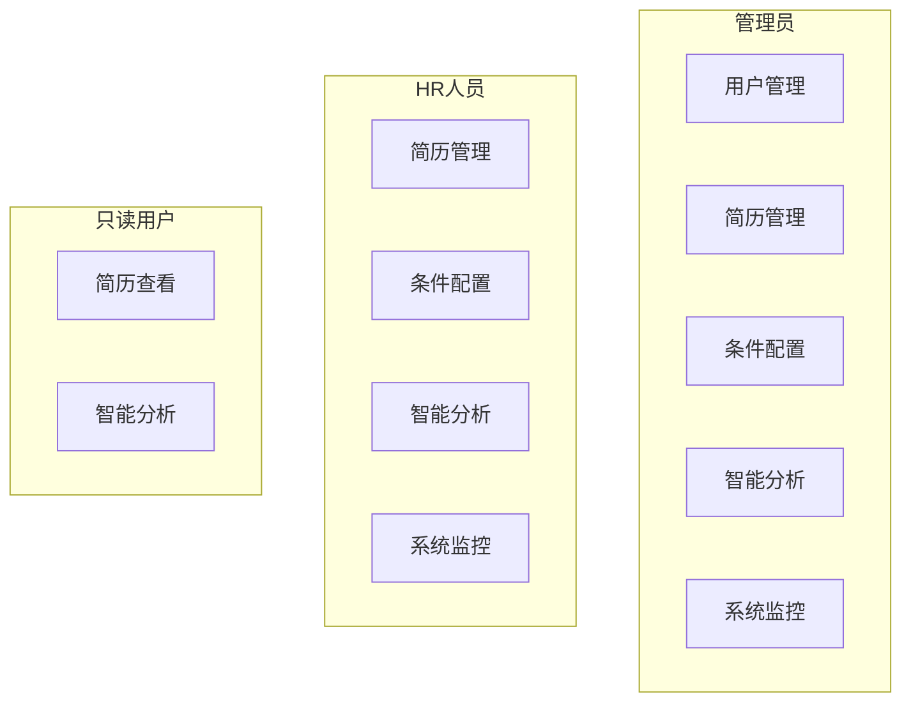

# 使用指南

## 系统登录

### 登录流程

### 默认账户

| 角色 | 用户名 | 密码 | 权限说明 |
|------|--------|------|----------|
| 管理员 | admin | admin123 | 全部功能 |
| HR | hr | hr123 | 简历管理、条件配置、智能分析 |
| 只读用户 | viewer | viewer123 | 仅查看功能 |

### 登录步骤

1. 打开浏览器，访问系统地址 `http://localhost:3000`
2. 在登录页面输入用户名和密码
3. 点击"登录"按钮
4. 登录成功后自动跳转到首页

## 功能模块概览

## 简历上传筛选

### 功能说明

简历上传筛选是系统的核心功能，支持单个和批量上传简历，系统自动解析、提取信息并进行智能筛选。

### 操作流程

### 单个简历上传

1. 点击左侧菜单"简历上传筛选"
2. 在"筛选条件"下拉框中选择预设的筛选条件
3. 点击"选择文件"按钮，选择一份简历（PDF 或 DOCX 格式）
4. 点击"上传"按钮
5. 等待系统处理完成（约 3-5 秒）
6. 查看处理结果，包括提取的信息和筛选结论

### 批量简历上传

1. 点击左侧菜单"简历上传筛选"
2. 在"筛选条件"下拉框中选择预设的筛选条件
3. 点击"选择文件"按钮，选择多份简历（最多 50 个文件）
4. 点击"批量上传"按钮
5. 系统显示上传进度条，实时更新处理进度
6. 处理完成后，可在人才列表中查看所有结果

### 支持的文件格式

| 格式 | 扩展名 | 说明 |
|------|--------|------|
| PDF | .pdf | 推荐，解析效果最佳 |
| Word | .docx | 推荐，解析效果良好 |
| 旧版Word | .doc | 支持，但建议转换为 .docx |

### 注意事项

- 单个文件大小不超过 10MB
- 批量上传最多支持 50 个文件
- 相同内容的简历会自动去重
- 处理过程中请勿关闭浏览器

## 人才信息管理

### 功能说明

人才信息管理模块用于查看、搜索和管理已上传的简历信息。

### 人才列表

### 搜索与筛选

| 筛选条件 | 说明 |
|----------|------|
| 关键词 | 搜索姓名、学校、专业等字段 |
| 筛选状态 | 合格/不合格/未筛选 |
| 学历 | 专科/本科/硕士/博士 |
| 技能 | 按技能标签筛选 |

### 查看人才详情

1. 在人才列表中，点击某条记录的"查看"按钮
2. 进入详情页面，可查看完整信息：
   - 基本信息：姓名、联系方式、学历等
   - 工作经历：公司、职位、时间
   - 项目经历：项目名称、角色、描述
   - 技能列表：技能名称及熟练程度
   - 筛选结果：是否合格及原因
   - 简历照片：提取的照片

### 更新人才状态

1. 在人才详情页面，点击"编辑"按钮
2. 修改筛选状态（合格/不合格）
3. 点击"保存"按钮

### 批量操作

1. 在人才列表中，勾选需要操作的人才
2. 点击顶部"批量操作"按钮
3. 选择操作类型：
   - 批量删除：软删除选中的人才
   - 批量更新状态：修改筛选状态
4. 确认操作

## 筛选条件配置

### 功能说明

筛选条件配置模块用于创建和管理简历筛选规则，系统根据这些规则自动判断候选人是否符合要求。

### 条件结构

### 创建筛选条件

1. 点击左侧菜单"筛选条件配置"
2. 点击"新建条件"按钮
3. 填写条件信息：
   - **条件名称**：如"Java开发工程师"
   - **条件描述**：详细说明筛选要求
   - **学历要求**：勾选要求的学历层次
   - **技能要求**：添加技能及熟练程度
   - **工作年限**：设置最低和最高年限
   - **院校层级**：勾选要求的院校层级
4. 点击"保存"按钮

### 条件配置示例

**Java开发工程师筛选条件**：

| 配置项 | 值 |
|--------|-----|
| 条件名称 | Java开发工程师 |
| 学历要求 | 本科、硕士 |
| 技能要求 | Java（精通）、Spring（熟练）、MySQL（熟练） |
| 工作年限 | 最低 3 年 |
| 院校层级 | 985、211 |

**前端开发工程师筛选条件**：

| 配置项 | 值 |
|--------|-----|
| 条件名称 | 前端开发工程师 |
| 学历要求 | 本科 |
| 技能要求 | Vue（熟练）、React（了解）、TypeScript（熟练） |
| 工作年限 | 最低 2 年 |
| 院校层级 | 无要求 |

### 编辑和删除条件

- **编辑**：点击条件列表中的"编辑"按钮，修改后保存
- **删除**：点击条件列表中的"删除"按钮，确认后删除

## 智能分析问答

### 功能说明

智能分析问答模块基于 RAG 技术，支持使用自然语言查询简历库，获取智能分析结果。

### 问答流程

### 支持的问题类型

| 问题类型 | 示例问题 | 返回结果 |
|----------|----------|----------|
| 人才查询 | "有哪些5年以上经验的Java开发？" | 候选人列表 |
| 统计分析 | "本科学历占比多少？" | 统计数据+图表 |
| 技能推荐 | "这个岗位还需要什么技能？" | 技能建议 |
| 对比分析 | "张三和李四谁更合适？" | 对比表格 |

### 使用方法

1. 点击左侧菜单"智能分析"
2. 在输入框中输入问题
3. 点击"提问"按钮
4. 等待系统处理（约 2-5 秒）
5. 查看回答结果和相关简历来源

### 问题示例

**人才查询类**：
- "有哪些5年以上工作经验的Java开发工程师？"
- "找出清华大学毕业的候选人"
- "有多少人精通Spring框架？"

**统计分析类**：
- "简历库中本科学历占比多少？"
- "平均工作年限是多少？"
- "最常见的技能有哪些？"

**对比分析类**：
- "比较张三和李四的技能"
- "哪个候选人的Java经验更丰富？"

### 查看历史记录

系统自动保存查询历史，可在"历史记录"标签页查看：
- 查询时间
- 查询问题
- 回答摘要
- 点击可重新查看完整结果

## 系统监控

### 功能说明

系统监控模块用于查看系统运行状态和性能指标。

### 监控面板

### 查看系统指标

1. 点击左侧菜单"系统监控"
2. 查看实时系统指标：
   - CPU 使用率
   - 内存使用率
   - 磁盘使用率
   - 系统运行时间

### 查看服务状态

在监控页面可查看各服务的健康状态：
- MySQL：数据库服务
- Redis：缓存服务
- MinIO：图片存储服务
- ChromaDB：向量数据库服务

### 查看系统日志

1. 点击"日志"标签页
2. 可按日志级别筛选：
   - DEBUG：调试信息
   - INFO：一般信息
   - WARNING：警告信息
   - ERROR：错误信息

## 用户管理

### 功能说明

用户管理模块用于管理系统用户账户（仅管理员可访问）。

### 用户角色权限

### 创建用户

1. 点击左侧菜单"用户管理"
2. 点击"新建用户"按钮
3. 填写用户信息：
   - 用户名（唯一）
   - 密码
   - 邮箱
   - 角色
4. 点击"保存"按钮

### 编辑用户

1. 在用户列表中，点击"编辑"按钮
2. 修改用户信息
3. 点击"保存"按钮

### 禁用/启用用户

1. 在用户列表中，点击"禁用"或"启用"按钮
2. 确认操作

## 常见问题

### Q1: 简历上传后显示"解析失败"

**可能原因**：
- 文件格式不正确
- 文件损坏
- 文件内容为空

**解决方案**：
- 确认文件格式为 PDF 或 DOCX
- 尝试重新打开文件确认内容正常
- 如果是 .doc 格式，转换为 .docx 后重试

### Q2: 批量上传进度卡住不动

**可能原因**：
- 网络连接中断
- 服务器处理繁忙

**解决方案**：
- 刷新页面重新上传
- 减少批量上传文件数量
- 检查网络连接

### Q3: 智能问答返回空结果

**可能原因**：
- 简历库中没有相关数据
- 问题表述不清晰

**解决方案**：
- 确认简历库中有数据
- 尝试换一种方式提问
- 使用更具体的关键词

### Q4: 登录后显示"权限不足"

**可能原因**：
- 用户角色权限不够
- 账户被禁用

**解决方案**：
- 联系管理员确认账户状态
- 确认访问的功能是否在权限范围内

### Q5: 简历照片显示不出来

**可能原因**：
- MinIO 服务异常
- 简历中没有照片
- 照片格式不支持

**解决方案**：
- 检查 MinIO 服务状态
- 确认简历中包含照片
- 联系技术支持

## 快捷键

| 快捷键 | 功能 |
|--------|------|
| Ctrl + F | 搜索框聚焦 |
| Esc | 关闭弹窗 |
| Enter | 确认提交 |
| Ctrl + S | 保存（编辑页面） |

## 技术支持

如遇到其他问题，请联系技术支持：
- 提供问题描述和截图
- 提供操作步骤
- 提供浏览器版本信息
